## Note:
Due to the attack on Tehran on 28 February 2026, I am experiencing severely restricted internet access even now. For the complete log, refer to `/internet-outage-log/outage-log.md`

**Impact on Software Installation:**

Because of these restrictions, I cannot always access the official Kali repositories directly. To continue working offline and still install packages, I use a **local Kali mirror** that is accessible within the restricted network. For example, the Iranian mirror:
``` text
deb http://mirror.shatel.ir/kali kali-rolling main non-free contrib
```
**Caution:** Local mirrors may not be perfectly in sync with the official Kali repositories. Use them only when necessary. If you have full internet access, stick with the official repositories.

## Chapter 4: Adding and Removing Software


One of the most important skills when working with an operating system is managing software. Sometimes, we need to install a tool or software that isn't pre-installed on our system, or we need to remove something we don't need to free up space.

Sometimes, a software package requires other software to run, and you need to install everything together. A package manager handles the entire installation, including dependencies, automatically.

In this chapter, we learn three ways of managing software in Linux: the `apt` package manager, GUI-based installers, and `git`.

### Using `apt` to Handle Software

Kali and Ubuntu are based on Debian. In these systems, the default software manager is the **Advanced Packaging Tool**, or simply `apt`. With the `apt` command, you can download, install, update, and upgrade packages.

#### Searching for a Package

Always remember: if you want to download a new package, you can search for it in your repository to check if it's available. The syntax is simple:

```bash
sudo apt search keyword
```

For example, let's see if the package for **Uncomplicated Firewall (UFW)** is in our repository. UFW is a simple yet powerful Linux firewall that can help protect your work or system.

```bash
sudo apt search ufw
```

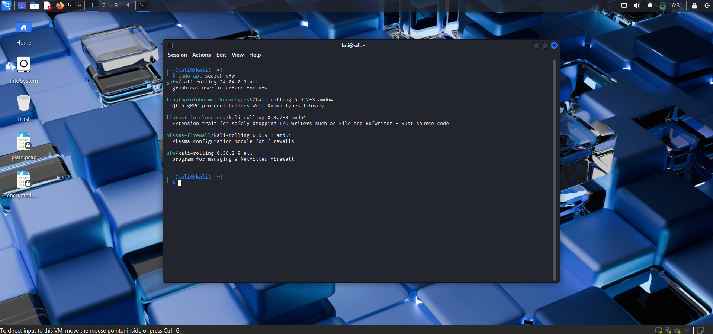

> **What is a repository?**  
> A repository is a server that stores software packages for a specific Linux distribution. APT keeps a local list of available packages from these servers. When you run `sudo apt update`, APT refreshes that list. Repositories contain thousands of pre-compiled programs, along with metadata (version, dependencies, description). The default repository for Kali includes many security and hacking tools. You can add or remove repositories by editing the `/etc/apt/sources.list` file.

> **Note:** `apt search` looks for **keywords** in package names and descriptions. You may see several results. For UFW, you will see something like "ufw - program for managing a Netfilter firewall" – that's the one!

> **Note:** You can check the repository for packages even when you are **offline** if you have a cached list (after running `apt update` while online). The search uses your local package index.

#### Adding Software

Once you have confirmed the package is in your repository, you can install it. Use `apt` with the `install` keyword:

```bash
sudo apt install packagename
```

Before installing, the terminal will show you all the packages that will be installed (including dependencies). If everything looks good, type `y` to start the installation.
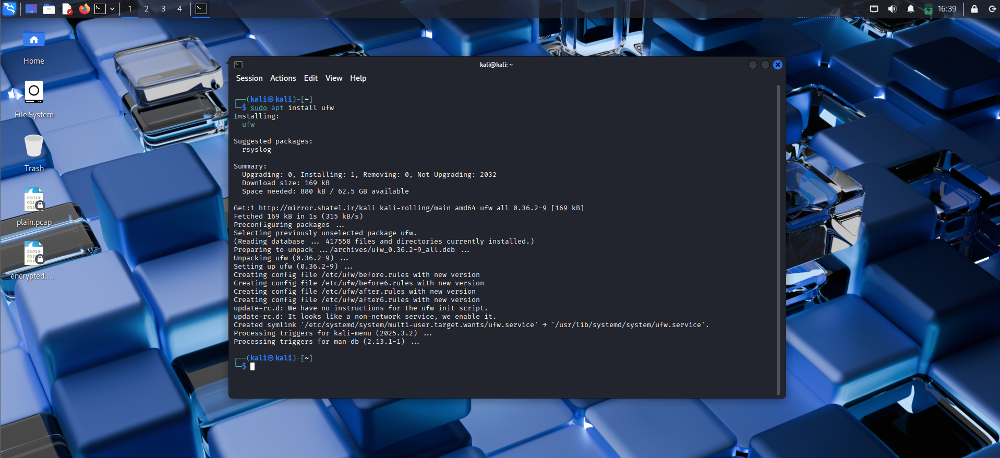


#### Removing Software

To remove a package, use the `remove` keyword:

```bash
sudo apt remove packagename
```

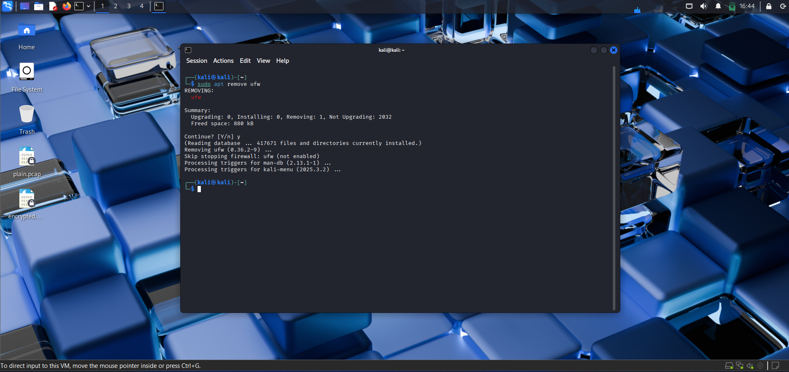


> **Important:** When you install a package and configure it, those configuration files are saved on your system. The `remove` command only uninstalls the program files, **not the configuration files**. This means if you install the same package again, you won't need to reconfigure it.

If you want to remove **everything** (including configuration files), use the `purge` keyword instead of `remove`:

```bash
sudo apt purge packagename
```

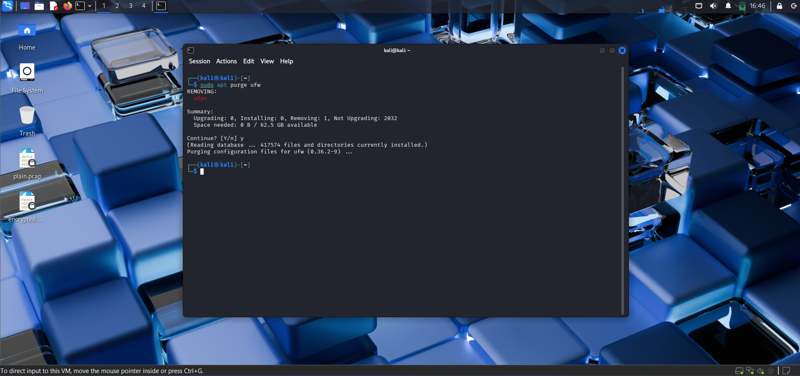

#### Updating Packages

Repositories are updated continuously. However, your system won't know about new packages or new versions unless you request an update.

> **Difference between update and upgrade:**
> - `sudo apt update` – Updates the **list** of available packages from the repositories (downloads new package indexes). This does **not** install new versions of your software.
> - `sudo apt upgrade` – **Upgrades** the installed packages to their latest versions (using the updated list).

To update your package list:

```bash
sudo apt update
```

The system will look for any available updates for packages in your repository. The message `Reading package lists... Done` at the end means the package lists have been updated successfully.
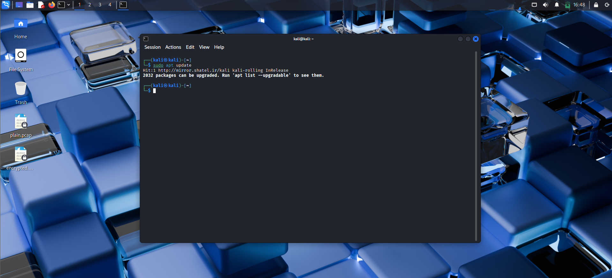

#### Upgrading Packages

To upgrade all your installed packages to the latest versions:

```bash
sudo apt upgrade
```

This will take some time, depending on how many updates are available. You will be shown the total size to download and estimated time. Type `y` to proceed.
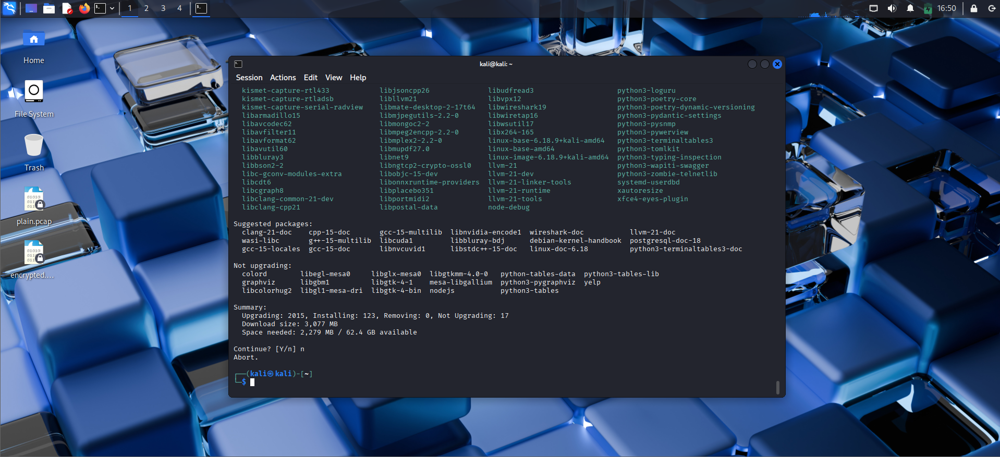

### Adding Repositories to Your `sources.list` File

Repositories are servers for different Linux distributions that host software files. Nearly all distributions have their own repositories. Using another distribution's repository for your system may not work, or it could break your system entirely. They may look similar, but the code and software might be completely different.

Kali's default repository contains numerous hacking tools and related software. It may be useful to add one or two additional repositories (e.g., Ubuntu's) to access more software or as a backup if Kali's repo is down.

The list of repositories your system uses is stored in the `sources.list` file. It's a plain text file, so you can change, add, or remove repository addresses. Open it with any editor:

```bash
sudo nano /etc/apt/sources.list
```

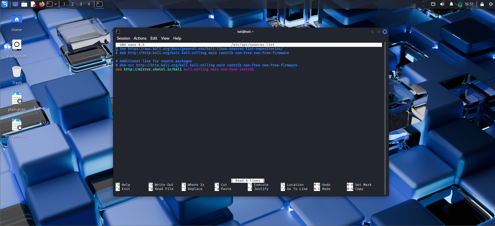

Many Linux distributions separate their repositories into **components**. For example, Debian (on which Kali is based) has these categories:

- **Main** – Contains supported open-source software
- **Universe** – Contains community-maintained open-source software
- **Multiverse** – Contains software restricted by copyright or other legal issues
- **Restricted** – Contains proprietary device drivers
- **Backports** – Contains packages from later releases (backported to older releases)
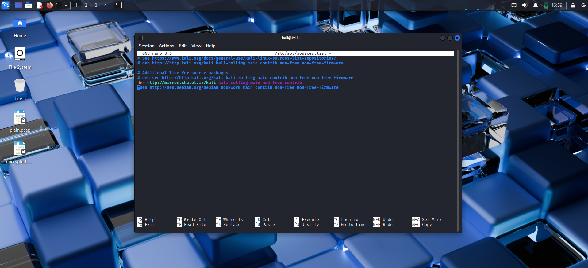

> **Warning:** Although you can add any repository to your list, it's not recommended unless you know what you're doing. Mixing repositories from different distributions may break your system (dependency conflicts, incompatible libraries).

**Example – Adding an Ubuntu repository to install `gr-iridium` (satellite hacking tool):**

First, find the Ubuntu Universe repository link (e.g., `deb http://archive.ubuntu.com/ubuntu focal universe`). Add it to `/etc/apt/sources.list`, then update and install:

```bash
sudo apt update
sudo apt install gr-iridium
```
Note: If it were available, I would add the repository and install it. However, `gr-iridium` is not in the standard Kali or Debian repositories, so I will not install it here.

### Using a GUI-Based Installer

Recent versions of Kali do not come with a GUI software center pre-installed. However, you can install two common GUI package managers: **Synaptic** and **Gdebi**.

Install Synaptic using `apt`:

```bash
sudo apt install synaptic
```

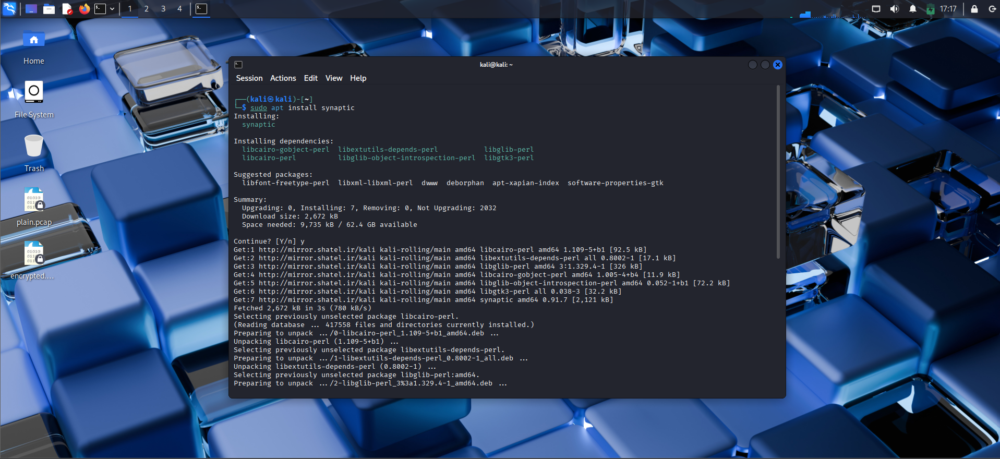

Once installed, go to **Menu** → **Settings** → **Synaptic Package Manager**.

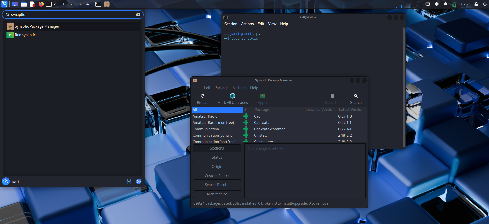

To install software (e.g., `ufw`), click **Search**, type `ufw`, select the package, and mark it for installation. Then click **Apply**. It's simple and user-friendly.
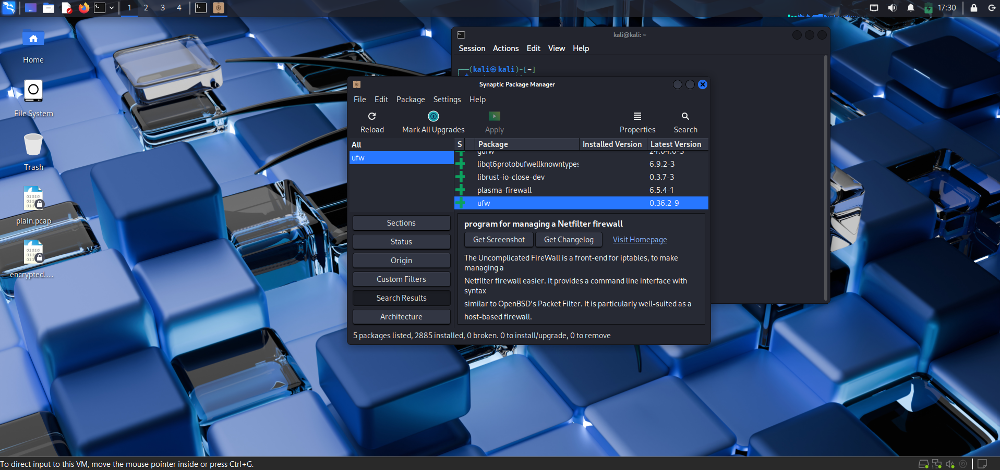
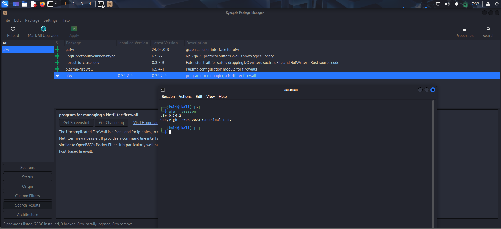

### Installing Software with `git`

Sometimes you need software that is not available in any repository. In that case, you can install it directly from **GitHub** – a platform where developers share code, collaborate, and distribute programs.

For example, **Cameradar** is an IP camera hacking tool. You won't find it in standard repositories, but it is available on GitHub.

**Steps:**

1. Find the GitHub repository address (e.g., `https://github.com/Ullaakut/cameradar`).
2. Clone it using `git clone`:

```bash
git clone https://github.com/Ullaakut/cameradar
```
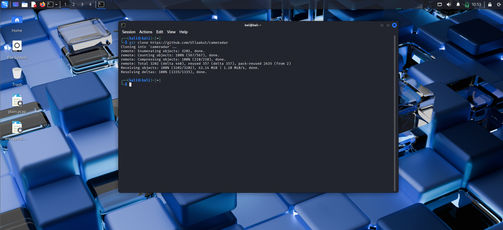

3. This command copies all files to your local drive. List the contents:

```bash
ls -l
ls -l cameradar
```
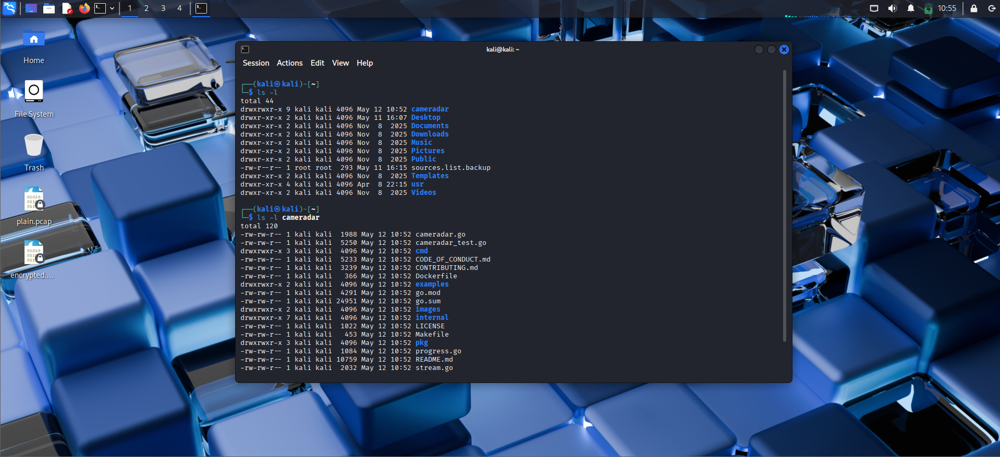

Now you can follow the tool's specific build or installation instructions (often a `README.md` file inside the cloned directory).

---
