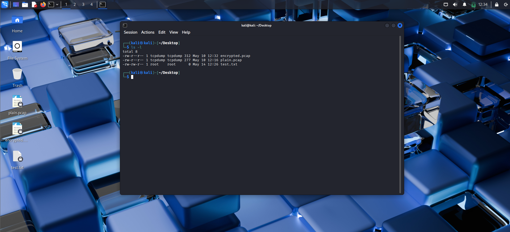
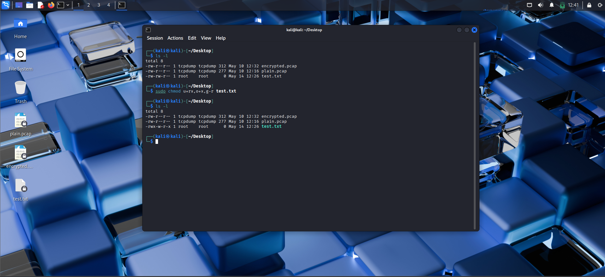
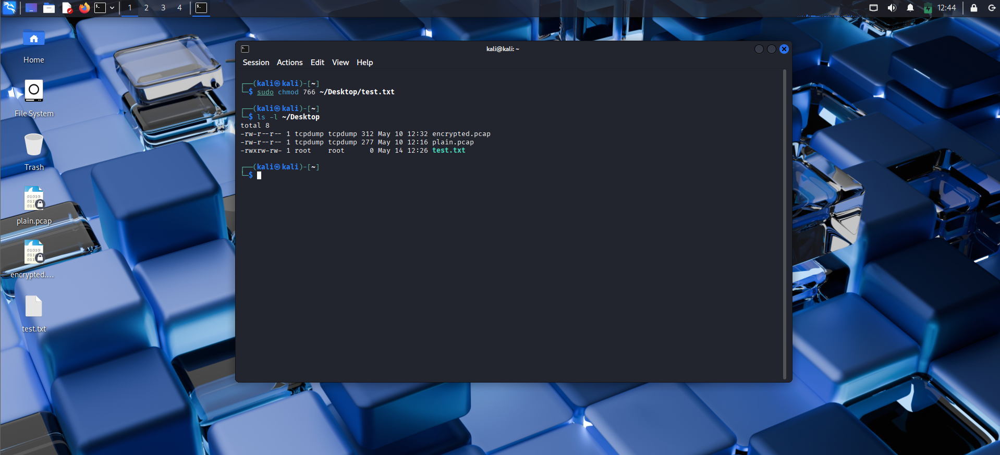
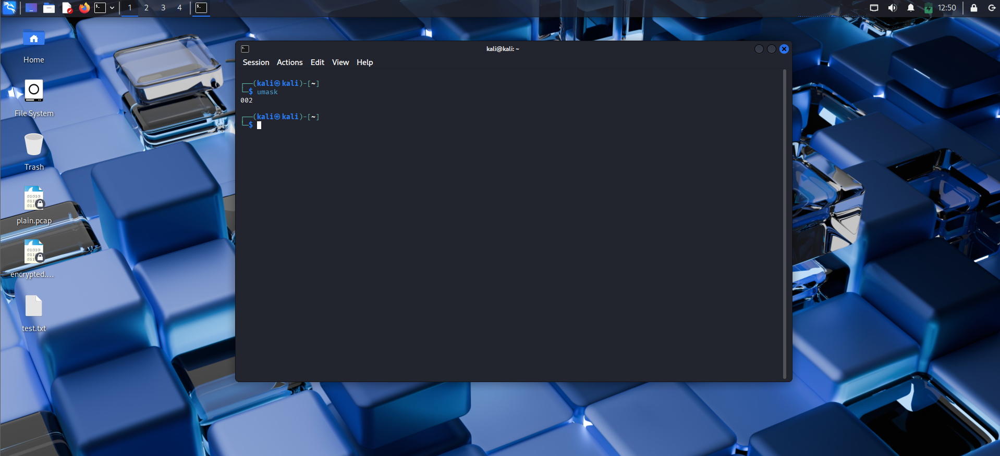
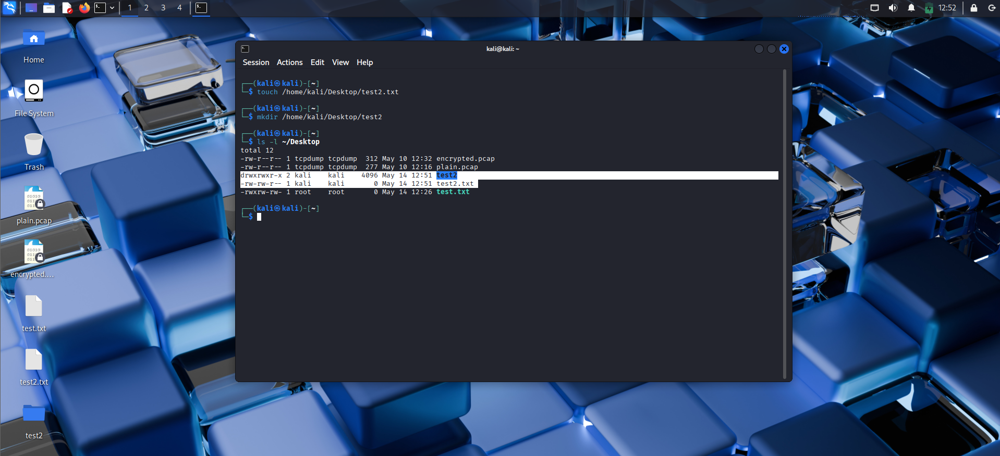
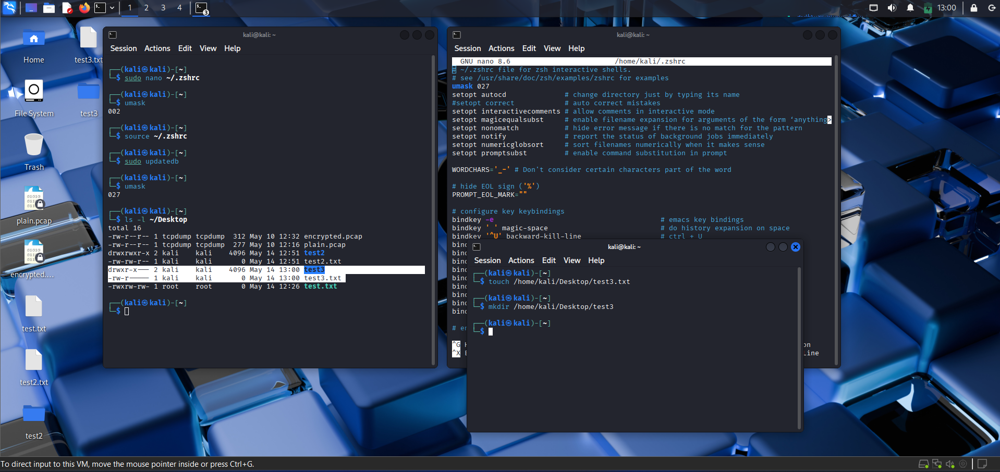
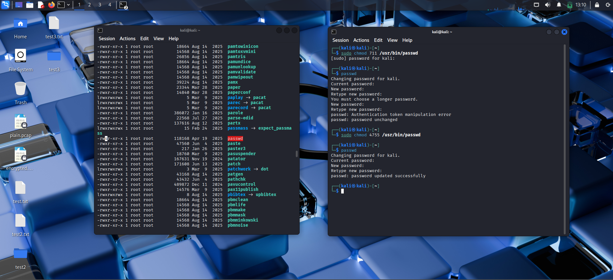

We have different users on a system, and files and directories must not be accessible to everyone. Linux provides methods for securing files and directories using **permissions**: read, write, and execute. These permissions can be assigned to three entities: the owner of the file, a specific group of users, and all other users.

In this chapter, we will look at checking, granting, setting default, and using special permissions. We will also understand how knowing permissions can lead to hacking.

### Different Types of Users

The **root user** is the most powerful user on the system and can do almost anything. Other users belong to **groups**. Groups are useful because users with similar needs can be assigned to the same group, giving them shared access to files and directories.

The root user is part of the root group by default. When a new user is added, they must be assigned to a group to gain access to files and directories.

### Granting Permissions

For each file, there are three permissions:

- **r** – Read: open and view the file (4)
- **w** – Write: view and edit the file (2)
- **x** – Execute: run the file (not necessarily view or edit it) (1)

The root user can grant these permissions. Also, when a file is created, the creator (owner) can grant these permissions to others.

### Granting Ownership to an Individual User

To change permissions, you must be the root user or the owner of the file. To change ownership of a file to another user, use the `chown` (**ch**ange **own**er) command:

```bash
chown root ~/Desktop/test.txt
```

In the command above, after `chown` we specify the new owner's username, followed by the file path and name.


> *Picture: creating a file as the kali user and transferring ownership to the root user.*

### Granting Ownership to a Group

Use the `chgrp` (**ch**ange **gr**oup) command. While hackers often work alone, it's common nowadays to see them working in teams: red team, blue team, or even purple team. The red team needs access to hacking tools, so they might be in the root group. The blue team only needs access to defensive tools such as intrusion detection systems (IDS).

For example, if the red team downloads a software and wants to give it to the blue team:

```bash
sudo chgrp blueteam software
```


> *Picture: changing group ownership from kali to root group.*

### Checking Permissions

To view permissions of files and directories, use `ls -l` (long listing format), which we learned in Chapter 1.



From left to right, the output shows:

| Field | Description |
|-------|-------------|
| File type | `-` for file, `d` for directory, etc. |
| Permissions | Three sets: owner, group, others (e.g., `rwxr-xr--`) |
| Number of links | Hard links to the file (search AI for "links") |
| Owner | Username of the file owner |
| Group | Group name |
| Size | File size in bytes |
| Timestamp | Last modification time |
| Name | File or directory name |

Specifically, the permission string:  
- First character: `-` = file, `d` = directory.  
- Next three: owner permissions (`r`, `w`, `x`).  
- Next three: group permissions.  
- Last three: other users' permissions.  

A dash (`-`) means the permission is not granted. These permissions are not fixed; the root user or file owner can change them.

### Changing Permissions with UGO (Symbolic Method)

Some users prefer symbols rather than numbers. This is called **UGO syntax**.

Syntax: `chmod` + `u/g/o` + `+/-/=` + `r/w/x` + filename.

- `u` = user (owner)
- `g` = group
- `o` = others

Operators:
- `+` add a permission
- `-` remove a permission
- `=` set exact permission

Examples:
```bash
# Give execute permission to the owner
sudo chmod u+x test.txt

# Multiple changes at once
sudo chmod u+rx,o+x,g-r test.txt
```



### Giving Root Execute Permission on a New Tool

When you download a tool, Linux by default assigns permissions `666` (read/write for all) to files and `777` to directories. This means you cannot execute the tool immediately. You need to change the permissions.

For example, to give the owner execute permission while allowing group and others only read/write:

```bash
sudo chmod 766 ~/Desktop/test.txt
```

Here, `7` (owner: read(4)+write(2) +execute(1)), `6` (group: read+write), `6` (others: read+write).



Note: We changed the permission with Decimal Notation. we add the numbers we want together and put them back to back for owner, group, and others. Read is 4, write is 2, and execute is 1. So, if I want to give all, I will use 7. First digit is for the owner, next is group and final digit is for the others.
### Setting More Secure Default Permissions with `umask`

Linux has default permissions: files start as `666` (`-rw-rw-rw-`) and directories as `777` (`drwxrwxrwx`). The `umask` (user file-creation mask) subtracts a value from these defaults.

Run `umask` in the terminal to see the current mask.



If `umask` is `002`, then:
- New file permissions: `666 - 002 = 664` (`-rw-rw-r--`)
- New directory permissions: `777 - 002 = 775` (`drwxrwxr-x`)



To permanently change the umask (for Zsh users), edit `~/.zshrc` and add a line like `umask 027`. Then apply changes:

```bash
nano ~/.zshrc
```


Note: To apply the changes, use `source ~/.zshrc` command.
### Special Permissions

Linux has three special permissions: **SUID** (Set User ID), **SGID** (Set Group ID), and the **sticky bit**.

#### Granting Temporary Root Permissions with SUID

Normally, you need proper permissions to read/write/execute files. But some programs, like `passwd`, need to modify `/etc/shadow` (a file only writable by root). SUID solves this.

When a binary has the SUID bit set, it runs with the privileges of the file's owner (usually root), regardless of who executes it.

The SUID digit is `4`, placed before the normal three-digit permission (e.g., `4755`).
In the `ls -l` format displaying, this `4` is visible as `s`in the place of `x` like this: `-rwsr-xr-x`
When we have the `s`, it means we have the `x` and SUID enable at the same time.

Example with `passwd` (without SUID you cannot change your password):

```bash
# Remove SUID (temporarily break passwd)
sudo chmod 711 /usr/bin/passwd
# Try changing password – will fail
passwd
# Restore SUID
sudo chmod 4755 /usr/bin/passwd
# Now it works again
passwd
```



> **Important:** SUID only affects execution; the execute permission must still be set. Only root can toggle SUID. After restoring SUID with `4755`, the execute bits are also restored (`5` = r-x). It works.

#### Granting Root Group Permissions with SGID

SGID works similarly but for group ownership. The digit is `2`.

When SGID is set on a **directory**, any new file created inside that directory inherits the directory's group, not the creator's group.

Example:
- Directory belongs to group `sales`
- You belong to group `engineering`
- You create a file inside → file belongs to `sales`.

Note: SGID in `ls -l`, again is the `s` but in the group section not the user section like this: `-rwxr-sr-x`
#### The Outmoded Sticky Bit

The sticky bit was used on directories to prevent users from renaming or deleting files owned by others. It is now largely obsolete in modern Linux (though still seen in `/tmp`). Just know it existed.

### Special Permissions, Privilege Escalation, and the Hacker

A hacker can search for binaries with SUID enabled using:

```bash
sudo find / -user root -perm -4000
```

If such a binary is vulnerable, the hacker may gain **privilege escalation** – executing code with root privileges. For example, they could edit `/etc/shadow` or use the application to access password hashes.

Understanding these permissions is critical for both system defense and ethical hacking.

