## Chapter 6: Managing Processes

Most of the time, we have hundreds or even thousands of processes running on our system. A **process** is a program that runs and uses resources — a terminal, a web server, any running command, a database, the GUI interface, or something else.

As a hacker or security engineer, we need to know about running processes and manage them to optimize the system. We need to find the process first, and we can use scripts to automate this.

### Viewing Processes

Most of the time, the first action is viewing running processes. We can use the `ps` command to see them in Linux.

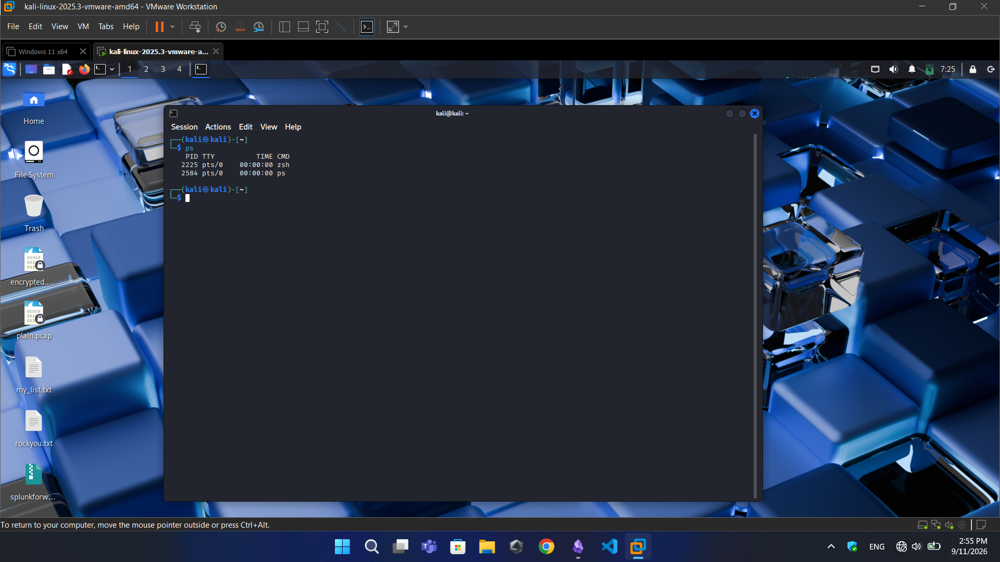

The Linux kernel assigns a **PID (Process ID)**, a unique number, to every process it creates, sequentially.

> **Note:** The PID is far more important than the process name itself because when we work with processes, we need the PID.

The `ps` command is not very useful without options. It lists only the processes started by the logged-in user and processes running on that terminal.

In the picture `01-ps.png`, the output shows that we have a `zsh` shell running, and within it, the `ps` command.

Sometimes we want more information than the basic `ps` command provides. For example, we want to see processes belonging to other users or processes running in the background by the system. We can use `ps aux`. This shows all processes running on the system by all users, including system background processes.

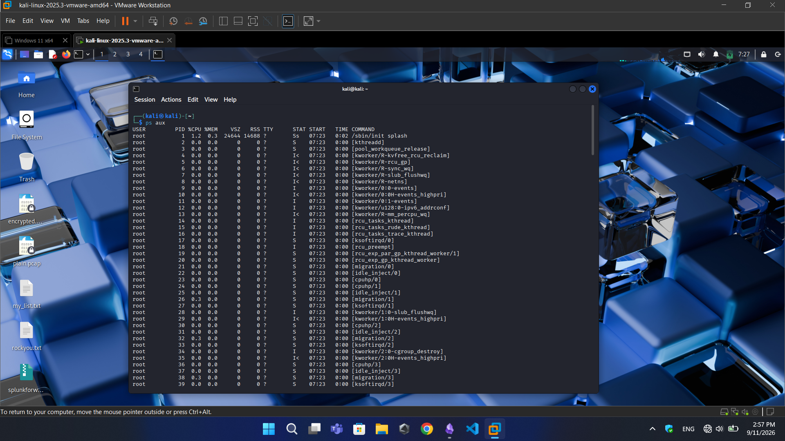

> **Note:** This option does not use a dash (`-`) and must be written in lowercase.

As we can see, many processes are running. The output includes columns such as: `USER`, `PID`, `%CPU`, `%MEM`, `VSZ`, `RSS`, `TTY`, `STAT`, `START`, `TIME`, `COMMAND`.

The most important columns are:
- **USER** – The user who invoked the process
- **PID** – The Process ID
- **%CPU** – The percentage of CPU being used by the process
- **%MEM** – The percentage of memory being used
- **COMMAND** – The command that started the process

In summary, we need to know the PID of a process to perform actions on it.

#### Filtering by Process Name

When we want to check a process, we usually don’t want to see a list of all processes because it is too much information. To find a process from a list, we can use the filtering command `grep`. I will test this by running Metasploit Framework and then using `ps aux` and `grep` to find it.

> **Note:** Running `msfconsole` will take over the terminal. So, we need to run our commands in another terminal.

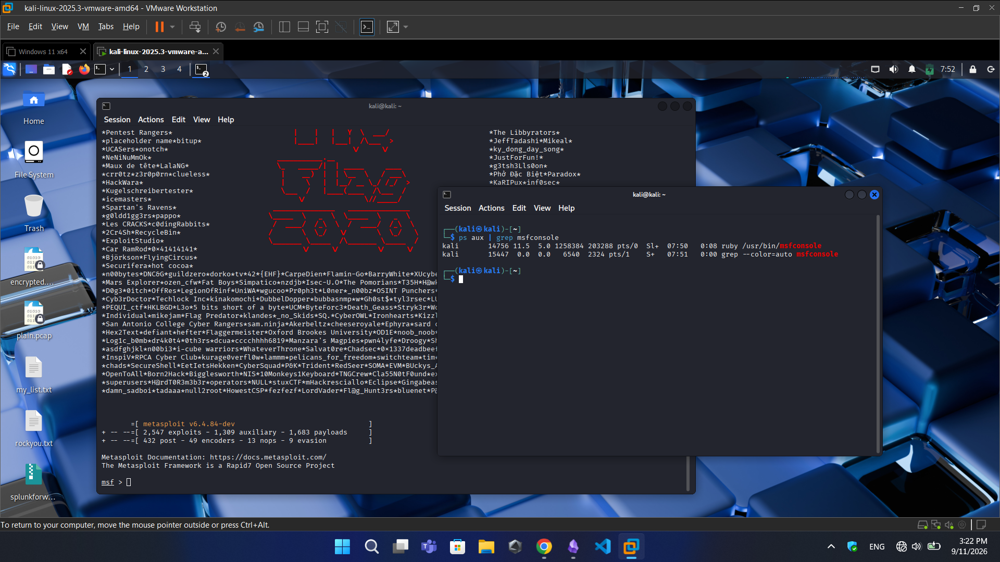

The result shows all processes matching the term `msfconsole`. Remember that when searching like this, the header columns are not displayed.

We can learn a lot from this output. By looking at the third column (`%CPU`), we can see how much CPU the process is using. In my case, it is 11.5 percent. The fourth column (`%MEM`) shows the percentage of memory used; for me, it is 5.0 percent.

#### Finding the Greediest Process with `top`

As we saw earlier, when we run `ps`, we get a list of PIDs. Sometimes we just want to see which processes are using the most resources. We can use the `top` command, which displays processes ordered by resource usage, from largest to smallest. Unlike `ps`, `top` is not a one-time command; it refreshes the list every 3 seconds by default, allowing us to identify resource-hungry processes much more quickly.

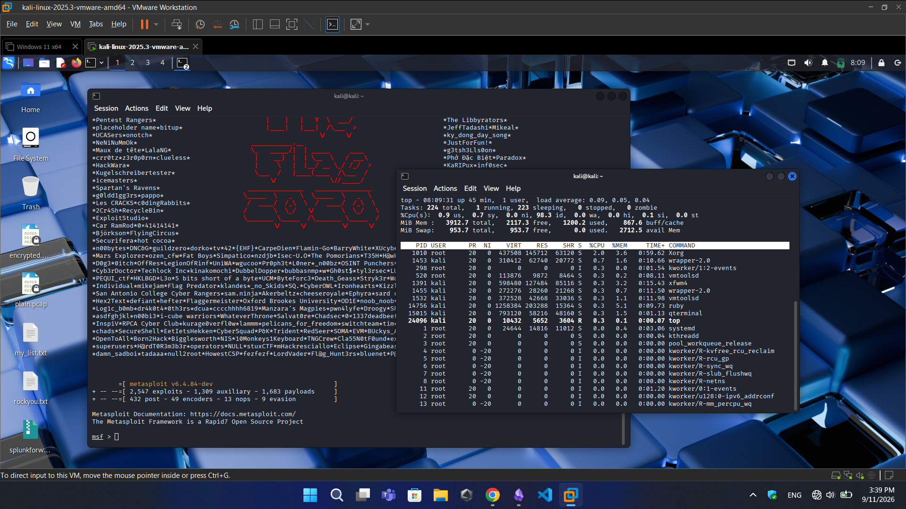

Most system administrators and hackers keep a terminal open running `top` to monitor CPU usage. We can interact with `top` as well. By pressing `h` or `?`, we will see a help page for its interactive mode. While `top` is running, we can give commands to kill a process, change a process’s priority, and change the display page.

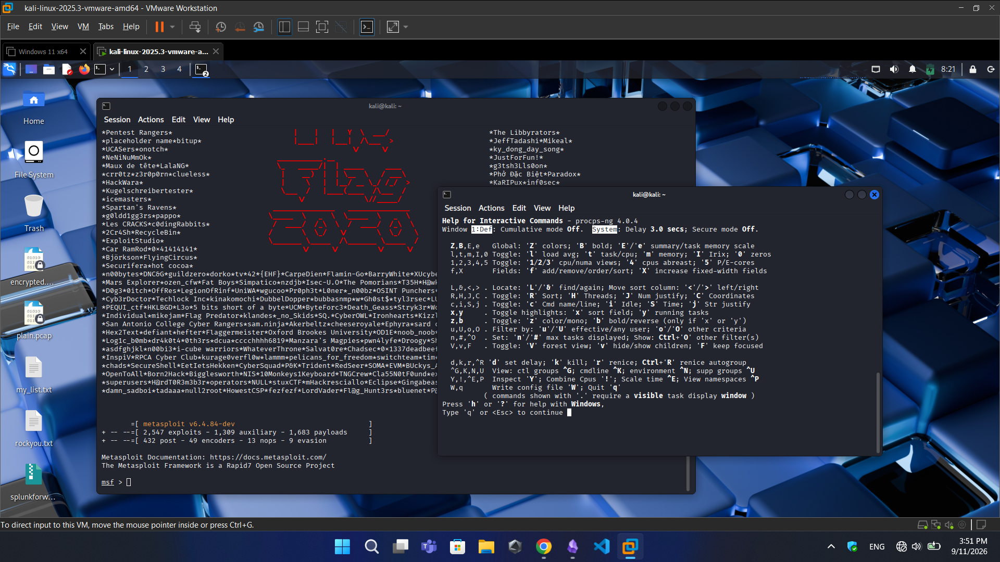

### Managing Processes

Most of the time, hackers or system administrators need to run processes simultaneously, such as port scanning, stress testing, and security testing. In this section, we will learn how to manage multiple processes.

#### Creating Process Priority with `nice`

The `nice` command is used to set or change the priority of a process. When a process is created, the kernel has the final say about resource allocation, but we can suggest a priority range.

To understand the `nice` command, think about the word itself: How *nice* are you to others when using resources? If you use too much for yourself, you are *not* nice!

The range is from -20 (highest priority) to +19 (lowest priority), with 0 as the default. A higher number means lower priority, so the process uses fewer resources. A lower number means higher priority, so the process uses more resources and is less “nice” to others. When a process starts, it inherits the nice value of its parent. A regular user can lower the priority (increase the nice value) but cannot raise it (decrease the nice value). As root, you can change it to any value.

You can check the current nice value by running `nice` alone.

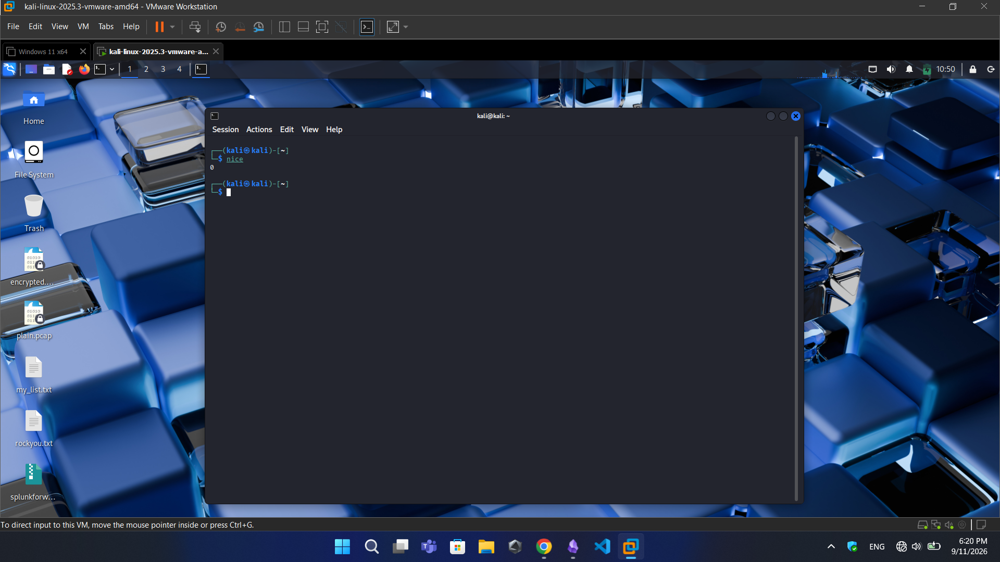

We can run a process with a specific nice value using `nice`, and while it is running, we can change the value using `renice`. Note:
- `nice` sets a **relative** adjustment (increment/decrement from the default).
- `renice` sets an **absolute** value.

#### Setting the Priority When Starting a Process

For learning, I will use a process suggested by DeepSeek AI. It says to run this command, which puts the CPU at 100%. It prints `y` forever, and redirecting to `/dev/null` discards the output.

```zsh
yes > /dev/null &
```

> **Note:** I am using Kali Linux in a VM with 4 CPU cores. I learned that when I run the above command twice, each process uses a separate core. So, in `top`, both processes show 100% and they are not competing for CPU. I will force both processes to run on one core using the command below, which I learned from AI:

```zsh
taskset -c 0 yes > /dev/null &
taskset -c 0 nice -n 19 yes > /dev/null &
```

First, I will run `top` in one terminal to monitor. Second, I will show the default value of `nice` in another terminal. Third, I will run the commands above in two terminals to show CPU usage.

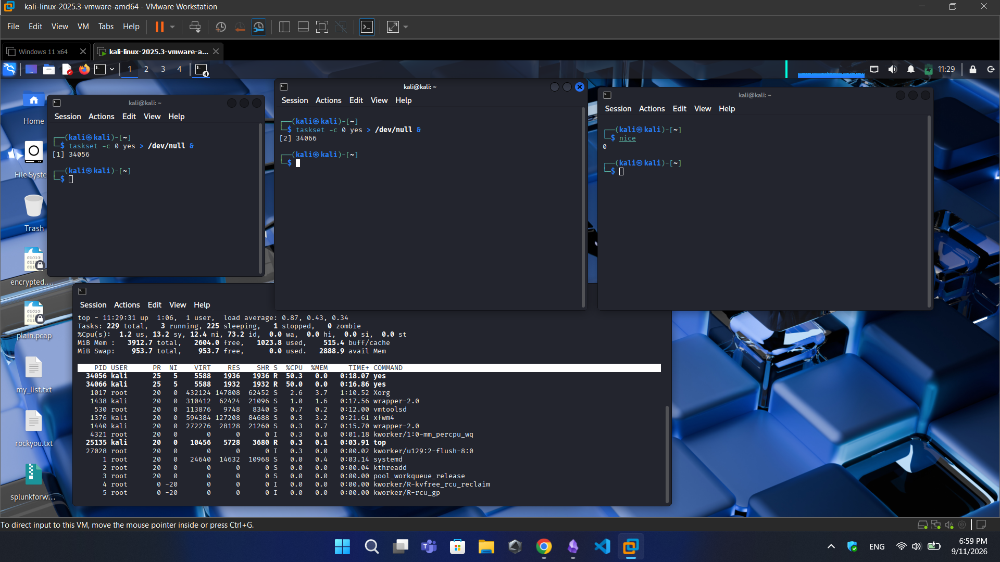

Now, I will start the processes again, but this time I will give one process a high nice value to check if it reduces CPU usage.


**The Golden Rule to remember:**
> **`nice` is a relative weight, not a speed limit.**
> If nothing else needs the CPU, even a nice-19 process will run at full speed.

#### Changing the Priority of a Running Process with `renice`

The `renice` command takes a number from -20 to 19 and sets the nice value of a running process to that absolute value, ignoring its starting value. We need the PID to use `renice`.

```zsh
renice <value> <pid>
```

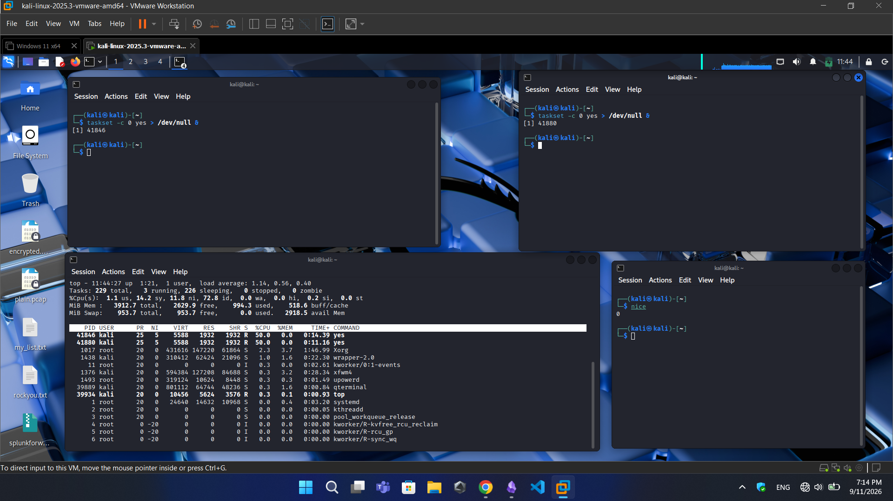
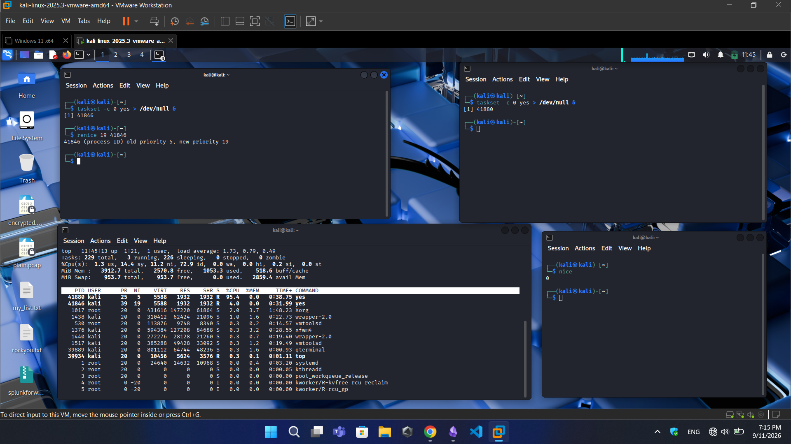

> **Note:** You cannot decrease the nice value (making the process more resource-hungry) unless you have permission. In this case, I used `sudo`.

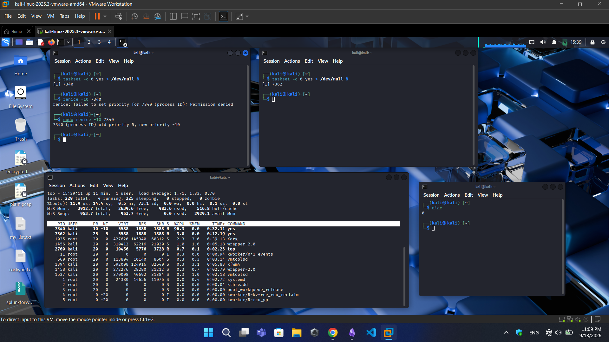

We can also renice a process from within `top`. Press `r`, then type the process PID, and then the new nice value. As with `renice`, you cannot set lower values without the proper privileges.

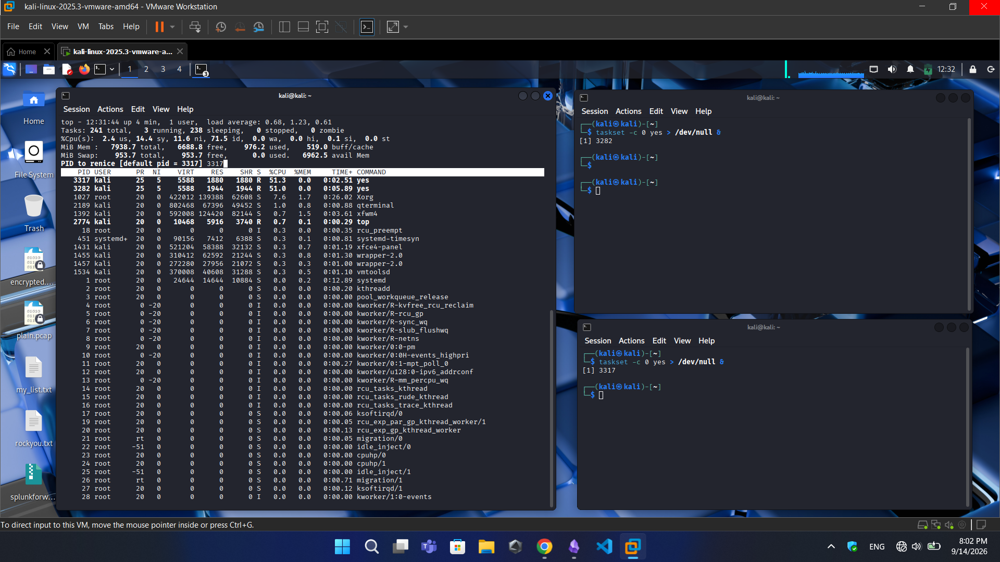
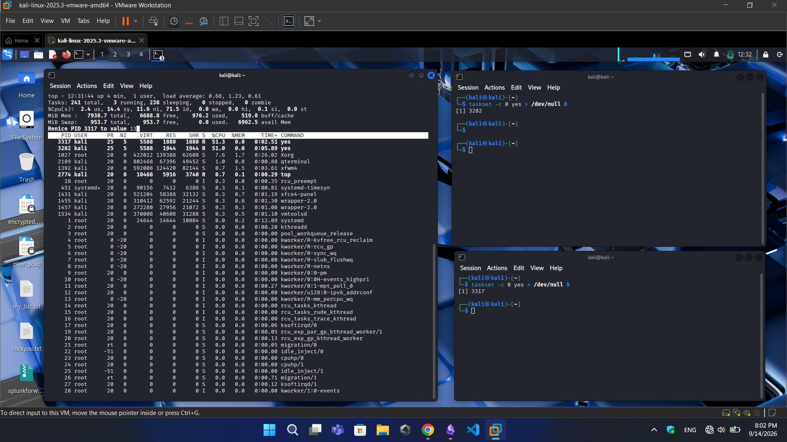
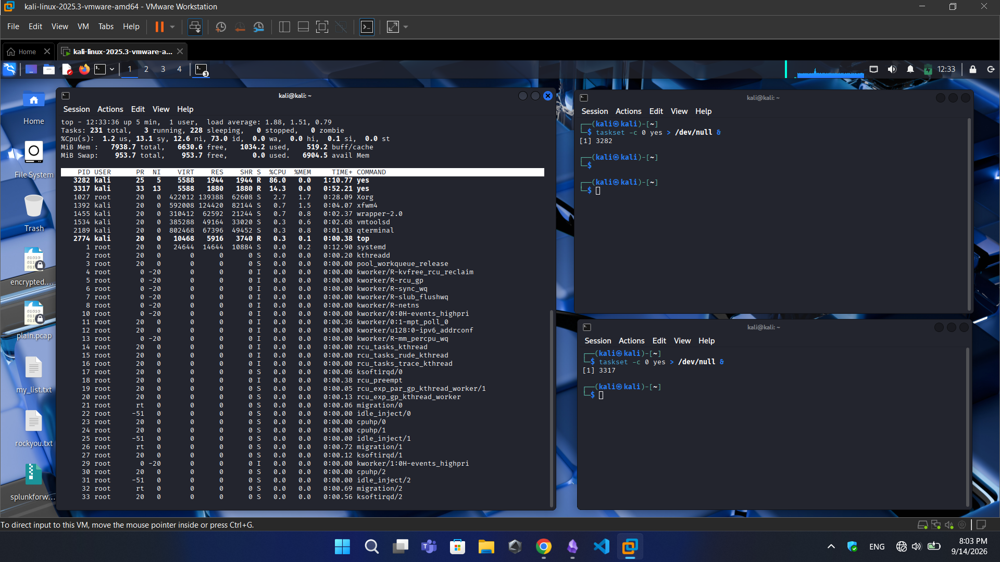

#### Killing Processes

Sometimes a process can freeze, show unusual behavior, or use a lot of resources. We can use the `kill` command to terminate it. There are 64 kill signals, but we will focus on the most important ones. The command is `kill -signal PID`. The signal switch is optional; if omitted, the default *SIGTERM* is used.

The most common signals are:
- **SIGHUP (1)** – Hangup. Stops the process and may restart it if the program or its supervisor is designed to do so.
- **SIGINT (2)** – Interrupt. Sends a weak signal that may not always work, but usually does.
- **SIGQUIT (3)** – Core dump. Terminates the process and saves its information in a file named `core` in the current directory.
- **SIGTERM (15)** – Termination. The default signal for `kill`.
- **SIGKILL (9)** – The most powerful signal. Forcefully stops the process and discards its resources and information (cannot be caught or ignored).

To terminate a process, use `kill` if you know the PID, or `killall` if you know the process name.

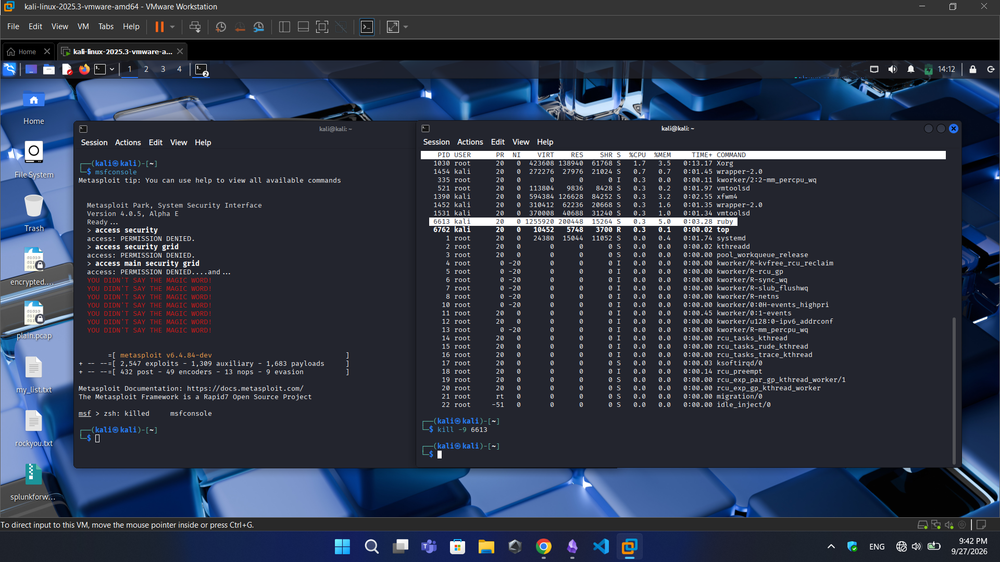
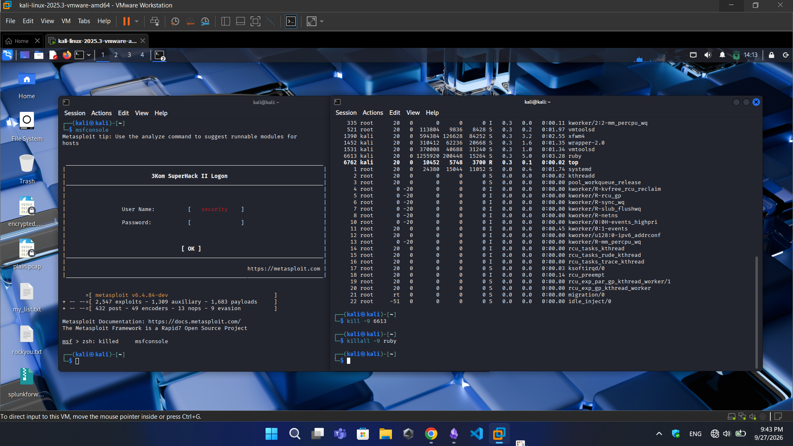

#### Running Processes in the Background

In Linux, everything we work with executes within a shell, both for GUI and command line. When we run a command, the shell waits for it to finish before accepting another command. Suppose we want to run a process in the background and still have access to the terminal. For example, if we use `yes > /dev/null`, it will send `y` to the void until we stop it. While it runs, we cannot enter another command in that terminal.

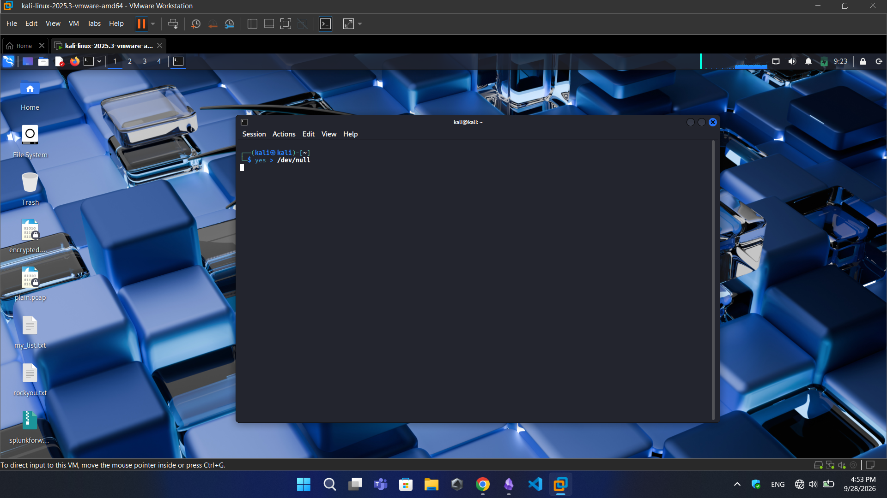

Of course, we could open another terminal, but it is better to run the process in the background. To do this, simply add an ampersand (`&`) at the end of the command:

```zsh
yes > /dev/null &
```

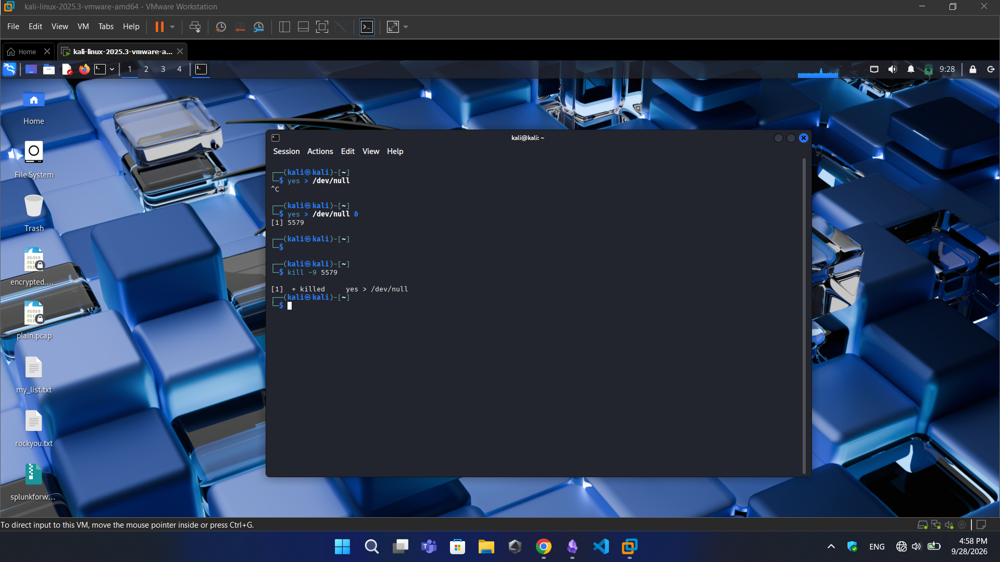

We can also move a process to the background using the `bg` command followed by the PID. To move a process to the foreground, use `fg` followed by the process name.

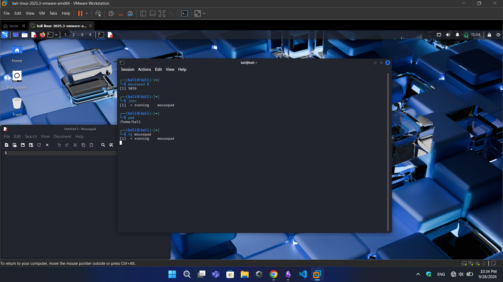

### Scheduling Processes

Sometimes we need to schedule tasks to run at a specific time. In Linux, we can use two tools: `at` and `crond`. I will cover the `at` command for now. It uses a daemon (background process) called `atd` to schedule and run processes in the future. First, we need to install `at` on our Linux system.

```zsh
sudo apt install at
```


Second, we need to give `at` the time we want to run our commands. Then `at` goes into interactive mode and accepts the commands to execute at that time. Next, use `CTRL + D` to exit interactive mode.

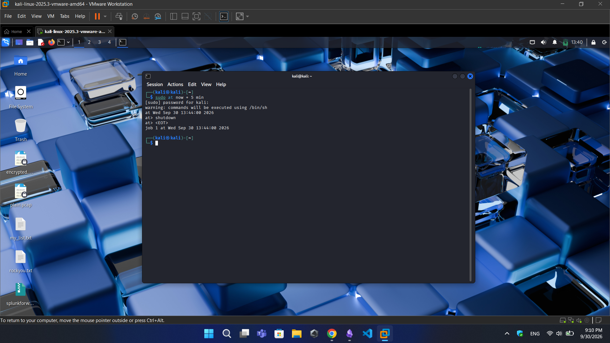

---
