We have different tools for analyzing the network on Kali. We will check some of the most common ones in this chapter.

### Command Line Tools

#### ifconfig

One of the most basic commands is `ifconfig` (similar to `ipconfig` on Windows). We can get information like: IPv4 private address, netmask, broadcast IP address, IPv6 address, MAC address, and loopback (localhost) IP address.

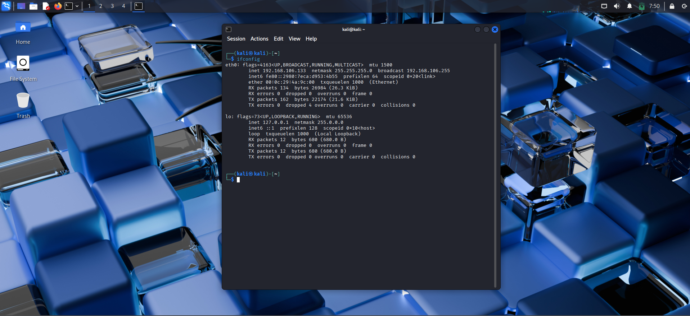

#### ping

Another useful command is `ping`. It tells us whether a system is alive or not. For `ping` we can use either an IP address or a domain name. `ping` uses ICMP (Internet Control Message Protocol) to check the system.

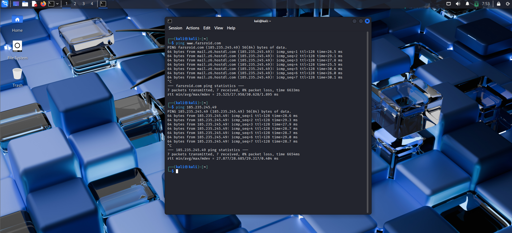

#### netstat

Network statistics (`netstat`) is another command-line tool that shows connections coming to or going from the device. It can be useful for troubleshooting and finding malware connections. You can use these switches with `netstat` as well:

- `-a`: for all connections
- `-t`: for TCP connections
- `-u`: for UDP connections
- `-l`: for all listening connections

You can also pipe (`|`) the output of `netstat` to `grep`. For example, if we have an Apache web server running and listening, we can use:

```bash
netstat -a | grep http
```
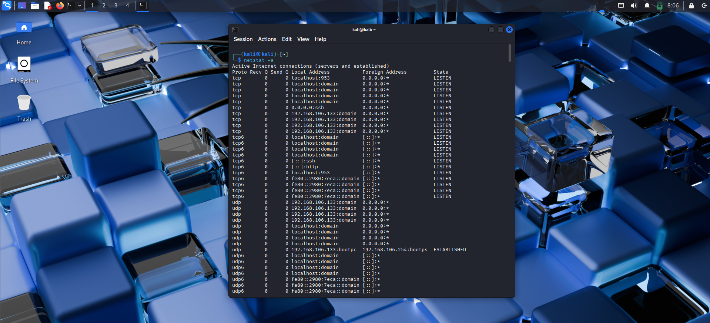
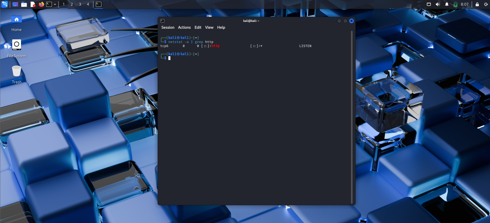
#### ss

`ss` is another command-line tool for network monitoring. It works just like `netstat`, but displays even more information.


---

### Network Sniffers

Network sniffers go by many names: packet analyzer, protocol analyzer, or network traffic analyzer. They listen to and inspect network traffic passing by. They are important tools for both hackers and network engineers. For attacks like DNS spoofing and Man‑in‑the‑Middle (MitM), sniffers are essential.

Some popular sniffers:

- SolarWinds Deep Packet Inspection and Analysis Tool
- Tcpdump
- Windump
- Wireshark
- Network Miner
- Capsa
- tshark

We will focus on the two most common ones: **Tcpdump** and **Wireshark**. We'll also take a look at the NSA's EternalBlue exploit to better understand how these sniffers work.

For many years, the FBI used a sniffer called **"Carnivore"** to listen to and analyze the network of people suspected of crimes!

---

#### Prerequisites to Sniffing

To **sniff**, we must put our Network Interface Card (NIC) into **promiscuous mode**. This means our NIC will pick up **any** packets traveling on the network around it. (Normally, NICs only accept data addressed to their own MAC address, not others'.)

The standard format for saving captured data is **.pcap** (packet capture) files. Linux uses the `libpcap` library, and Windows uses `WinPcap` or `Npcap`.

---

### Tcpdump in Action

Tcpdump is one of the earliest sniffers from Linux/UNIX systems (1988). It was developed by researchers at the Lawrence Livermore National Laboratory in Berkeley, CA, running BSD Unix. It uses the Berkeley Packet Filter (BPF) format to create filters. Tcpdump is lightweight, versatile, and perfect for remote work or when we don't have access to GUI‑based sniffers like Wireshark.

To start using Tcpdump, type `sudo tcpdump` in the terminal. You will see packets moving through the network!

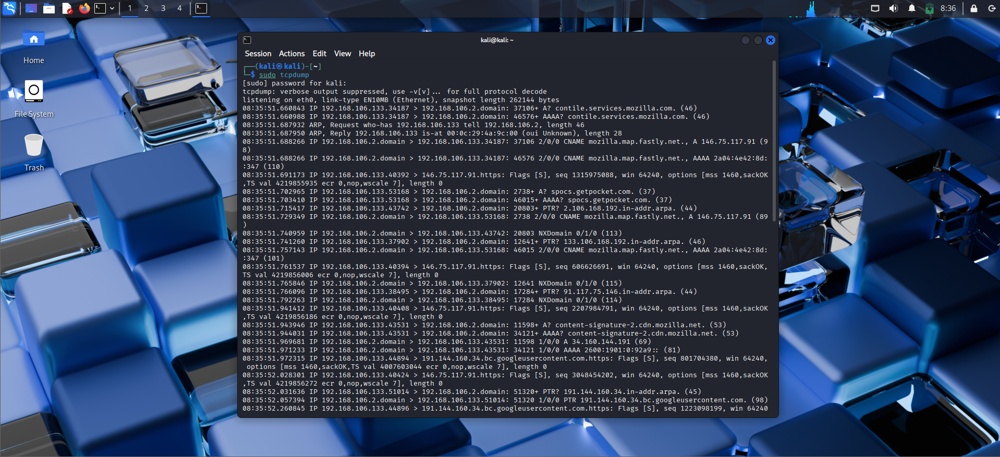

To understand it better, open two terminals. In one, run a `ping` command; in the other, start `tcpdump`. Because `ping` uses ICMP, you should see ICMP traffic in the tcpdump terminal.

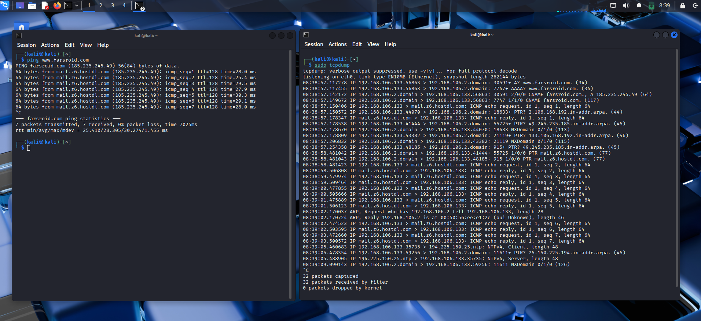

As you can see, we have ICMP request and reply – that means the system is pinging!

Let's say we want to capture data with Tcpdump and then analyze it with Wireshark. We can use:

```bash
tcpdump -w myoutput.cap
```

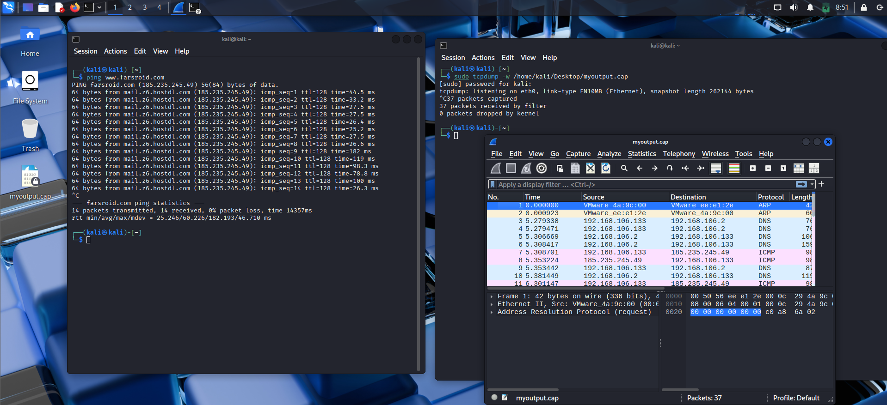

**Note:** When we start capturing and saving to a `.pcap` file, we won't see any packets on the tcpdump terminal itself – they are being saved directly to the file.

---

#### Filter by IP Address

With tcpdump filters, we can capture only traffic coming to or going from our machine.

Use this command:

```bash
tcpdump host <IP address>
```

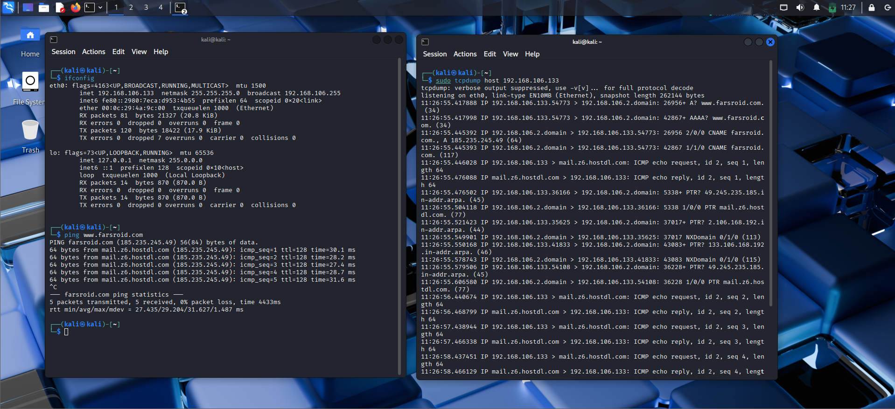

Now let's see some TCP flags in tcpdump action!

First, start your Apache server on Kali:

```bash
sudo service apache2 start
```

Enter your password if prompted.

Next, filter traffic to/from your system only. Then open a browser on Kali and type your system's IP address (the same one you used in the tcpdump filter).

If you look closely, you'll see `S` flags (SYN) and `R` flags (RST).

**Note:** tcpdump uses a dot (`.`) to represent the ACK flag.

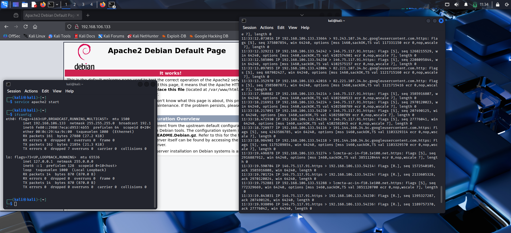

If we want to filter only traffic **coming from** a specific source IP, use:

```bash
tcpdump src host <IP address>
```

Now we see only packets originating from that source.

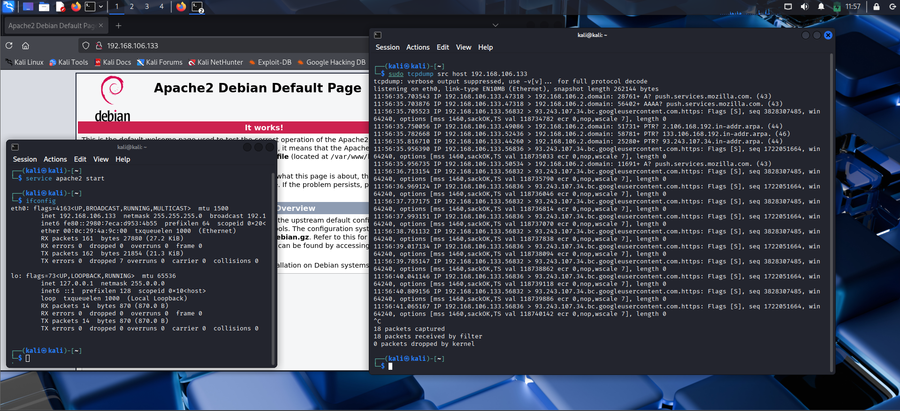

---

#### Filter by Ports

What if we want to capture all traffic but keep only traffic going to a specific port?

For example, let's filter all traffic except traffic to port 80. We can use the `-vv` (very verbose) option to decode all IP and TCP headers and find useful data (like user agent).

```bash
tcpdump -vv port 80
```

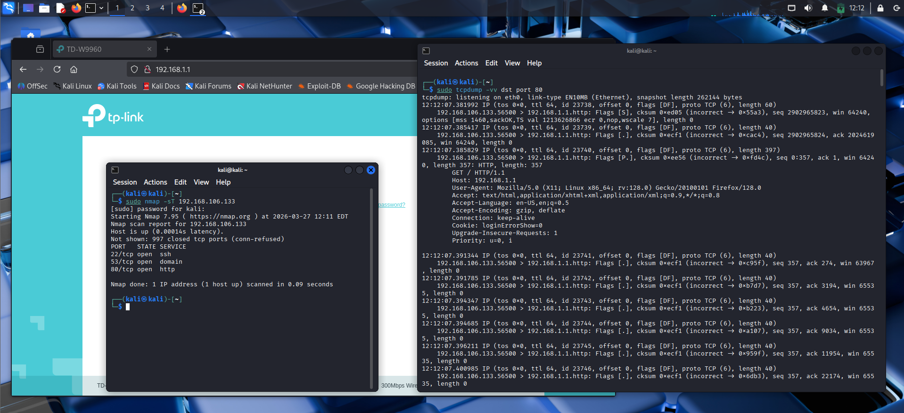

---

#### Filter by TCP Flags

For example, to see only traffic with the SYN flag set:

```bash
tcpdump 'tcp[tcpflags] == tcp-syn'
```

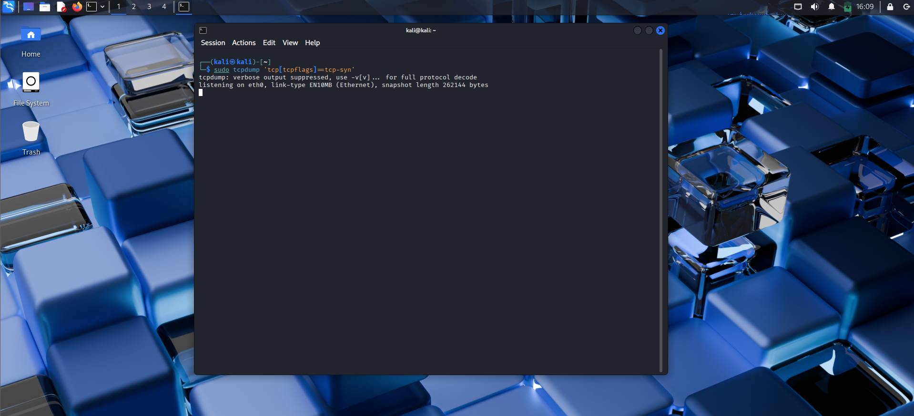
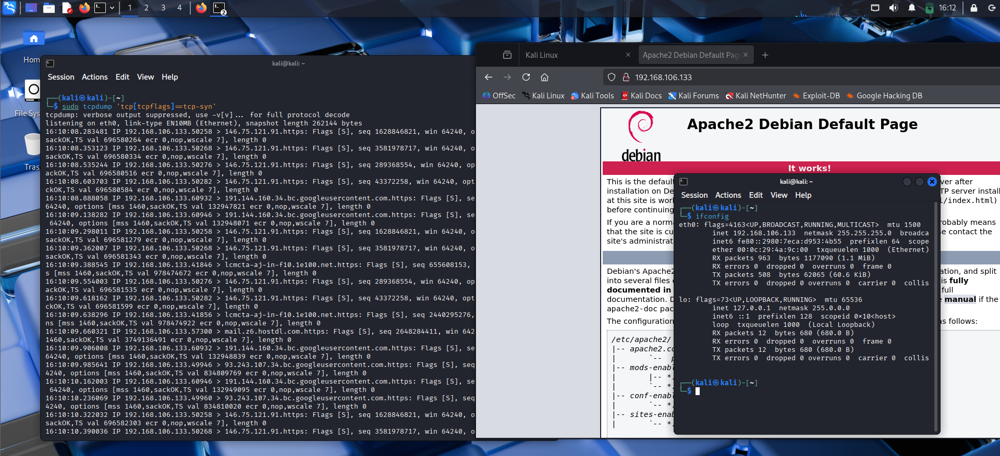

**Note:** Instead of `syn`, you can use other flags: `ack`, `fin`, `rst`, `psh`, `urg`.

---

#### Combining Filters

In tcpdump, we can combine filters with logical operators: AND (`&&`) or OR (`||`).

For example, to filter a specific IP address **and** port 80:

```bash
tcpdump host 192.168.106.133 and port 80
```

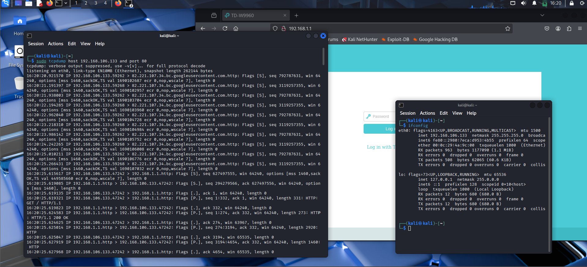

Another example – traffic on port 80 **or** port 443:

```bash
tcpdump port 80 or port 443
```

To see all traffic except from one system, use the negation symbol `!` (or `not`):

```bash
tcpdump not host 192.168.106.133
```

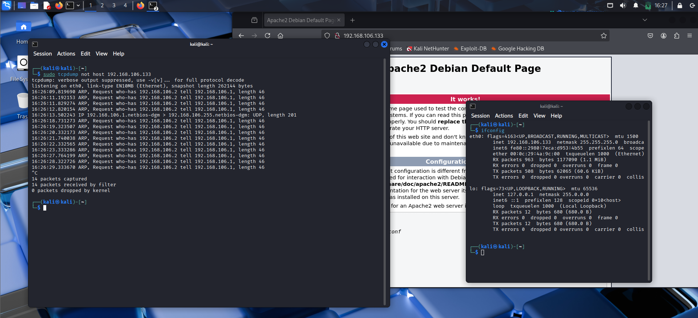

---

#### Filtering for Passwords and Identifying Artifacts

If a password is being transmitted in cleartext (unencrypted), we can use tcpdump to capture several ports and pipe to `egrep` to search for login/password strings.

```bash
tcpdump port 80 or port 21 or port 25 or port 110 or port 143 or port 23 -lA | egrep -i 'pass=|pwd=|log=|login=|user=|username=|pw=|passw=|password='
```

**Note:** If this command gives errors like "broken pipe" or "no such directory", check your syntax and ensure `egrep` is installed. 

Finally, to check the User‑Agent (browser signature) of clients:

```bash
tcpdump -vvAls0 | grep 'User-Agent'
```

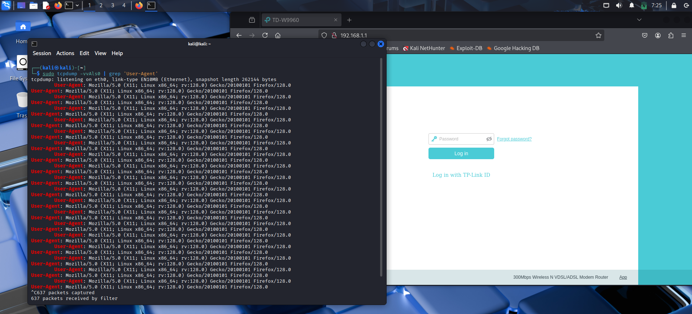

And to filter for cookies:

```bash
tcpdump -vvAls0 | grep 'Set-Cookie|Host|Cookie:'
```

---

### Wireshark – The Gold Standard in Sniffers/Network Analyzers

Among sniffers, **Wireshark** is the best. Previously it was named Ethereal. Every security admin has it in their arsenal. Kali includes Wireshark by default. To run it, open the GUI or type `wireshark` in the terminal.

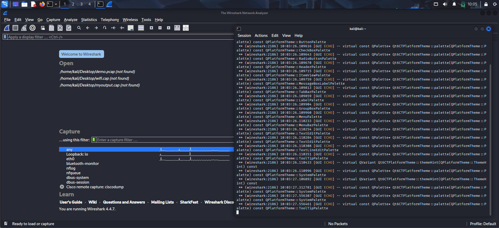

The first thing we must do after opening Wireshark is select the interface we want to work with. If we are using a VM, we need to select `eth0` (or the appropriate interface). If we have other interfaces, we can select them as well.

After selecting the interface, Wireshark will start capturing packets into `.pcap` format – the standard format for sniffers. This format is also used by other applications like Snort, Aircrack‑ng, tcpdump, and others.

In the Wireshark window, we have three smaller panes:

- **Packet List Pane (PLP)** (top) – Shows real packets moving on the network.

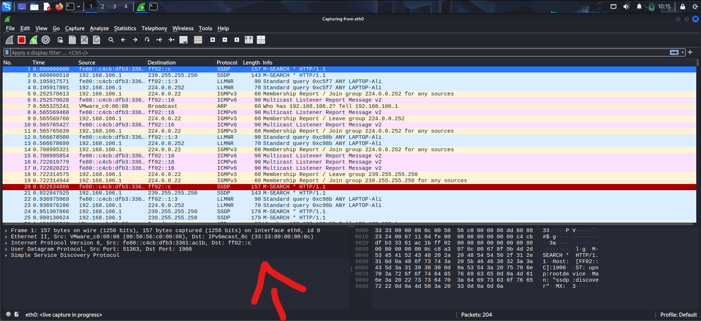

- **Packet Details Pane (PDP)** (middle left) – When we select a packet in the PLP, the PDP shows its header information.

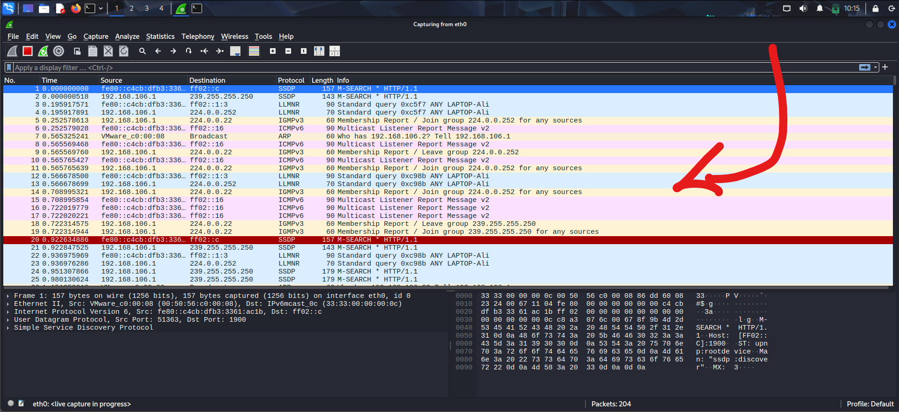

- **Packet Bytes Pane (PBP)** (bottom) – Shows the payload in hexadecimal (left) and ASCII (right).

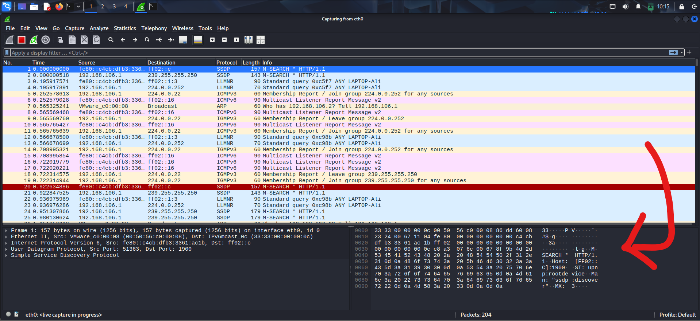

---

#### Crafting Filters in Wireshark

Because the number of packets can be overwhelming, we need to use filters to find traffic of interest.

One important filter is filtering by **protocol**. For example, type `tcp` in the filter bar at the top. If the syntax is correct, the background turns green; if incorrect, it turns dark red.

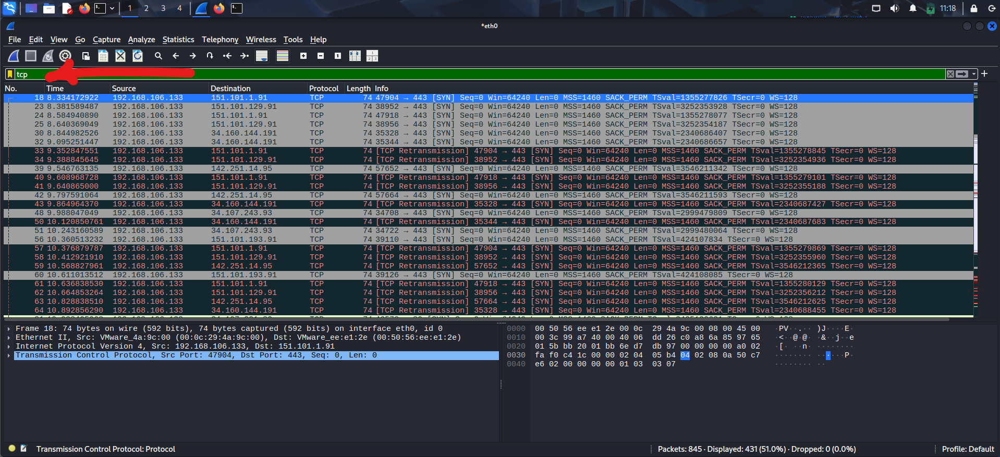

We can try other protocol filters too: `dns`, `udp`, `arp`, etc.

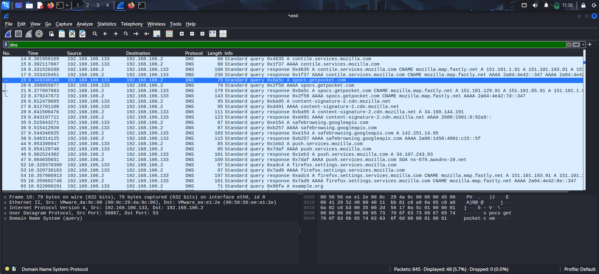

To see packets from a particular IP address (both sending and receiving), use:

```
ip.addr == 192.168.1.100
```

**Note:** Use double equal sign (`==`) as in Python.

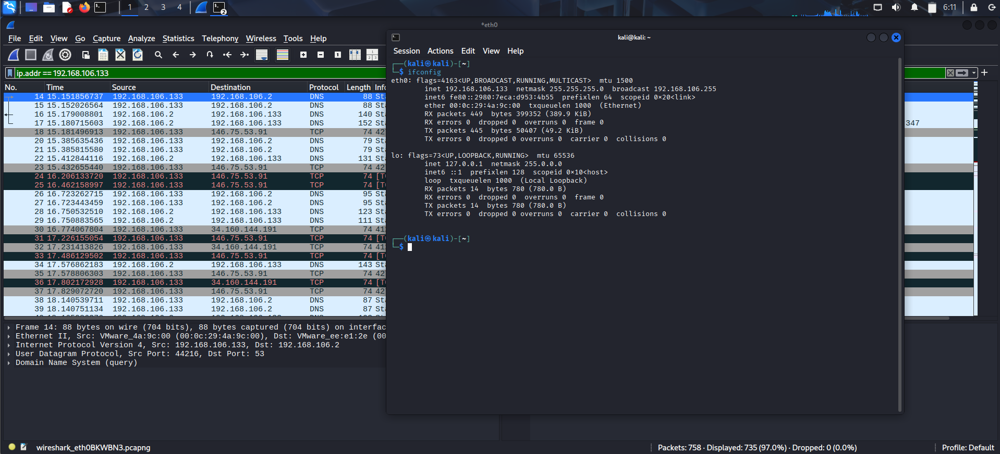

Another filter type is filtering by port. Example:

```
tcp.port == 80
```
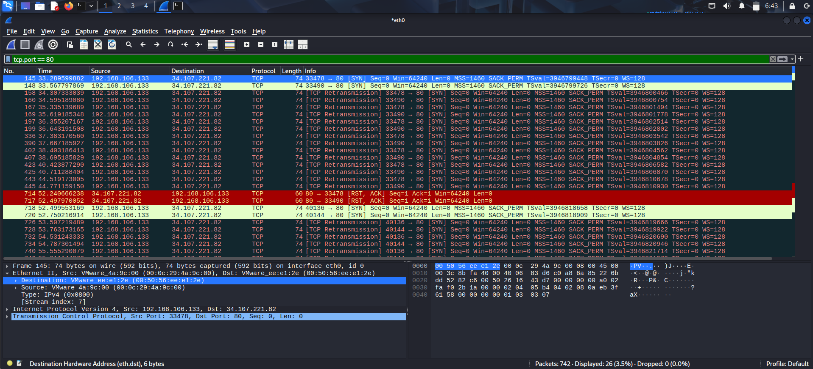

**Note:** All packets traveling through the network use either UDP or TCP. So when filtering ports, you must specify the protocol. Other useful syntaxes: `tcp.srcport`, `tcp.dstport`, `udp.port`, `udp.srcport`, `udp.dstport`.

When using the filter bar, we often look at header fields. The syntax for header fields uses `==`. But when we want to search for data **inside the payload** (hex/ASCII area), we use the word `contains`. For example:

First, capture some traffic with tcpdump:

```bash
sudo tcpdump -i eth0 host 192.168.106.133 -w /home/kali/Desktop/demo.pcap
```

Then open Firefox and visit `www.farsroid.com`. Stop the tcpdump capture (Ctrl+C).

Open the `.pcap` file with Wireshark:

```bash
wireshark -r /home/kali/Desktop/demo.pcap
```

Now apply a filter like:

```
tcp contains "farsroid"
```

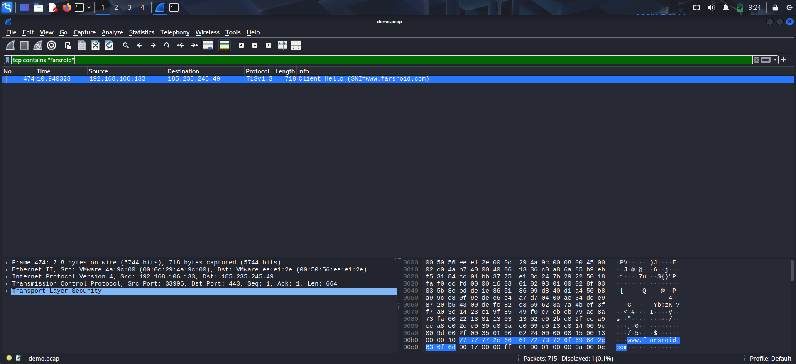

---

#### Crafting Filters with the Expression Window

If you're unsure about a filter, you can use the **Filter Expression** window. Right‑click on the filter bar and select "Filter Expression".

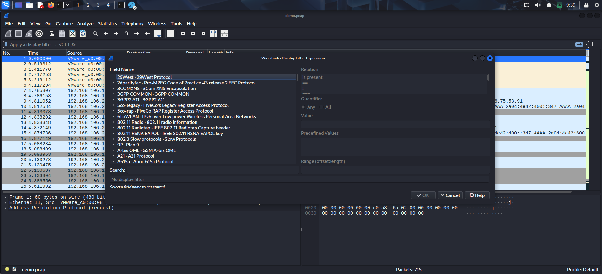

On the left is a list of fields. On the right, the most important part is "Relation". To create a filter, select a field, choose a relation (e.g., `==`), and set a value (often 0 or 1). For example, to find all packets with the TCP ACK flag set:

```
tcp.flags.ack == 1
```

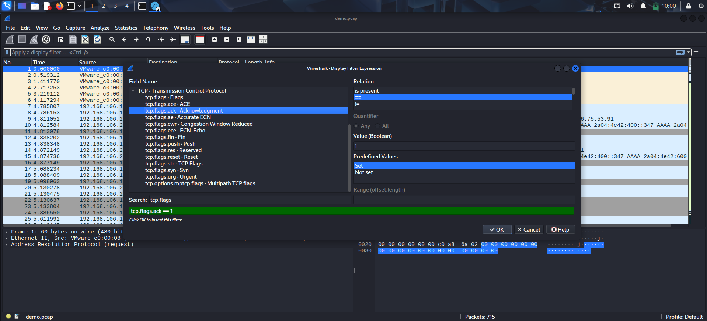

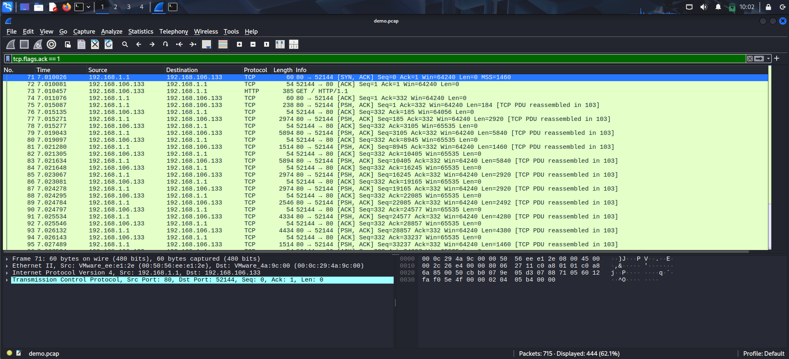

---

#### Following Streams

Sometimes we want to see the full conversation (stream) rather than individual packets. For instance, if someone is attacking your network, you can follow the stream to see the attack's behavior. To do this, select a packet, right‑click, go to **Follow** → **TCP Stream** (or UDP Stream).

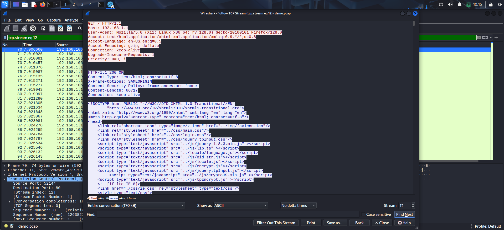

Now you can see the entire conversation of that packet.

---

#### Statistics

When analyzing a network, we can look at the **Statistics** menu to see the baseline of normal traffic.

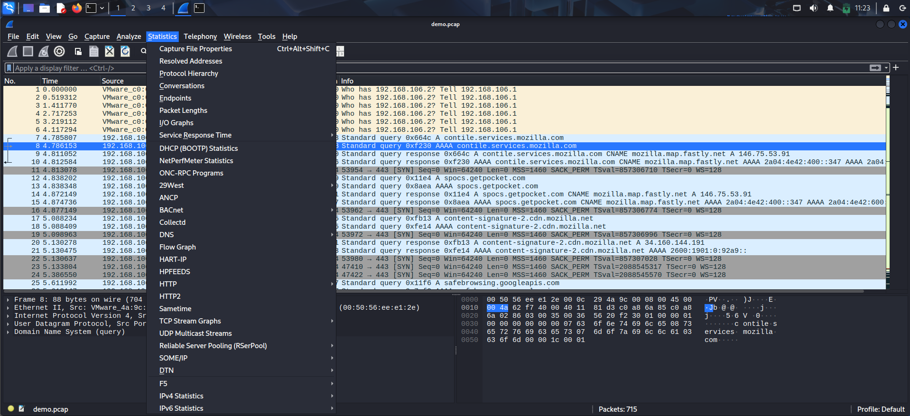

There are many options. For example, let's check IPv4 statistics:

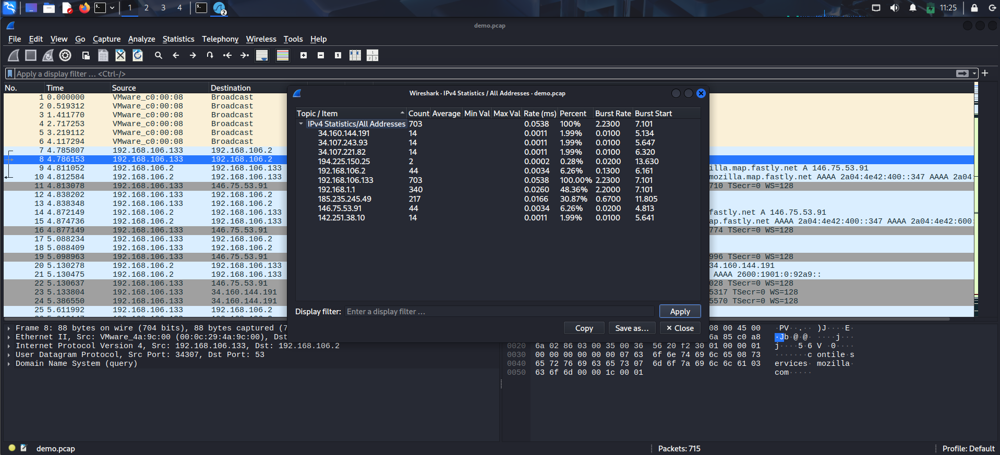

Wireshark lists all IP addresses and their traffic volumes.

---

Understanding how networks work and using tools like Tcpdump and Wireshark will make us better hackers and network engineers.
