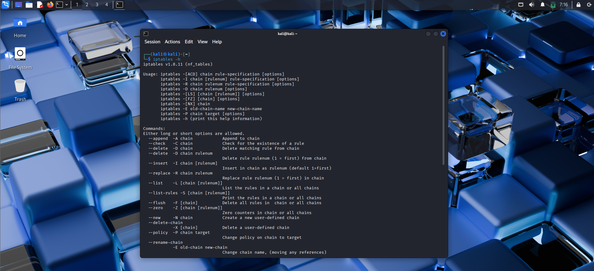
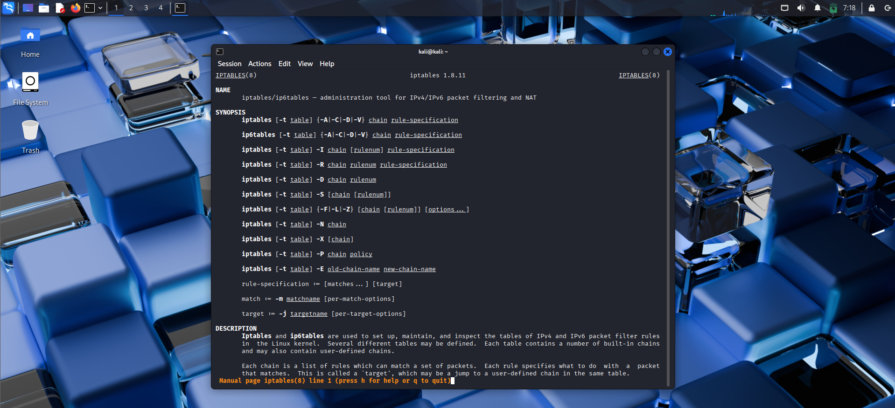
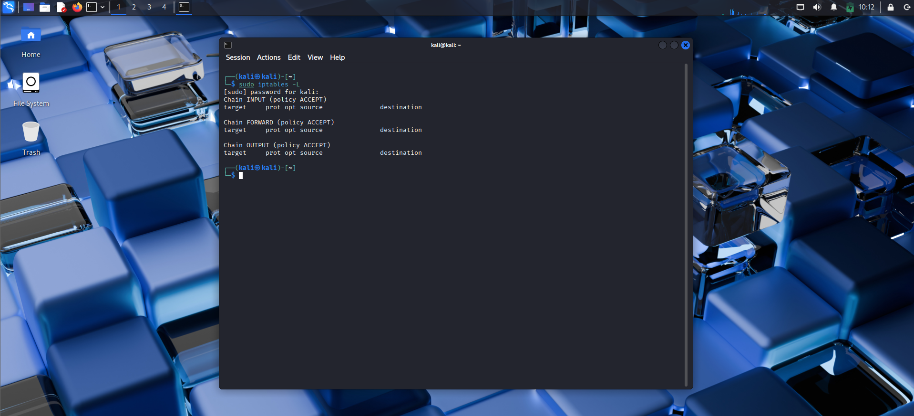
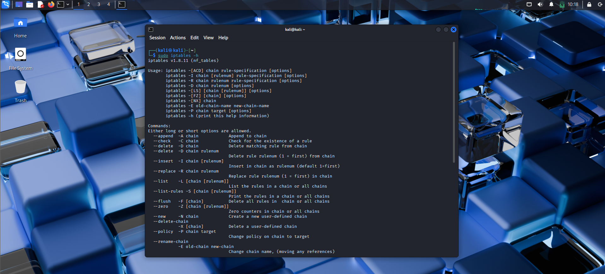
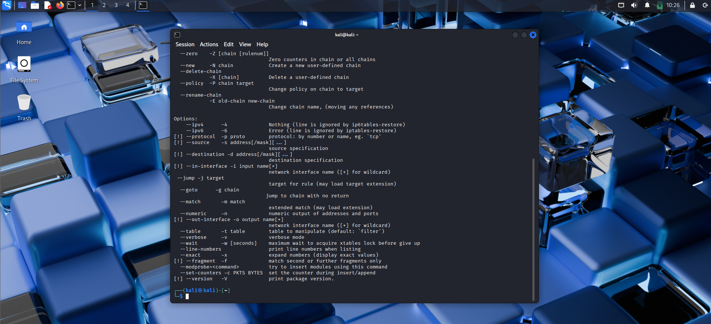
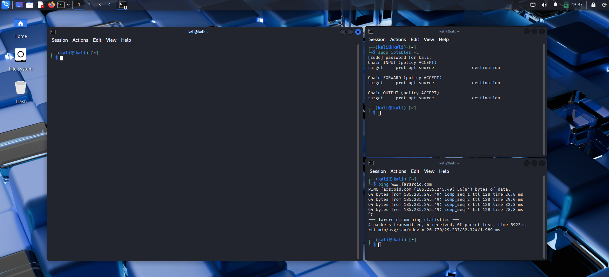
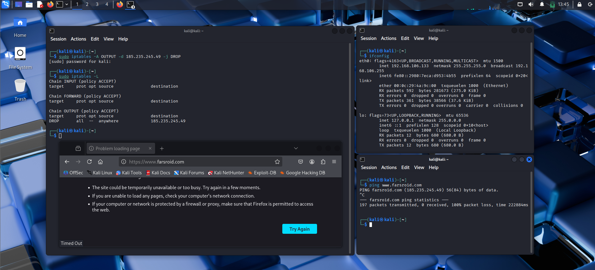
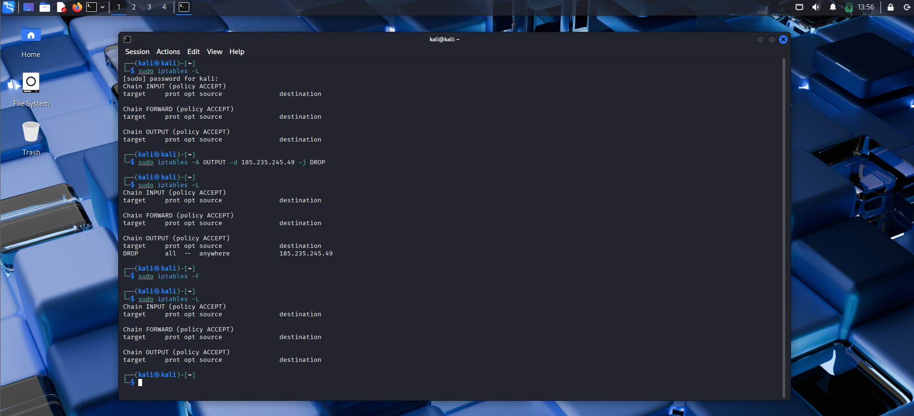

We have some knowledge of networks and packets right now, and it is a good idea to start thinking about how we can protect our network. Firewalls are the most important first line of defense. Linux has some powerful firewalls that are good with a bit of knowledge, and they are cheap.

A firewall is a subsystem on our device that controls incoming and outgoing network traffic. We have two different types: software-based and hardware-based. Software-based firewalls protect the system hosting them, while hardware-based firewalls protect the entire network and the computers on it.

Think of it like this: a hardware-based firewall is a dedicated server that filters all traffic, and the systems behind it don't need their own software-based firewalls.

One of the most flexible firewalls available on Linux and other \*nix-based systems is **iptables**. We can use the command line to set up policies for our traffic. Iptables was developed as part of the Netfilter project and has been part of the Linux kernel since January 2001.


### Iptables Basics

Iptables has three basic structures: **tables**, **chains**, and **targets**.

#### Tables

Tables are categories that define specific functionalities. The main tables are:

- **Filter** – The default table. Used for allowing or blocking traffic.
- **NAT** – Used to rewrite the source or destination addresses of packets.
- **Mangle** – Used for packet alteration, such as modifying TCP headers.
- **Raw** – Used to configure exemptions from connection tracking.

#### Chains

Chains are lists of rules within each table. Each table has built-in chains, and you can also add custom chains. The most important built-in chains are:

- **INPUT** – Packets that are received by the system (destination = local system).
- **OUTPUT** – Packets that are leaving the system (source = local system).
- **FORWARD** – Packets being routed through the system (when acting as a router).
- **MATCH** – When a packet meets the conditions defined in a rule, the action is triggered.

#### Targets

Once a packet matches a rule, the **target** tells the system what to do with it. Common targets:

- **ACCEPT** – Allow the packet to pass.
- **DROP** – Silently discard the packet.
- **LOG** – Log the packet (then continue processing).
- **REJECT** – Drop the packet and send an error message back.
- **RETURN** – Stop processing in this chain and return to the calling chain.

### Installing Iptables

Kali Linux comes with iptables pre‑installed. If you don't have it, run:

```bash
sudo apt install iptables
```

### Configuring the Default Policy

The **default policy** determines what the firewall does when a packet does **not** match any rule.

To see the current default policies, use:

```bash
sudo iptables -L
```


As you can see, all chains are set to **ACCEPT**. On most common systems, we accept all connections by default. On a very secure system, we would set them to **DROP** and then explicitly allow only necessary traffic. For now, we leave them as ACCEPT.

### Iptables Help

Take a look at the help menu:

```bash
sudo iptables -h
```

In the screenshot, look at the **Commands** section. Important commands include:

- `-A` – Append a rule to the end of a chain.
- `-D` – Delete a rule.
- `-L` – List all rules in a chain.

Now check the **Options** section:

Useful options:

- `-s` – Source address
- `-d` – Destination address
- `-j` – Jump to a target (ACCEPT, DROP, etc.)

### Creating Some Rules

**Example 1:** Block outgoing packets to a specific website (by IP address). First find the IP of the website, then:

```bash
sudo iptables -A OUTPUT -d <IP_address> -j DROP
```



**Example 2:** Block all incoming packets from a whole subnet using CIDR notation:

```bash
sudo iptables -A INPUT -s 192.168.1.0/24 -j DROP
```

**Example 3:** Block outgoing TCP traffic to port 80 (HTTP):

```bash
sudo iptables -A OUTPUT -p tcp --dport 80 -j DROP
```

**Example 4:** Allow outgoing connections to a specific website (by domain). Note: iptables doesn't resolve domain names directly; you need to use the IP address or use a helper like `-d` with the domain (it will resolve at rule creation time). Better to use the IP.

```bash
sudo iptables -A OUTPUT -p tcp -d farsroid.com -j ACCEPT
```

---

### Flush the Rules

To remove all rules and return to the default policy (ACCEPT), use the `-F` (flush) option:

```bash
sudo iptables -F
```


This clears all chains. Be careful – if your default policy is DROP, flushing will remove all rules but the DROP policy remains active, potentially locking you out.
