Lists allow you to store collections of information. Lists are one of the most powerful features of Python and will take your programming to another level.

### What is a List?

A list is a collection of items in a specific order. You can store different kinds of data in a list: numbers, names, addresses, and anything you can imagine. Because lists are collections of things, it's a good idea to name the list using a plural word. In Python, square brackets `[ ]` indicate a list. Each item in the list is separated by a comma.
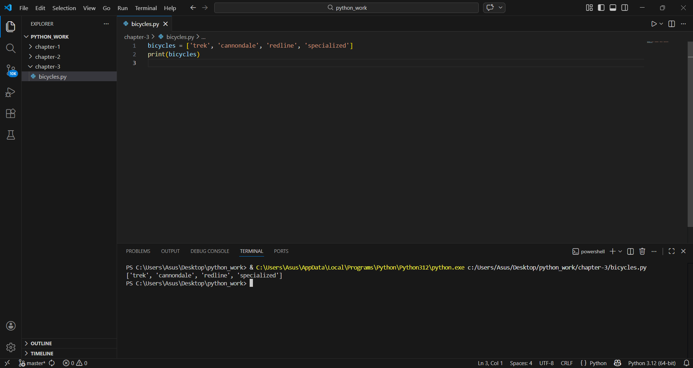

When we print the list, the output includes square brackets and commas, exactly as we typed it. This is not what we want our users to see, so we must learn how to access each element individually.

### Accessing Elements in a List

In Python, lists are ordered collections, meaning you can access each element by its position. The position number is called an **index**. We write the `print` function, then the name of the list with the index number inside square brackets:

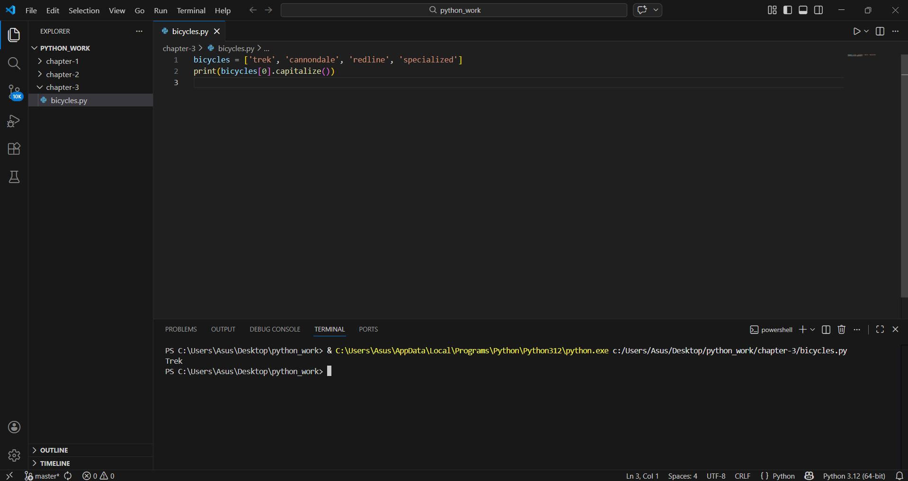

### Index Positions Start at 0, Not 1

After accessing an element using its index, you can also use methods on that element (e.g., capitalize it). Remember that indexing starts at **0**, not 1.

**Note:** To get the last element of a list, use index `-1`. To get the second-to-last element, use `-2`, and so on.

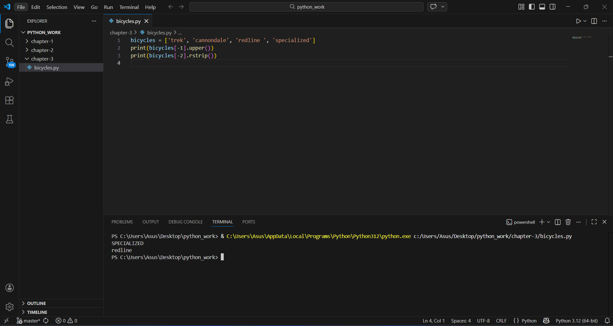

### Using Individual Values from a List

Each element of a list behaves like a variable. You can work with them just like strings, integers, or floats. Look at this example:

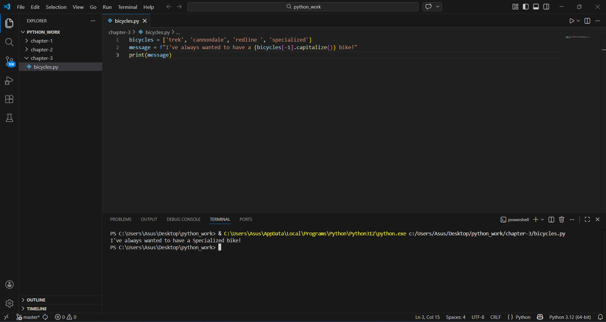

---

## Try It Yourself

**3-1. Names:** Store the names of a few friends in a list called `names`. Print each person's name by accessing each element in the list, one at a time.

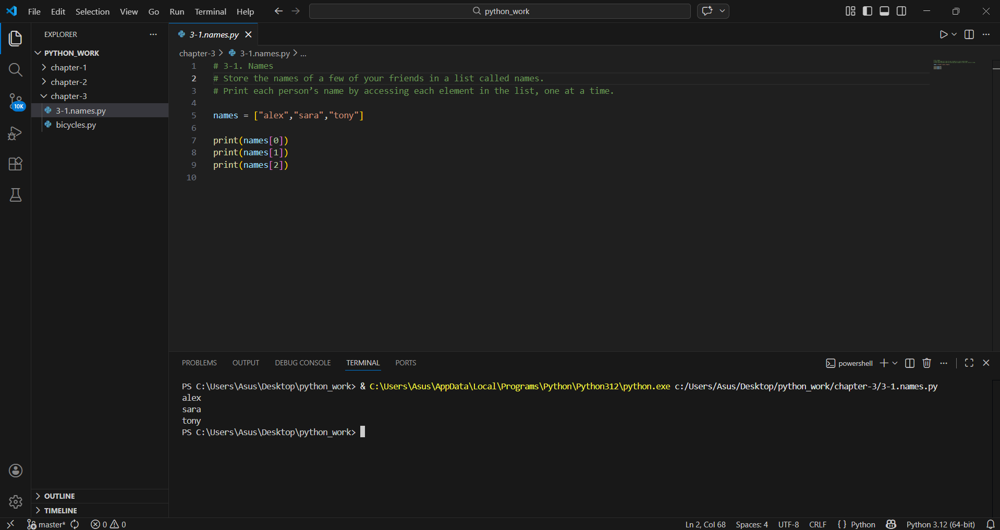

**3-2. Greetings:** Start with the list from Exercise 3-1. Instead of just printing each person's name, print a message to them. The text of each message should be the same, but each message should be personalized with the person's name.

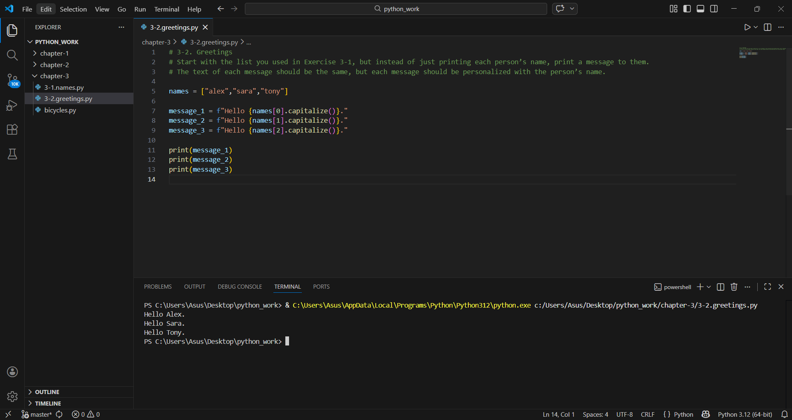

**3-3. Your Own List:** Think of your favorite mode of transportation (e.g., motorcycle or car) and make a list that stores several examples. Use your list to print a series of statements about these items, such as "I would like to own a Honda motorcycle."

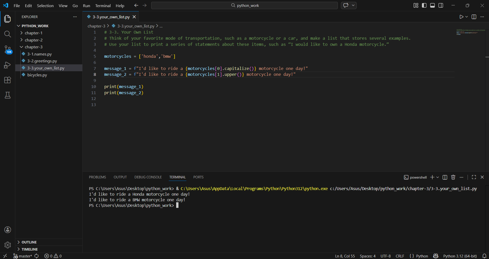

---

## Modifying, Adding, and Removing Elements

Lists are **dynamic** – you can change, add, or remove elements after creating the list.

### Modifying Elements in a List

To change the first element of a list, the syntax is simple:

```python
list_name[index] = 'new_value'
```

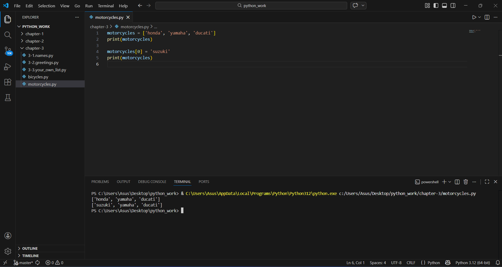

### Adding Elements to a List

Sometimes we need to add a new user's name to a list of website users. Python provides several methods.

#### Appending Elements to the End of a List

The simplest way to add a new item is `append()`. This adds the new item to the **end** of the list.

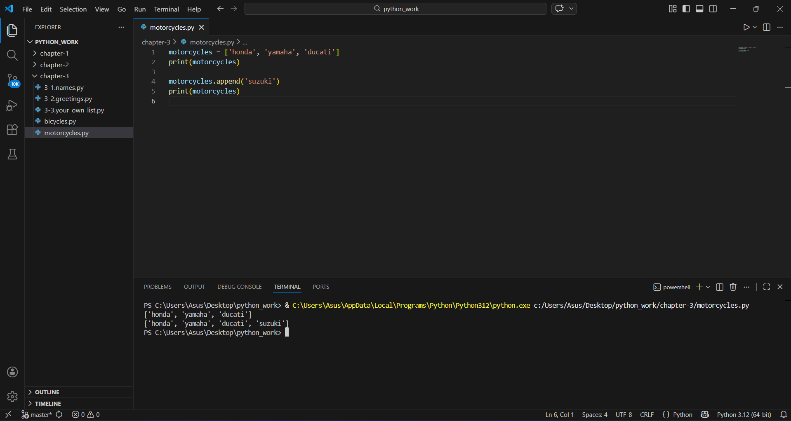

Often, when building a program or website, we start with an empty list and then append information as it comes in. This is very common.

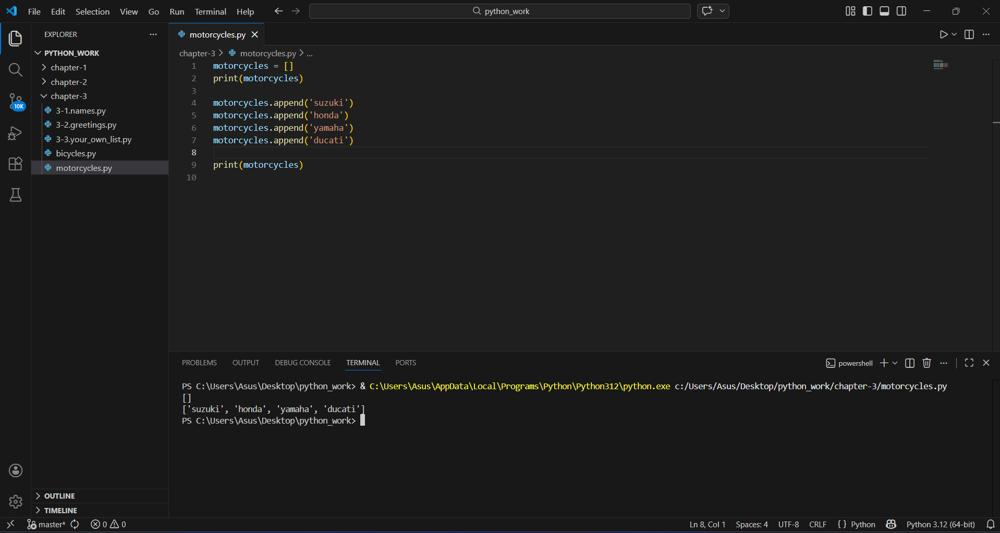

#### Inserting Elements into a List

What if we want to add an item at the beginning or a specific position? Use the `insert()` method.

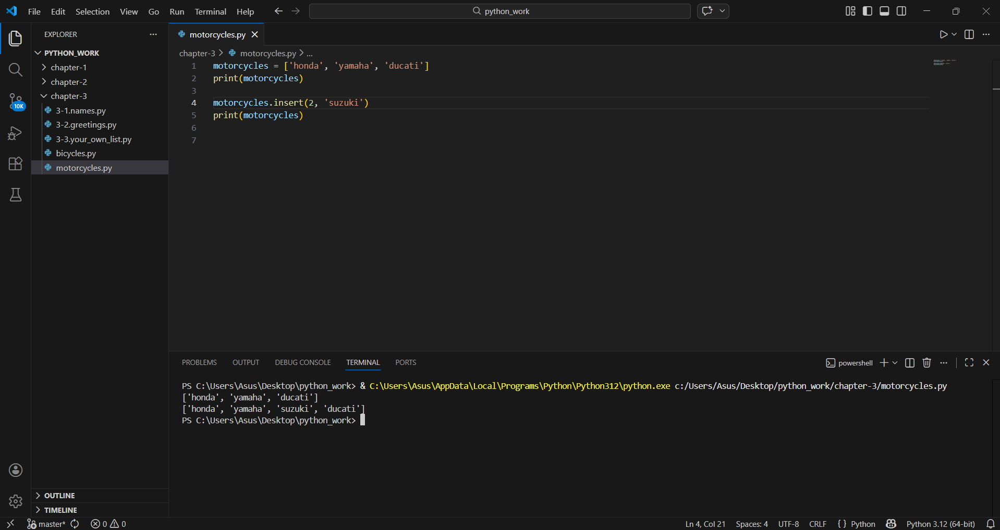

**Note:** Inserting can be confusing. Python first checks the list positions, then applies the index number. Remember, indexing starts at 0.

### Removing Elements from a List

Imagine a user wants to remove their account from a website. We need to remove their name from the list. Here are several ways.

#### Removing an Item Using the `del` Statement

If you know the index of the element you want to remove, use the `del` statement:

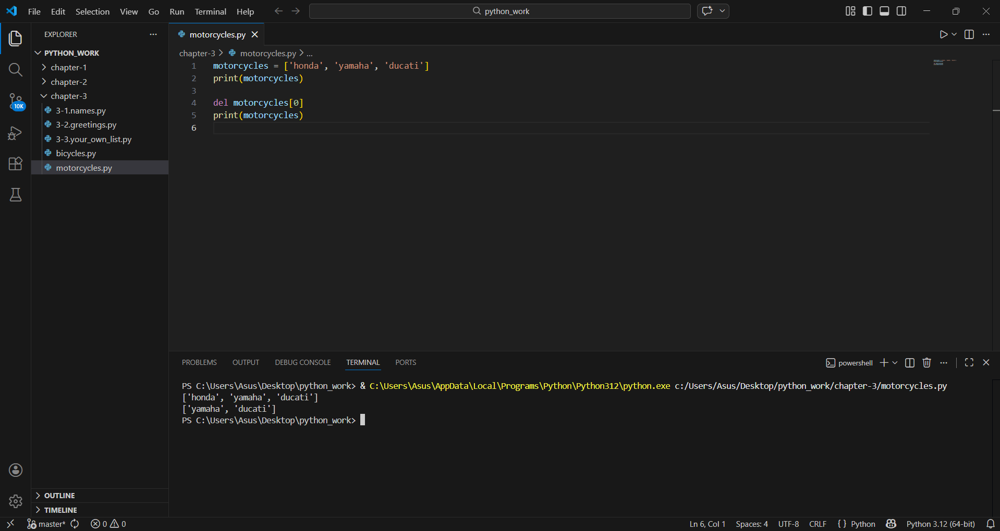

**Note:** `del` removes the item permanently – it's gone!

#### Removing an Item Using the `pop()` Method

In our website scenario, suppose we want to remove a person's name from a shipping list and add it to a delivered list. We cannot use `del` because that would delete the item permanently. Instead, use `pop()`:

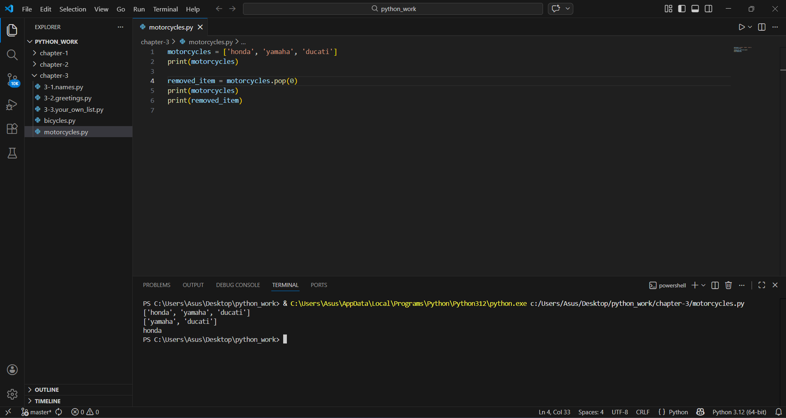

**Important notes about `pop()`:**
- You can pass an index to `pop()` to remove a specific item (e.g., `pop(0)` removes the first item).
- You cannot pass a string – only an index number.
- If you don't provide an index, `pop()` removes the **last** item of the list.
- If you use `pop()` but forget to assign the removed value to a variable, it is gone – just like `del`.

#### Removing an Item by Value

If you know the value of the item (not its index), use the `remove()` method:

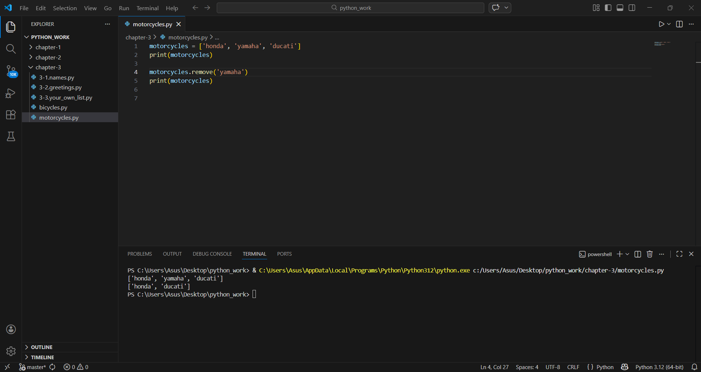

**Important notes about `remove()`:**
- `remove()` takes the **value** of the item, not an index number.
- If the value is a number, it will still work (it acts as an element).
- You cannot leave the parentheses empty – you must provide a value.
- If there are two identical items, `remove()` only deletes the **first** occurrence.

---

## Try it Yourself

**3-4. Guest List:** If you could invite anyone (living or deceased) to dinner, who would you invite? Make a list that includes at least three people you'd like to invite. Then use your list to print a message to each person, inviting them to dinner.

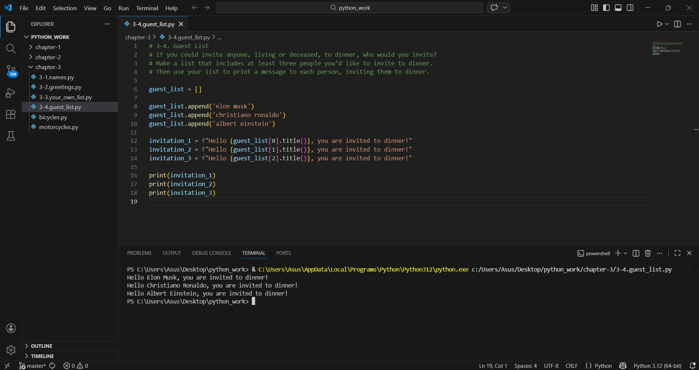

**3-5. Changing Guest List:** You just heard that one of your guests can't make the dinner, so you need to send out a new set of invitations.
- Start with your program from Exercise 3-4. Add a `print()` call stating the name of the guest who can't make it.
- Modify your list, replacing the name of the guest who can't come with the name of the new person you are inviting.
- Print a second set of invitation messages, one for each person still in your list.

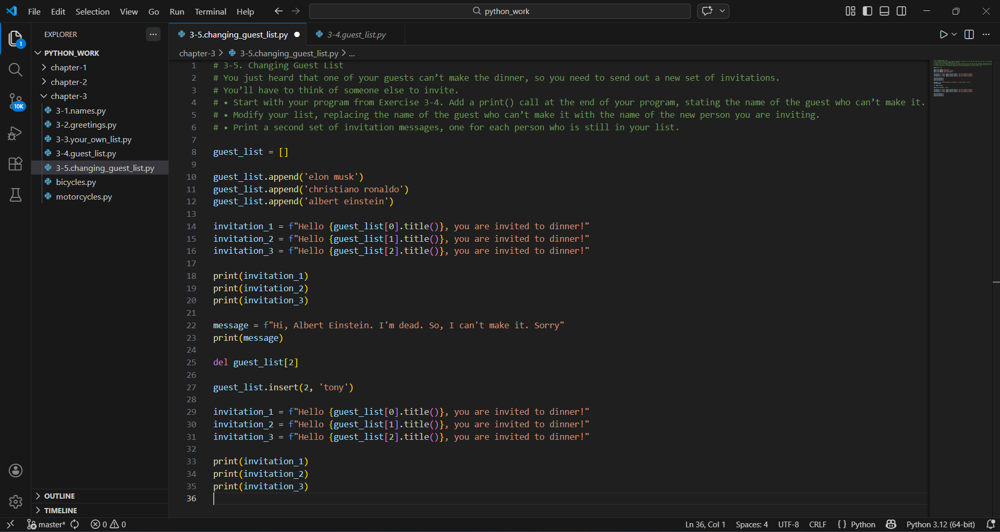
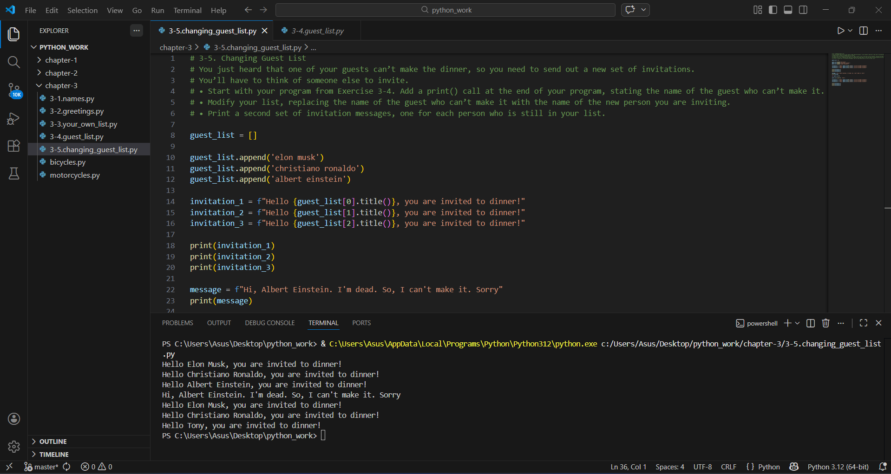

**3-6. More Guests:** You just found a bigger dinner table, so now more space is available. Think of three more guests to invite.
- Start with your program from Exercise 3-4 or 3-5. Add a `print()` call informing people that you found a bigger table.
- Use `insert()` to add one new guest to the beginning of your list.
- Use `insert()` to add one new guest to the middle of your list.
- Use `append()` to add one new guest to the end of your list.
- Print a new set of invitation messages, one for each person in your list.

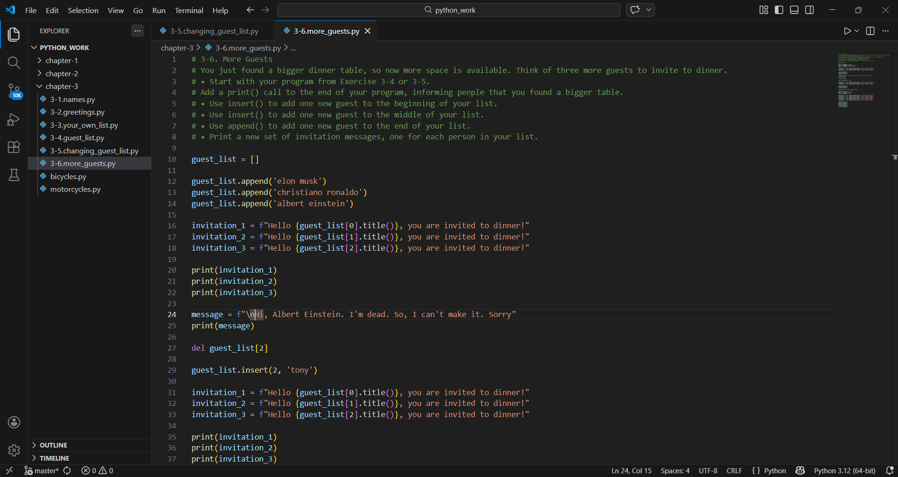
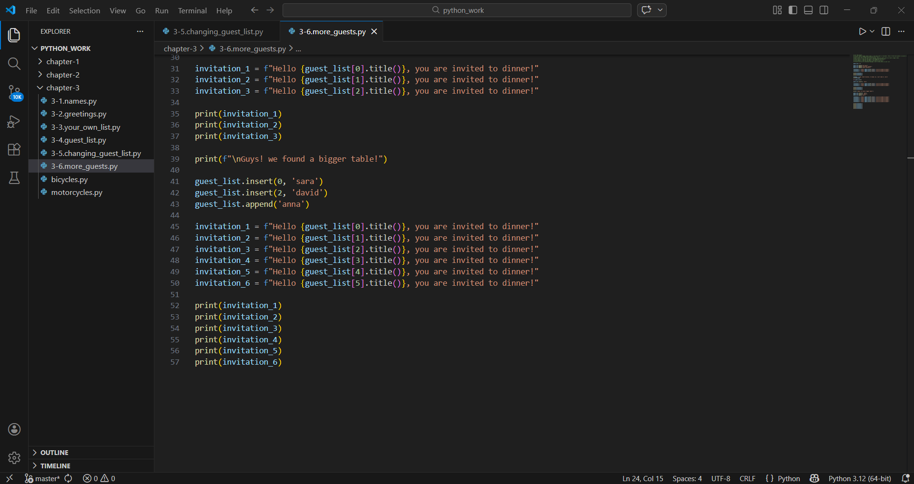
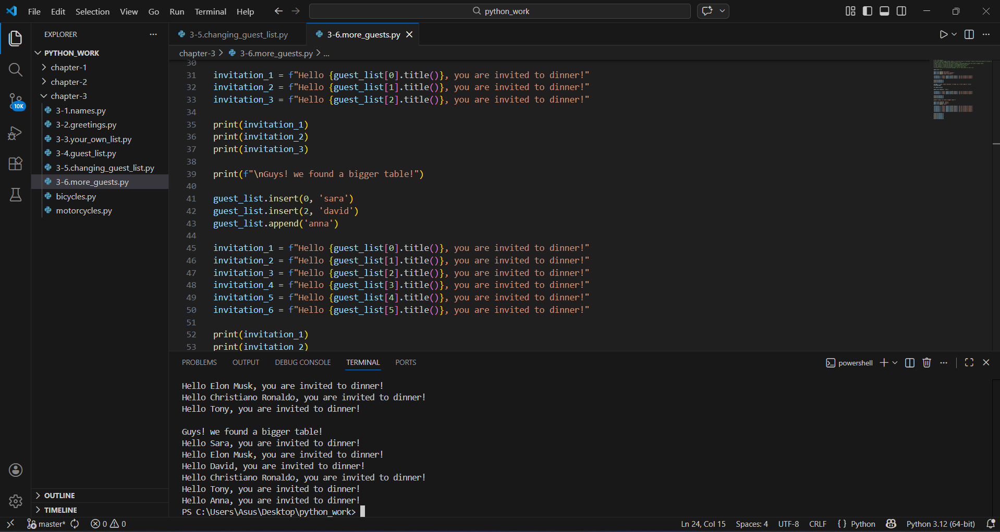

**3-7. Shrinking Guest List:** You just found out that your new dinner table won't arrive in time, so you have space for only two guests.
- Start with your program from Exercise 3-6. Add a new line printing a message that you can invite only two people.
- Use `pop()` to remove guests from your list one at a time until only two names remain. Each time you pop a name, print a message to that person letting them know you're sorry you can't invite them.
- Print a message to each of the two people still on your list, letting them know they're still invited.
- Use `del` to remove the last two names, leaving an empty list. Print your list to confirm it is empty.

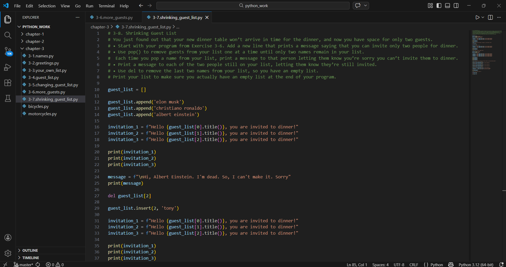
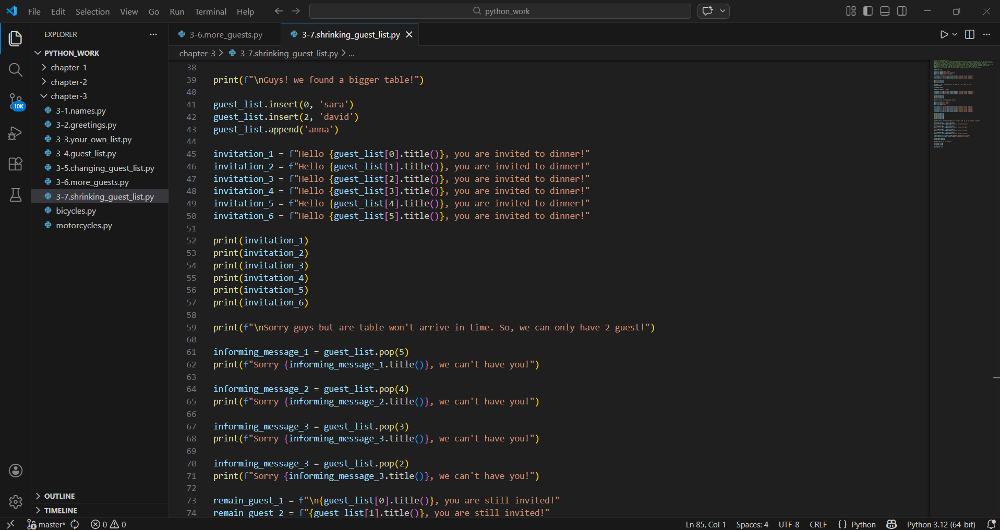
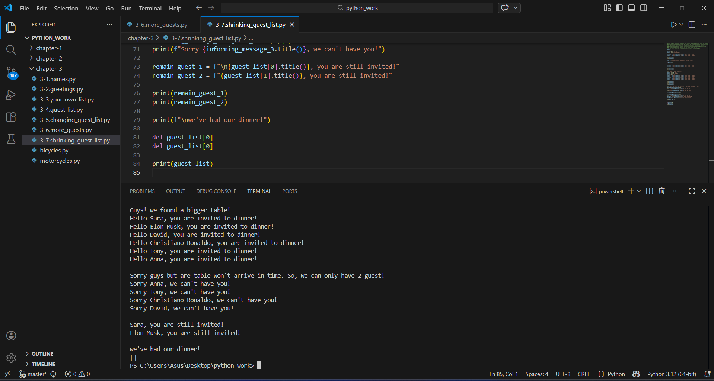

---

## Organizing a List

Sometimes we want to change the order of our list, and other times we want to keep the original format. Python provides several ways to do this.

### Sorting a List Permanently with the `sort()` Method

If you want to sort items in a list alphabetically, use the `sort()` method. Let's work with a list where all elements are lowercase:

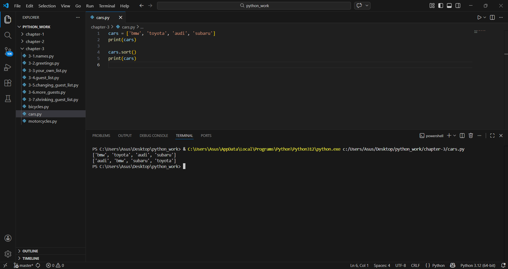

**Note:** Once you use `sort()`, the order is permanently changed.

You can pass arguments to methods. For example, the argument `reverse=True` will sort the list in reverse alphabetical order. This change is also permanent:

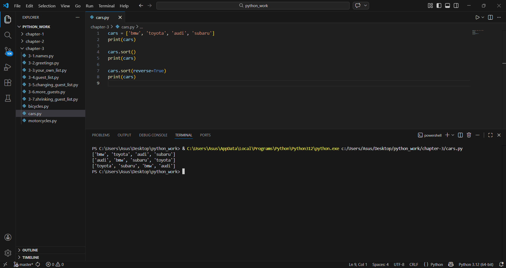

### Sorting a List Temporarily with the `sorted()` Function

The `sorted()` function works like the `sort()` method, but it does **not** permanently change the original list.

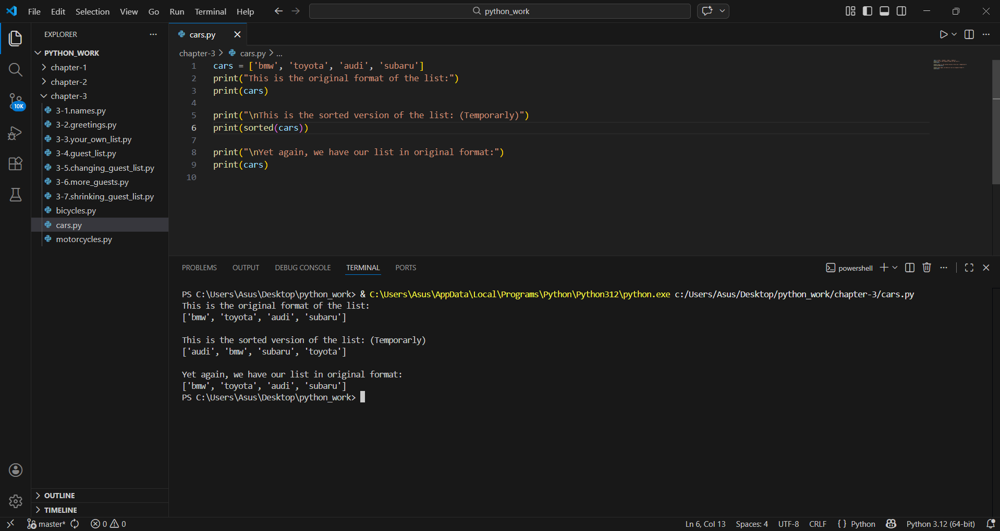

**Note:** `sort()` is a method, while `sorted()` is a function. They sound similar but are used differently. Use `sorted()` just like you use `print()`.

You can also pass `reverse=True` to `sorted()`:

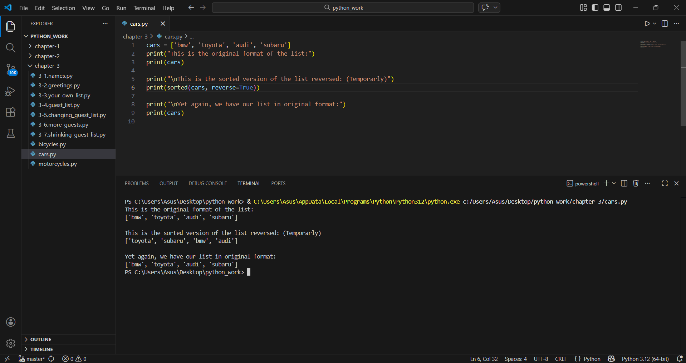

### Printing a List in Reverse Order

If you simply want to reverse the order of elements (not alphabetically), use the `reverse()` method:

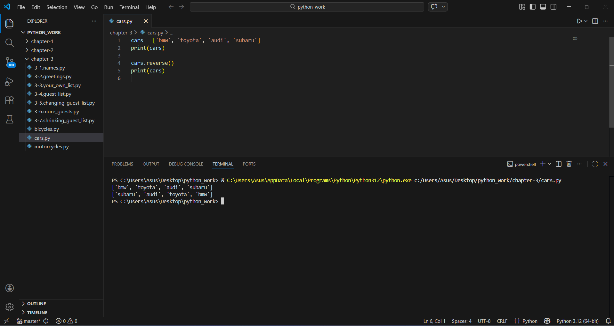
**Note:** `reverse()` permanently changes the order of the list. To get back to the original order, simply apply `reverse()` again.

### Finding the Length of a List

To see how many items are in a list, use the `len()` function:

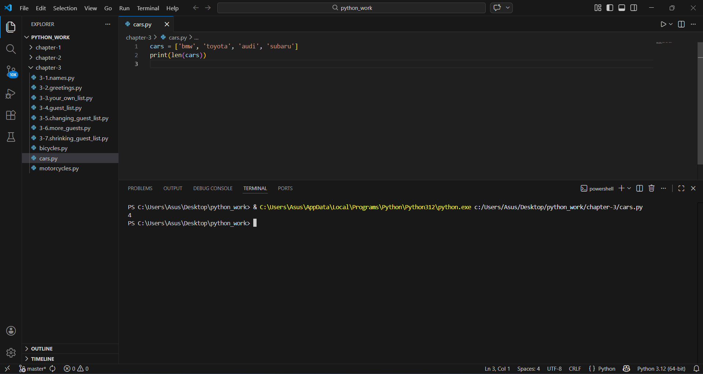

**Note:** Remember that indexing starts at 0, but `len()` counts from 1. So if a list has 3 items, `len()` returns 3, while the last index is 2.

---

## Try it Yourself

**3-8. Seeing the World:** Think of at least five places in the world you'd like to visit.
- Store the locations in a list. Make sure the list is **not** in alphabetical order.
- Print your list in its original order (as a raw Python list).
- Use `sorted()` to print your list in alphabetical order without modifying the actual list.
- Show that your list is still in its original order by printing it.
- Use `sorted()` to print your list in reverse-alphabetical order without changing the original order.
- Show that your list is still in its original order by printing it again.
- Use `reverse()` to change the order of your list. Print the list to show the order has changed.
- Use `reverse()` again to change the order back to the original. Print the list to confirm.
- Use `sort()` to permanently store the list in alphabetical order. Print the list.
- Use `sort()` with `reverse=True` to store the list in reverse-alphabetical order. Print the list.

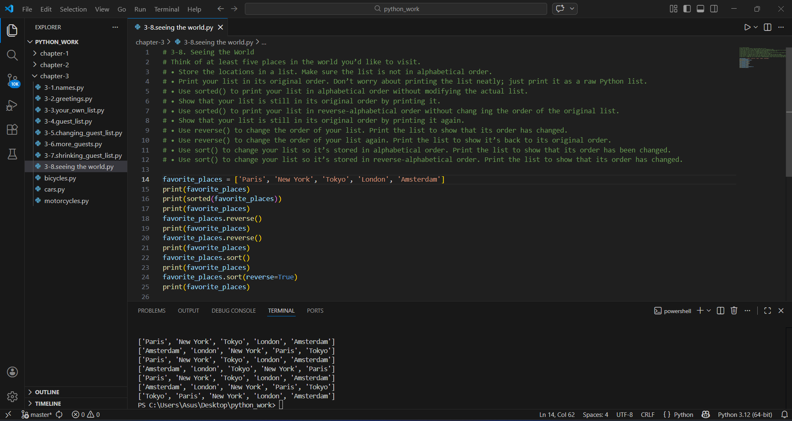

**3-9. Dinner Guests:** Working with one of the programs from Exercises 3-4 through 3-7, use `len()` to print a message indicating the number of people you're inviting to dinner.

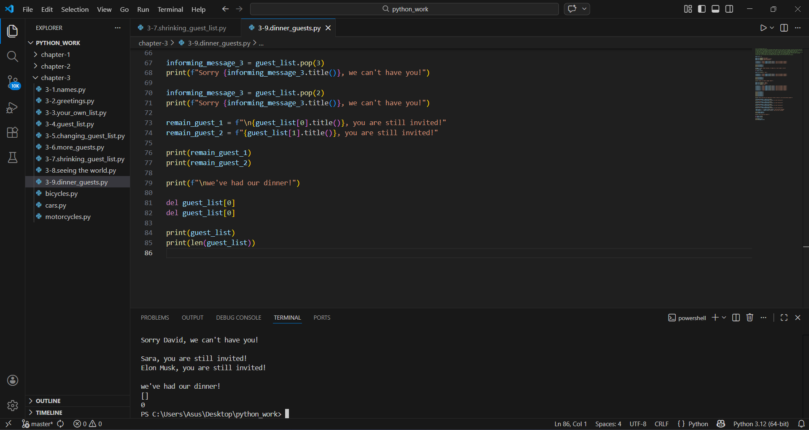

**3-10. Every Function:** Think of things you could store in a list (e.g., mountains, rivers, countries, cities, languages, or anything else). Write a program that creates a list containing these items and then uses **each function introduced in this chapter** at least once.

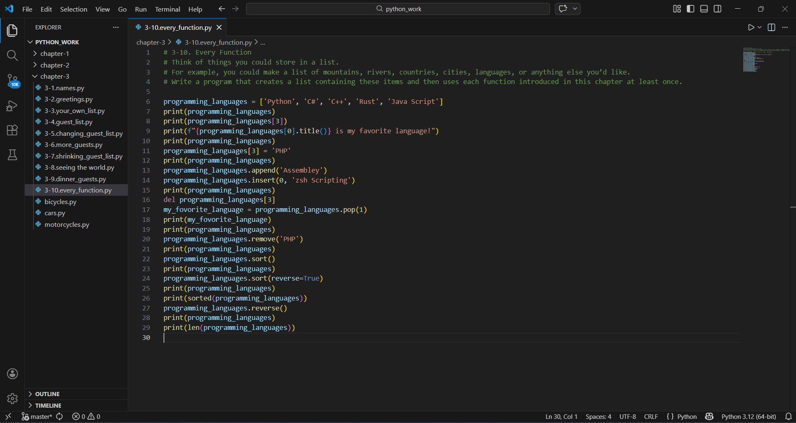
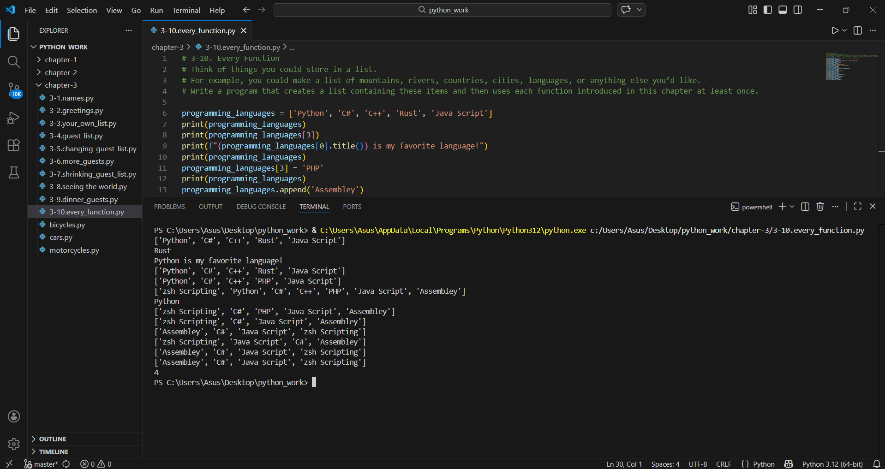

---

## Avoiding Index Errors When Working with Lists

It's simple: **index numbering starts at 0, not 1.** Always remember this to avoid off-by-one errors.

---

## Try it Yourself

**3-11. Intentional Error:** If you haven't received an index error in one of your programs yet, try to make one happen. Change an index in one of your programs to produce an `IndexError`. Make sure you correct the error before closing the program.

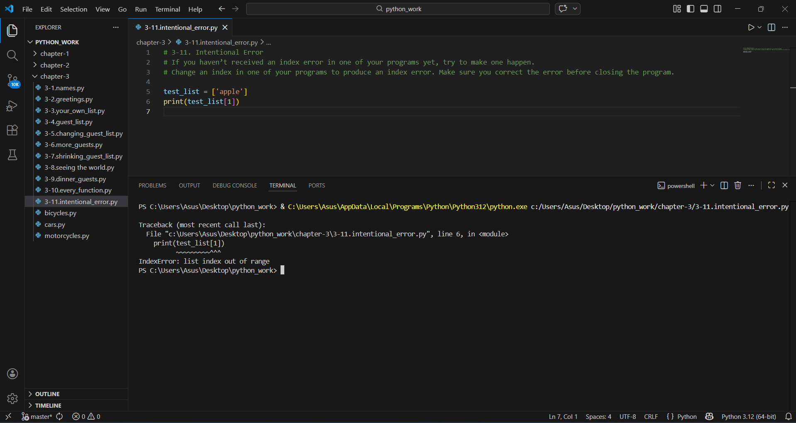


