# Chapter 1: Splunk Enterprise & Universal Forwarder Installation

**Objective:** Deploy a fully functional Splunk environment with a Windows 11 Enterprise instance as the indexer and a Kali Linux VM as a log forwarder. This forms the foundation for SOC monitoring, threat detection, and SIEM operations.

**Date:** June 2026

**Environment:**
- **Host OS:** Windows 11 (Primary)
- **Splunk Enterprise:** Version 10.2.3 (Free License, 500 MB/day)
- **VM:** Kali Linux 2025.3 (VMware Workstation)
- **Splunk Universal Forwarder:** Version 9.4.4 (64-bit .tgz)
- **Network Mode:** VMware NAT (VMnet8)

---

## Table of Contents
1. [Windows 11 Splunk Enterprise Installation](#1-windows-11-splunk-enterprise-installation)
2. [Kali Linux Universal Forwarder Installation](#2-kali-linux-universal-forwarder-installation)
3. [Network Configuration](#3-network-configuration)
4. [Connecting Forwarder to Indexer](#4-connecting-forwarder-to-indexer)
5. [Verification & Testing](#5-verification--testing)
6. [Troubleshooting Reference](#6-troubleshooting-reference)

---

## 1. Windows 11 Splunk Enterprise Installation

I installed **from** the installer (.msi) and set my admin credentials. The license that I am using is 60-day Enterprise Trials and then I will be using Free license for learning purpose.   
### Verification

I accessed the Splunk with this address in my browser:
```
http://127.0.0.1:8000
```


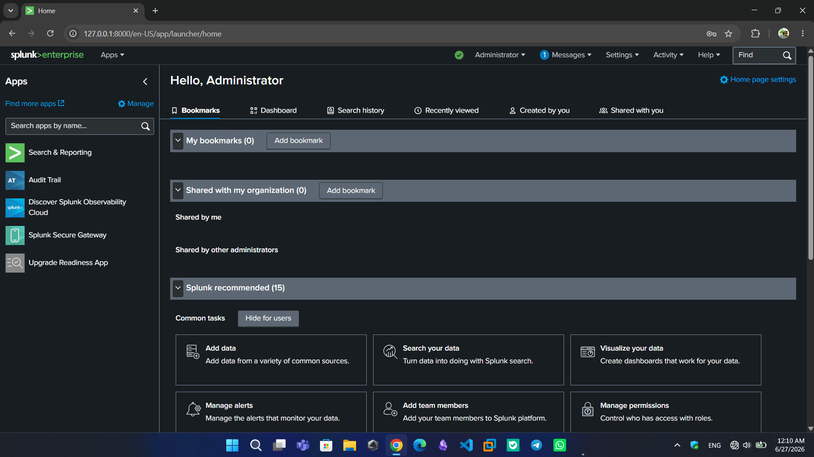

---

## 2. Kali Linux Universal Forwarder Installation

First, I downloaded the Universal Forwarder `splunkforwarder-9.4.4.tgz` from this link:
https://swdownload.wustl.edu/Splunk/index.shtml

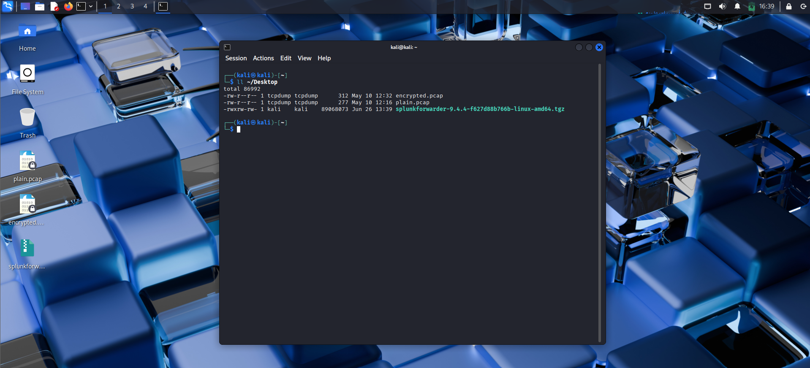

Then, I Extracted the forwarder to `/opt`:

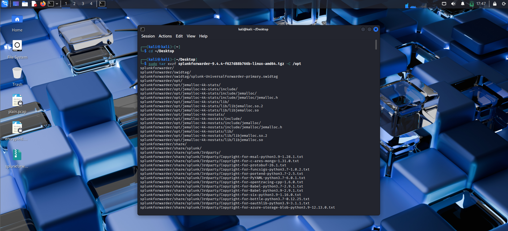

Next, I started the forwarder and accepted the license:

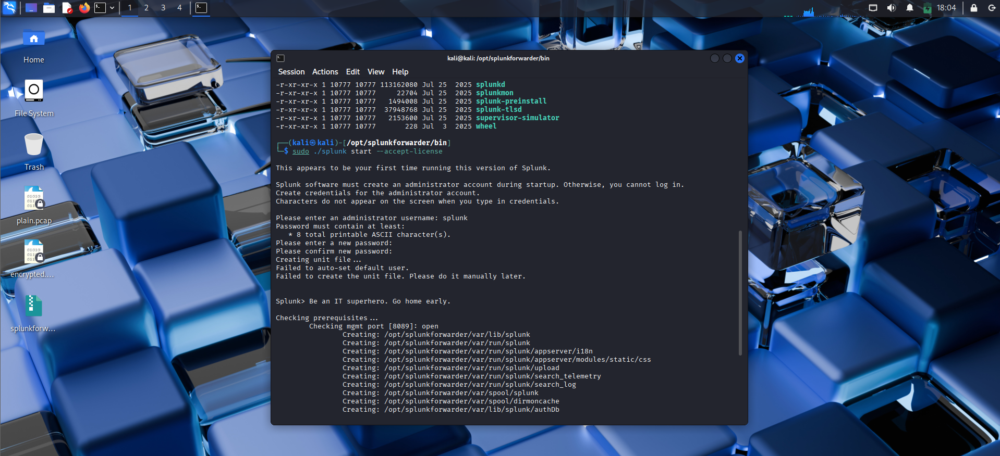


After that, I verified the forwarder is running:

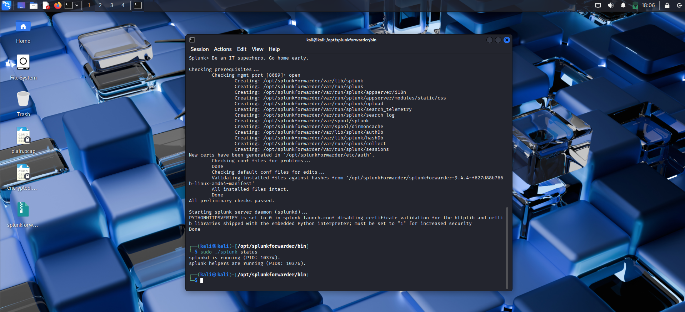

---

## 3. Network Configuration

Both my machines are on the same virtual network. The VMware NAT (VMnet8) network is used.

### Windows 11 Network Settings

I found my `VMnet8` IPV4 address by running `ipconfig` in my CMD:
`192.168.106.1`

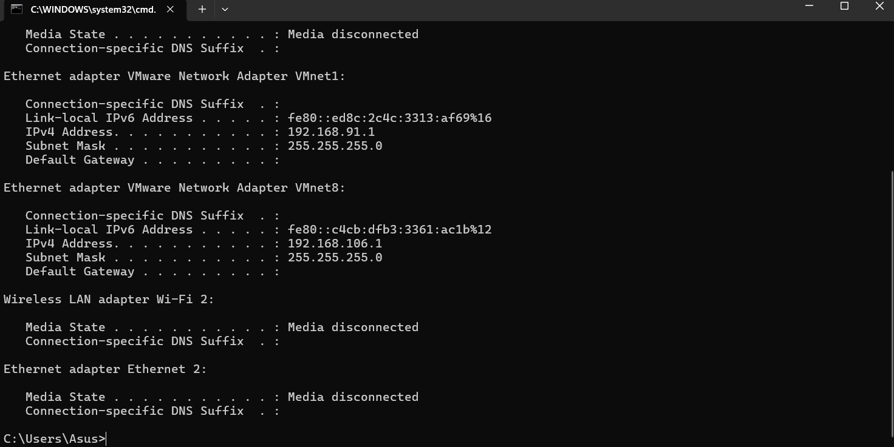
### Kali Linux Network Settings

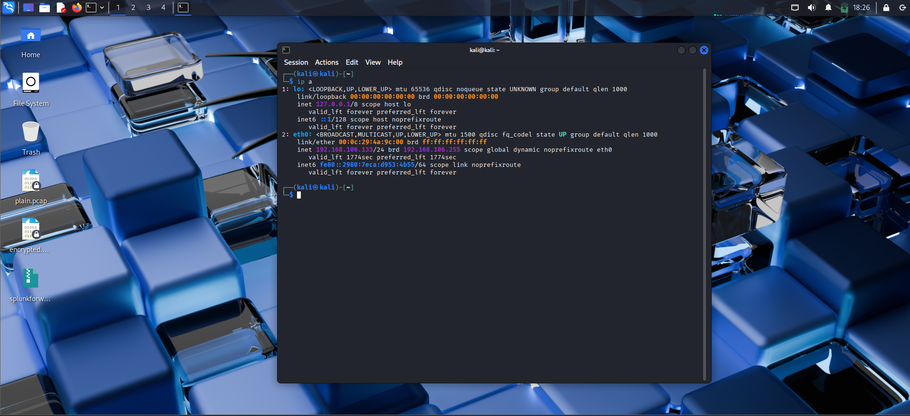
My Kali is on the same subnet. In this lab, the Kali VM automatically receives an IP from the VMware DHCP server.

---
## 4. Connecting Forwarder to Indexer

### 4.1 Enable Data Receiving on Windows Splunk

I logged into my Splunk Web. Then, I navigated to the `Forwarding and Receiving` section of the settings. I added a new receiver under `configure receiving` section. I added the port 9997.  

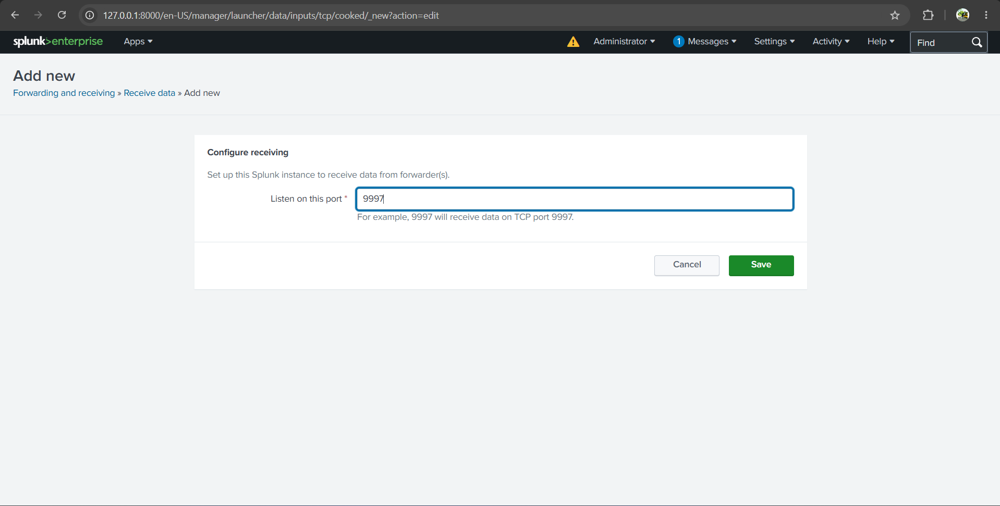


### 4.2 Add the Windows Firewall Rule

I added the port `9997` to the Firewall using the Firewall & network protection in Windows Security. And I ran the command below in PowerShell running as Administrator:
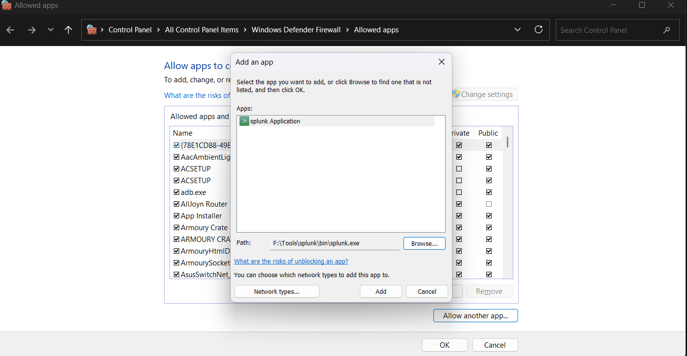
```powershell
New-NetFirewallRule -DisplayName "Splunk Receiver 9997" -Direction Inbound -Protocol TCP -LocalPort 9997 -Action Allow
```

### 4.3 Configure the Forwarder on Kali

I configured the forwarder on Kali to the IP `192.168.106.1:9997`:
```bash
cd /opt/splunkforwarder/bin
sudo ./splunk add forward-server 192.168.106.1:9997
```

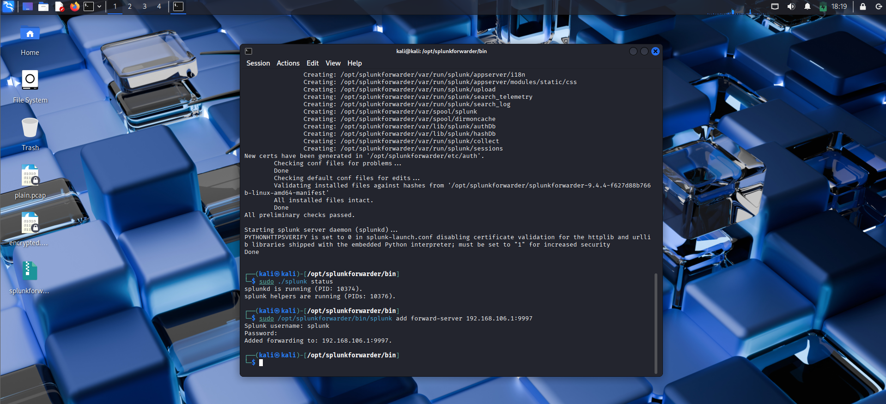

### 4.4 Add a Log Monitor on Kali

Then, I added the log for monitoring:
```bash
sudo ./splunk add monitor /var/log/auth.log
```
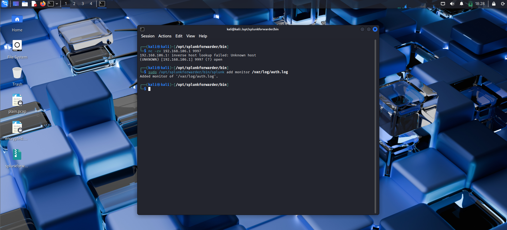

This monitors authentication logs (SSH logins, sudo commands, etc.).

---

## 5. Verification & Testing

### 5.1 Generate Test Logs

On Kali, I generated authentication events:

```bash
ssh kali@127.0.0.1
```
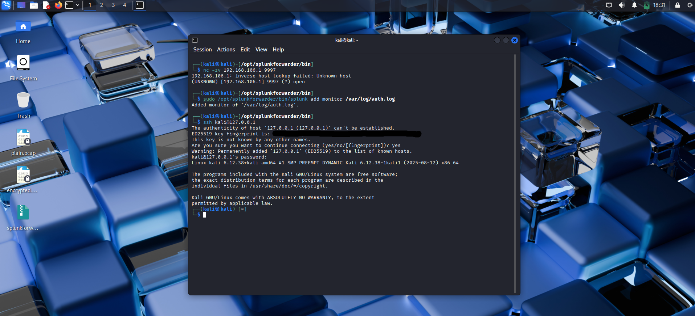

This creates an SSH login entry in `/var/log/auth.log`. 

### 5.2 Search for Data in Splunk Web

1. I Opened Splunk Web at `http://127.0.0.1:8000`
2. Clicked **"Search & Reporting"**
3. Set the time range to **"Today"**
4. Ran the search:

```
index=*
```

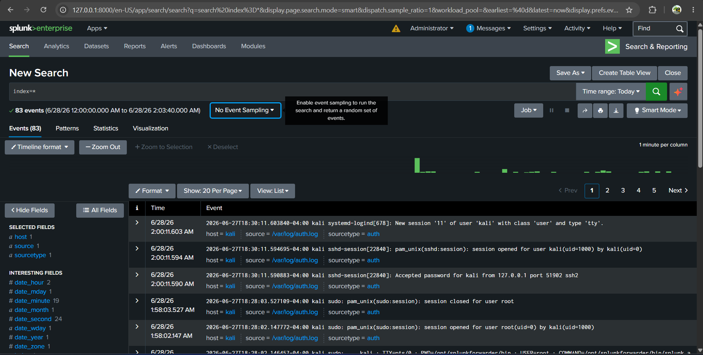

### 5.3 Verify Specific Events

For a more targeted search:

```
index=* "Accepted password"
```

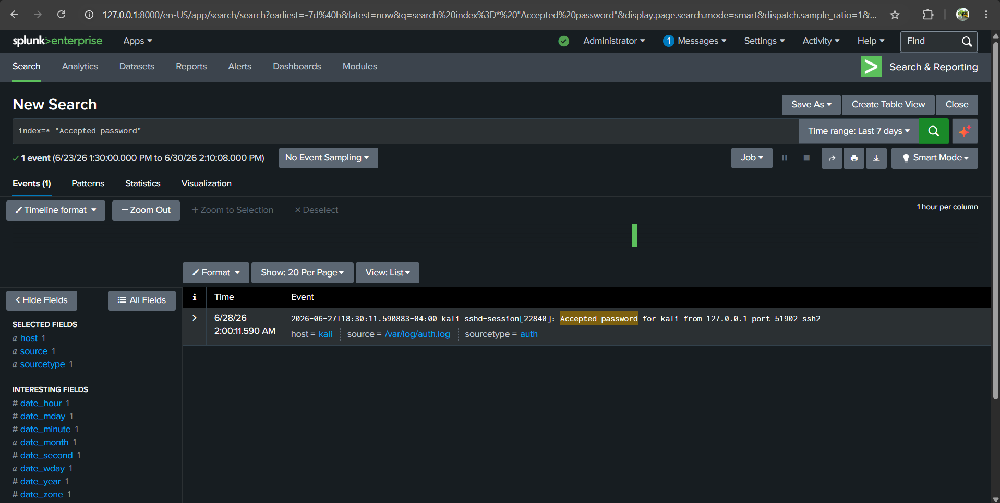

This filters specifically for successful SSH login attempts.

---

## 6. Troubleshooting Reference

### Issue: "Connection refused"

**Solution:** Verify the Windows firewall rule exists:
```powershell
Get-NetFirewallRule -DisplayName "Splunk Receiver 9997"
```

If missing, add it:
```powershell
New-NetFirewallRule -DisplayName "Splunk Receiver 9997" -Direction Inbound -Protocol TCP -LocalPort 9997 -Action Allow
```

### Issue: No data appears in Splunk Web

**Solution:** Check if the forwarder is connected:
```bash
sudo tail -f /opt/splunkforwarder/var/log/splunk/splunkd.log | grep -i tcp
```

Look for:
- `Connected to 192.168.106.1:9997` → Success
- `Connection refused` → Firewall blocking

### Issue: Forwarder won't start

**Solution:** Check for permission issues:
```bash
sudo chown -R splunk:splunk /opt/splunkforwarder
sudo /opt/splunkforwarder/bin/splunk start
```

---

## ✅ Milestone Achieved

At this point, I have:
- ✅ Splunk Enterprise installed on Windows 11 (Free License)
- ✅ Splunk Universal Forwarder installed on Kali Linux
- ✅ Network connectivity established via VMware NAT
- ✅ Data receiving enabled on port 9997
- ✅ Windows Firewall configured to allow incoming connections
- ✅ Log monitoring configured on `/var/log/auth.log`
- ✅ Data successfully ingested and searchable in Splunk Web

**Next Steps:** Continue to Chapter 2: Basic SPL (Search Processing Language) where I will analyze these authentication logs and build security use cases.

---

## 📚 References

- [Splunk Enterprise Installation Manual](https://docs.splunk.com/Documentation/Splunk/latest/Installation/InstallonWindows)
- [Splunk Universal Forwarder Installation](https://docs.splunk.com/Documentation/Forwarder/latest/Forwarder/InstallaUNIXforwarder)
- [Splunk Free License](https://www.splunk.com/en_us/software/free-splunk.html)
- [VMware NAT Networking](https://docs.vmware.com/en/VMware-Workstation-Pro/17/com.vmware.ws.using.doc/GUID-0F194129-C3F3-4AF9-86A4-4067F9467A12.html)
- `DeepSeek AI`
