Chapter 3: Installing Sysmon on Windows for Advanced Logging

**Objective:** Deploy Sysmon (System Monitor) on your Windows 11 machine to capture detailed system activity—process creation, network connections, file changes, and more. Then configure the Splunk Universal Forwarder to collect these logs and send them to your Splunk Enterprise instance for analysis.

**Date:** July - August 2026

**Prerequisites:**
- Splunk Enterprise installed and running on Windows 11 (from Chapter 1)
- Splunk Universal Forwarder installed on your Windows 11 machine
- Administrative privileges on Windows 11
- Internet connection to download Sysmon

---

## Table of Contents
1. [What is Sysmon?](#1-what-is-sysmon)
2. [Sysmon vs. Windows Event Logs](#2-sysmon-vs-windows-event-logs)
3. [Downloading Sysmon](#3-downloading-sysmon)
4. [Creating a Sysmon Configuration File](#4-creating-a-sysmon-configuration-file)
5. [Installing Sysmon](#5-installing-sysmon)
6. [Verifying Sysmon is Running](#6-verifying-sysmon-is-running)
7. [Configuring Splunk Universal Forwarder to Collect Sysmon Logs](#7-configuring-splunk-universal-forwarder-to-collect-sysmon-logs)
8. [Configuring Splunk to Receive Windows Event Logs](#8-configuring-splunk-to-receive-windows-event-logs)
9. [Verification & Testing](#9-verification--testing)
10. [Installing the Splunk Add-on for Sysmon](#10-installing-the-splunk-add-on-for-sysmon)
11. [Critical Windows Event IDs for SOC Analysts](#11-critical-windows-event-ids-for-soc-analysts)
12. [Practice Exercises](#12-practice-exercises)
13. [Troubleshooting Reference](#13-troubleshooting-reference)

---

## 1. What is Sysmon?

Sysmon (System Monitor) is a Windows system service and device driver created by Microsoft as part of the Sysinternals suite. Once installed, it remains persistent across system reboots and monitors system activity, logging detailed information to the Windows Event Log.

**Why Sysmon is critical for security monitoring:**

| Feature | What it Logs | Why It Matters |
| :--- | :--- | :--- |
| **Process Creation** | Full command line, parent process, process GUID, image hashes (SHA1, MD5, SHA256) | Detects suspicious processes, LOLBins, and command-line obfuscation |
| **Network Connections** | Source/destination IPs, ports, hostnames, and the process that initiated the connection | Identifies C2 beaconing, data exfiltration, and reverse shells |
| **File Creation Time Changes** | When file timestamps are modified | Catches malware trying to hide its tracks |
| **Driver/DLL Loading** | Binary signatures and hashes | Detects DLL side-loading and malicious drivers |
| **Raw Disk/Volume Reads** | Access to raw disk data | Identifies credential dumping and forensic evasion |
| **Registry Changes** | Modifications to critical registry keys | Detects persistence mechanisms |

> **Key Insight:** Traditional Windows Security Event Logs (Event IDs 4624, 4625, etc.) tell you *what* happened. Sysmon tells you *how* it happened—the process lineage, command-line arguments, and network context that reveal the attacker's true intent.

---

## 2. Sysmon vs. Windows Event Logs

| Capability | Windows Security Log | Sysmon |
| :--- | :--- | :--- |
| **Logon events** | ✅ Yes (4624, 4625) | ❌ No |
| **Full command-line** | ❌ No (truncated) | ✅ Yes |
| **Process parent/child** | ❌ Limited | ✅ Yes (with GUID) |
| **Network connections** | ❌ No | ✅ Yes |
| **File hash** | ❌ No | ✅ Yes (SHA1, MD5, SHA256) |
| **Registry changes** | ❌ No | ✅ Yes |
| **DLL loading** | ❌ No | ✅ Yes |
| **Configuration** | Fixed | ✅ Highly customizable (XML) |

**Bottom line:** You need BOTH. The Security Log gives you authentication context. Sysmon gives you the forensic depth to investigate what happened after authentication.

---

## 3. Downloading Sysmon

### 3.1 Download from Microsoft

1. Open your browser and go to the official Sysinternals page:
   ```
   https://learn.microsoft.com/sysinternals/downloads/sysmon
   ```
2. Click the **Download Sysmon** button. This downloads `Sysmon.zip` (approximately 4.6 MB).

### 3.2 Extract the Files

1. Create a folder for Sysmon:
   ```cmd
   mkdir C:\Sysmon
   ```
2. Extract the contents of `Sysmon.zip` into `C:\Sysmon`.
3. You should see these files:
   - `Sysmon64.exe` (64-bit version)
   - `Sysmon.exe` (32-bit version)
   - `Sysmon64.md5`
   - `Sysmon.exe.md5`
   - `Eula.txt`

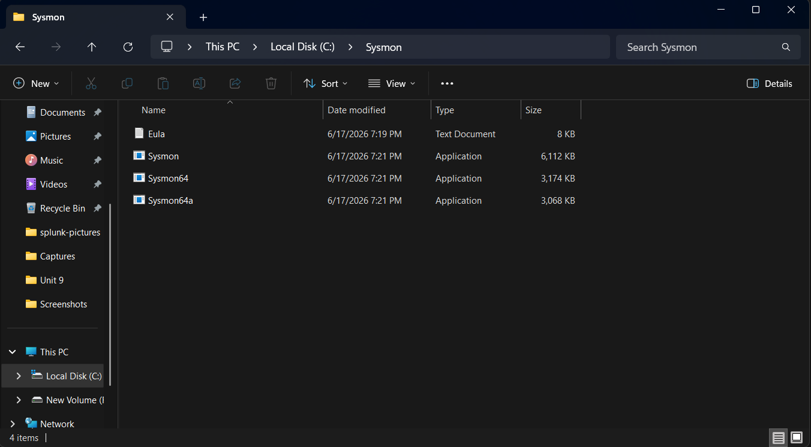


---

## 4. Creating a Sysmon Configuration File

Sysmon uses an XML configuration file that tells it exactly what to log and what to ignore. A well-designed configuration reduces noise and focuses on suspicious activity.

### 4.1 Option 1: Use a Community Configuration (Recommended)

The most widely used Sysmon configuration in the security community is maintained by **Olaf Hartong** (SwiftOnSecurity). It provides an excellent balance of coverage and noise reduction.

```powershell
# Download the configuration file to C:\Sysmon
Invoke-WebRequest -Uri "https://raw.githubusercontent.com/olafhartong/sysmon-modular/master/sysmonconfig.xml" -OutFile "C:\Sysmon\sysmonconfig.xml"
```

**Alternative** (if PowerShell is not available):
1. Go to: https://github.com/olafhartong/sysmon-modular
2. Click on `sysmonconfig.xml`
3. Click **Raw** and save the file as `sysmonconfig.xml` in `C:\Sysmon`.

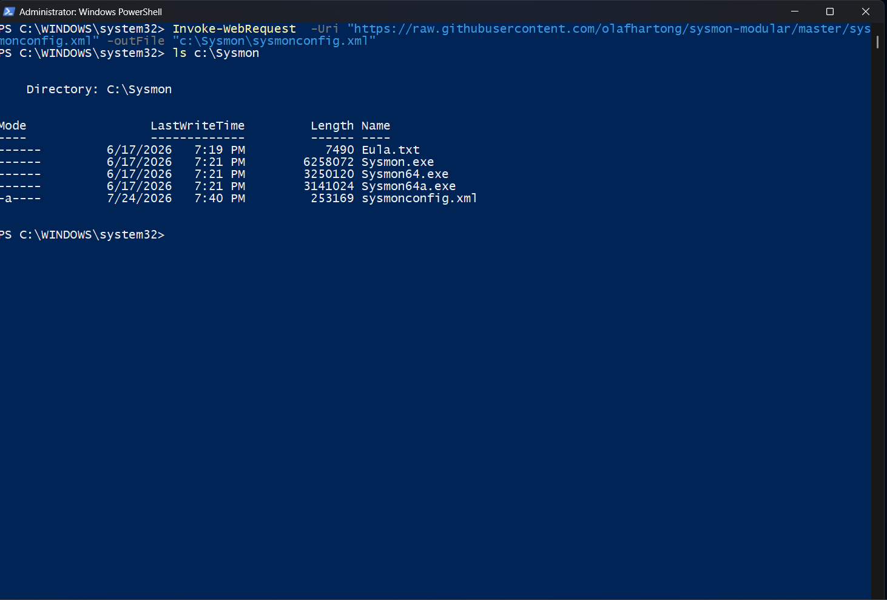

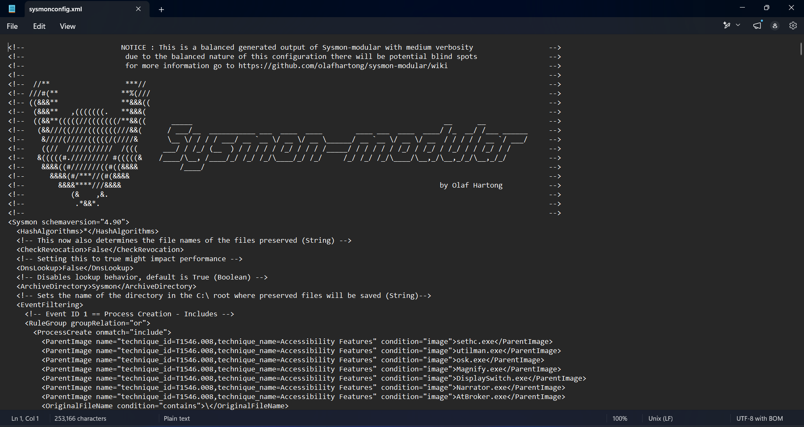

### 4.2 Option 2: Create Your Own Basic Configuration

For a learning environment, you can create a minimal configuration:

1. Open Notepad as Administrator.
2. Create a new file called `sysmon-basic.xml` in `C:\Sysmon`.
3. Paste the following basic configuration:

```xml
<Sysmon schemaversion="4.81">
  <!-- Capture all events by default -->
  <EventFiltering>
    <!-- Process creation -->
    <ProcessCreate onmatch="exclude">
      <!-- Exclude known safe processes to reduce noise -->
      <Image condition="end with">\svchost.exe</Image>
      <Image condition="end with">\csrss.exe</Image>
      <Image condition="end with">\wininit.exe</Image>
    </ProcessCreate>

    <!-- Network connections -->
    <NetworkConnect onmatch="include">
      <!-- Log all network connections -->
    </NetworkConnect>

    <!-- File creation time changes -->
    <FileCreateTime onmatch="include">
      <!-- Log all file time changes -->
    </FileCreateTime>

    <!-- Process access (e.g., LSASS access) -->
    <ProcessAccess onmatch="include">
      <!-- Log all process access attempts -->
    </ProcessAccess>

    <!-- Driver/DLL loading -->
    <DriverLoad onmatch="include">
      <!-- Log all driver loads -->
    </DriverLoad>

    <!-- Raw disk access -->
    <RawAccessRead onmatch="include">
      <!-- Log all raw disk reads -->
    </RawAccessRead>
  </EventFiltering>
</Sysmon>
```

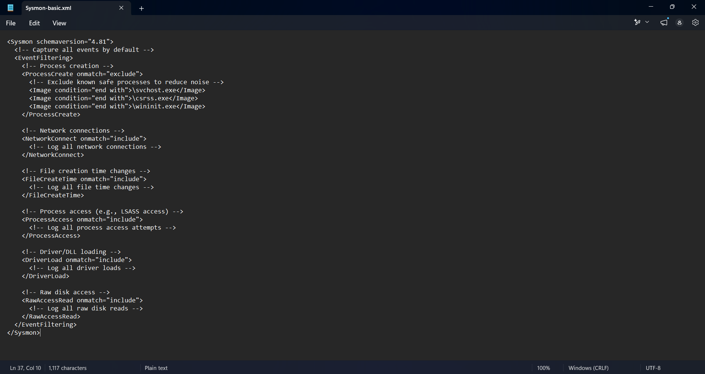

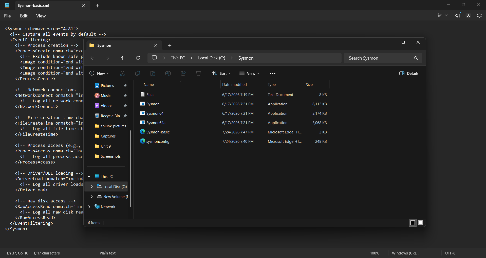

---

## 5. Installing Sysmon

### 5.1 Installation Command

Open **PowerShell** or **Command Prompt** as Administrator.

Navigate to the Sysmon directory:
```cmd
cd C:\Sysmon
```

Install Sysmon with the configuration file:

```cmd
.\Sysmon64.exe -accepteula -i sysmonconfig.xml
```

**Explanation:**
- `-accepteula` – Automatically accepts the End-User License Agreement
- `-i` – Installs the Sysmon service and driver
- `sysmonconfig.xml` – The configuration file to use

**Expected output:**
```
Sysmon v15.21 - System activity monitor
By Mark Russinovich and Thomas Garnier
Copyright (C) 2014-2026 Microsoft Corporation

Sysmon installed.
SysmonDrv installed.
Starting SysmonDrv.
SysmonDrv started.
Starting Sysmon.
Sysmon started.
```

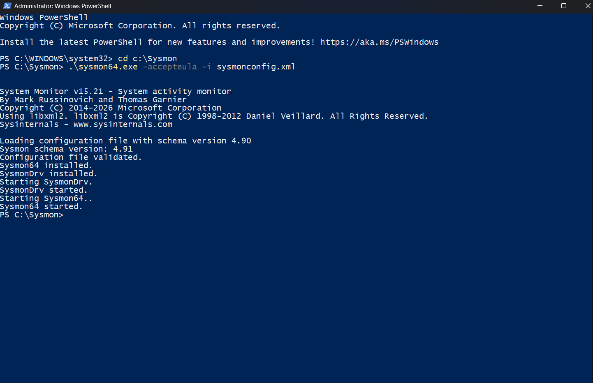

### 5.2 Common Sysmon Commands

| Command | Description |
| :--- | :--- |
| `Sysmon64.exe -c` | Dump current configuration |
| `Sysmon64.exe -c newconfig.xml` | Update configuration without reinstalling |
| `Sysmon64.exe -s` | Print configuration schema |
| `Sysmon64.exe -u` | Uninstall Sysmon |
| `Sysmon64.exe -m` | Install event manifest |

---

## 6. Verifying Sysmon is Running

### 6.1 Check the Service

1. Press **Win + R**, type `services.msc`, and press Enter.
2. Look for **Sysmon** in the list.
3. Verify the **Status** is **Running** and **Startup Type** is **Automatic**.

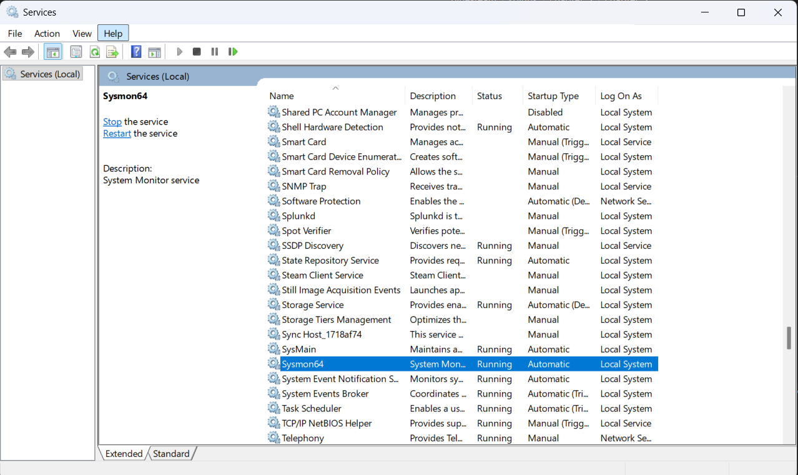

### 6.2 Check Event Viewer

1. Press **Win + R**, type `eventvwr.msc`, and press Enter.
2. Navigate to:
   ```
   Applications and Services Logs > Microsoft > Windows > Sysmon > Operational
   ```
3. You should see events appearing in real-time.

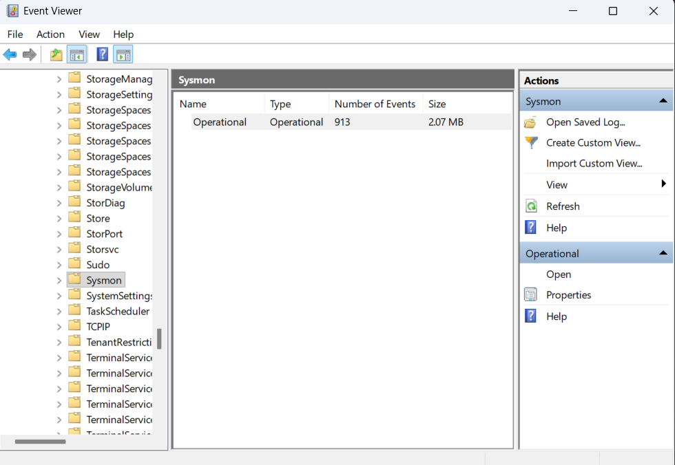

---

## 7. Configuring Splunk Universal Forwarder to Collect Sysmon Logs

Now that Sysmon is generating logs, you need to configure the Splunk Universal Forwarder to collect them.

### 7.1 Locate the inputs.conf File

The Universal Forwarder's configuration file is located at:
```
C:\Program Files\SplunkUniversalForwarder\etc\system\local\inputs.conf
```

If the file doesn't exist, create it.

### 7.2 Add Sysmon Log Input

Open `inputs.conf` in Notepad as Administrator and add the following stanza:

```conf
[WinEventLog://Microsoft-Windows-Sysmon/Operational]
disabled = 0
start_from = oldest
current_only = 0
checkpointInterval = 5
renderXml = true
index = main
```

**Explanation of settings:**

| Setting | Value | Description |
| :--- | :--- | :--- |
| `disabled` | `0` | Enables the input |
| `start_from` | `oldest` | Reads all existing events, not just new ones |
| `current_only` | `0` | Reads historical events too |
| `checkpointInterval` | `5` | Saves read position every 5 events |
| `renderXml` | `true` | Includes XML details (critical for Sysmon) |
| `index` | `main` | Sends data to the `main` index |

### 7.3 Add Windows Security Log Input

Also add the Windows Security log (for Event IDs like 4624, 4625):

```conf
[WinEventLog://Security]
disabled = 0
start_from = oldest
current_only = 0
checkpointInterval = 5
renderXml = false
index = main
```

### 7.4 Add Other Useful Windows Logs

```conf
[WinEventLog://Application]
disabled = 0
start_from = oldest
current_only = 0
index = main

[WinEventLog://System]
disabled = 0
start_from = oldest
current_only = 0
index = main

[WinEventLog://Windows PowerShell]
disabled = 0
start_from = oldest
current_only = 0
index = main
```

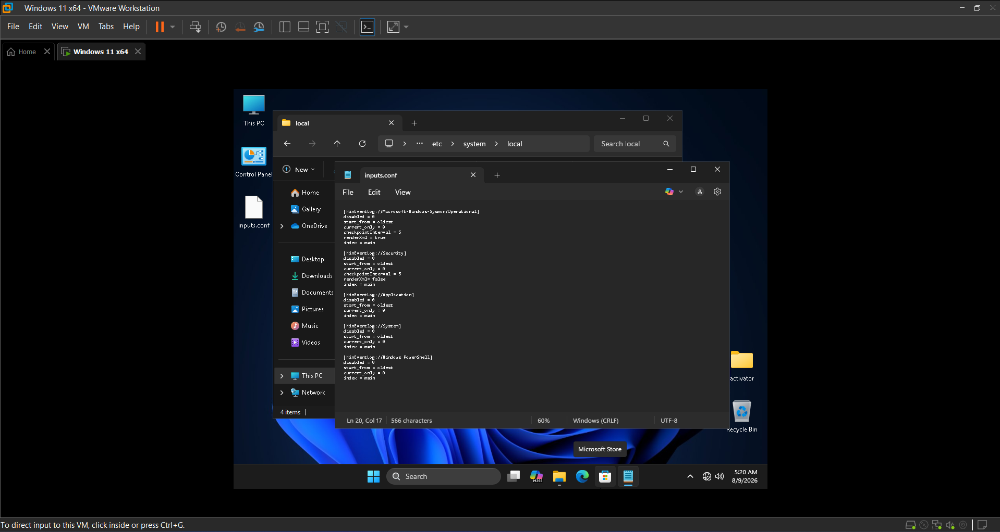

### 7.5 Restart the Universal Forwarder

After modifying `inputs.conf`, restart the forwarder:

```cmd
net stop SplunkForwarder
net start SplunkForwarder
```

Or use PowerShell:
```powershell
Restart-Service SplunkForwarder
```

---

## 8. Configuring Splunk to Receive Windows Event Logs

### 8.1 Verify the Receiver is Enabled

1. Log into Splunk Web at `http://127.0.0.1:8000`.
2. Navigate to **Settings** > **Forwarding and Receiving**.
3. Under **Receiving**, confirm that port `9997` is enabled (you did this in Chapter 1).

If not:
4. Click **Configure receiving** > **New**.
5. Enter port `9997` and click **Save**.

### 8.2 Verify the Forwarder is Sending Data

On your Windows 11 machine, check that the forwarder is connected:

```cmd
cd "C:\Program Files\SplunkUniversalForwarder\bin"
splunk list forward-server
```

You should see your Splunk indexer IP and port (e.g., `127.0.0.1:9997` or your Windows IP).

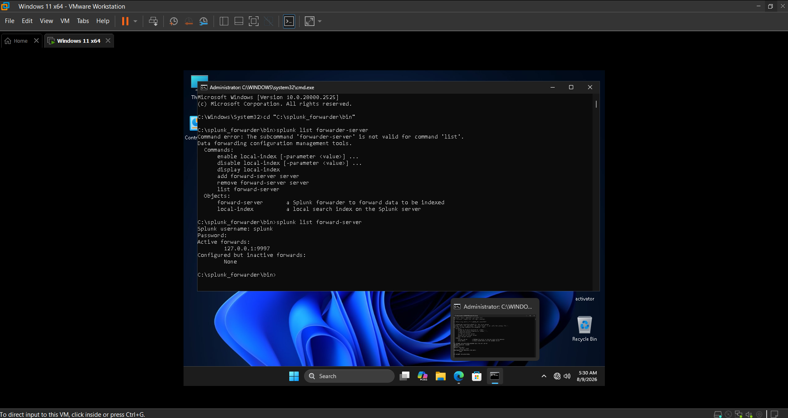

---

## 9. Verification & Testing

### 9.1 Generate Sysmon Events

To test that Sysmon logs are flowing to Splunk, generate some activity:

**Create a test process:**
```cmd
notepad.exe
```

**Create a network connection:**
```cmd
ping 8.8.8.8
```

**Open Event Viewer** to confirm Sysmon logged these events.

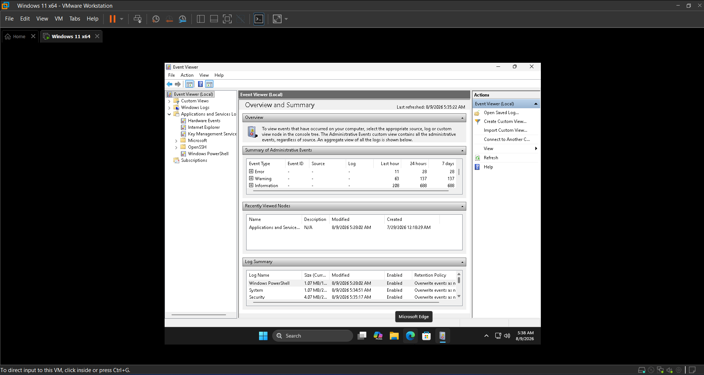

### 9.2 Search for Sysmon Logs in Splunk

1. Open Splunk Web at `http://127.0.0.1:8000`.
2. Go to **Search & Reporting**.
3. Set the time range to **Last 15 minutes**.
4. Run this search:

```
index=main source="WinEventLog://Microsoft-Windows-Sysmon/Operational"
```

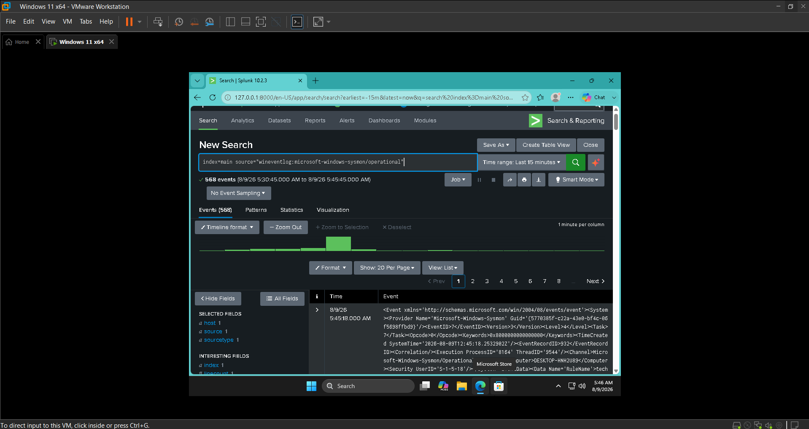

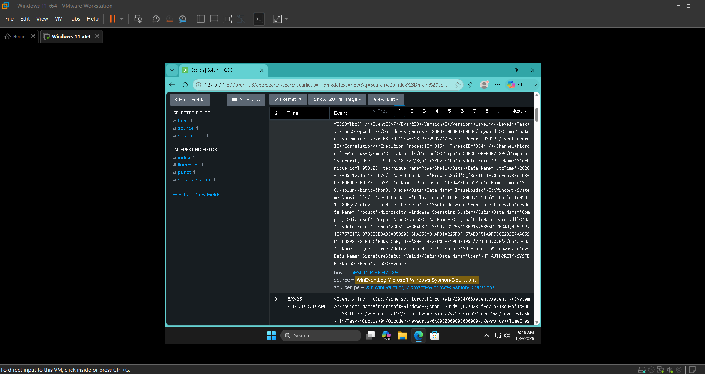

### 9.3 Search for Specific Sysmon Event Types

| Search | What it Shows |
| :--- | :--- |
| `index=main EventCode=1` | Process creation events |
| `index=main EventCode=3` | Network connections |
| `index=main EventCode=11` | File creation |
| `index=main EventCode=12` | Registry events |
| `index=main EventCode=15` | FileCreateStreamHash |

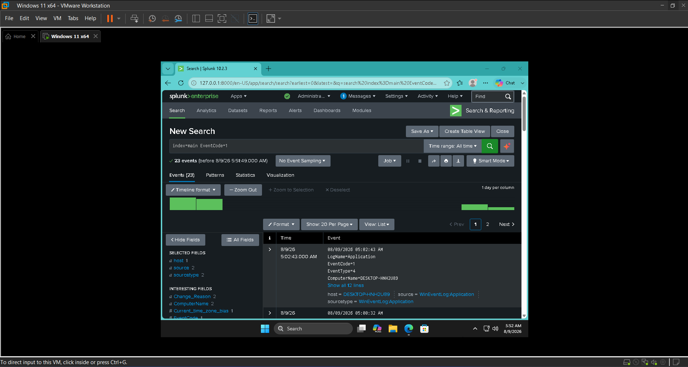

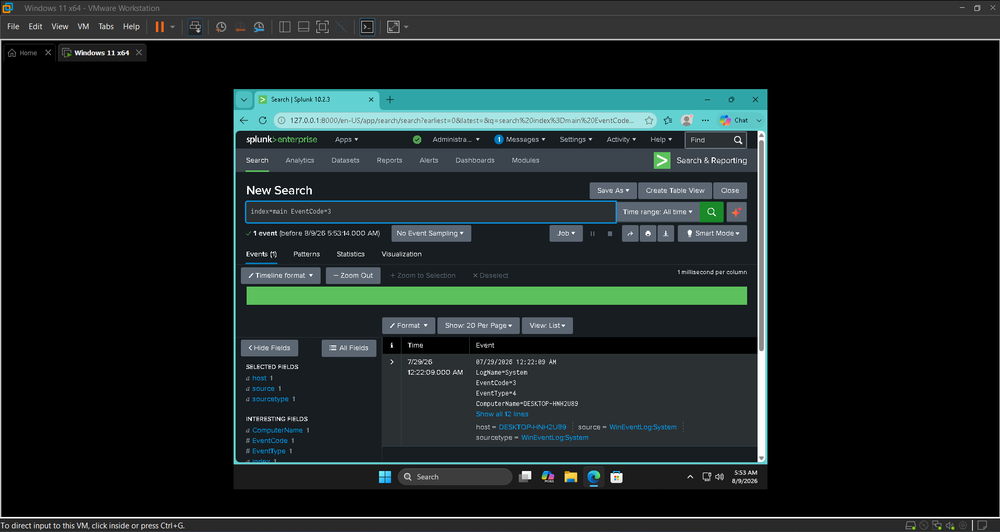

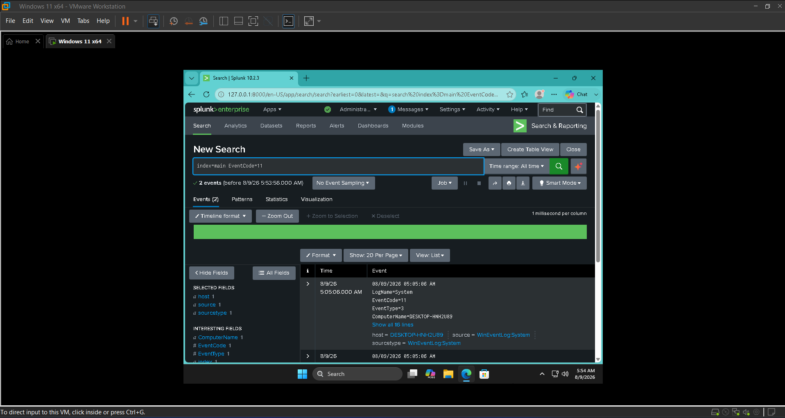

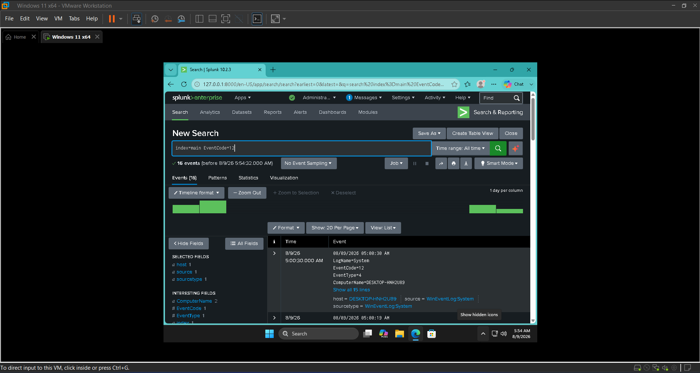

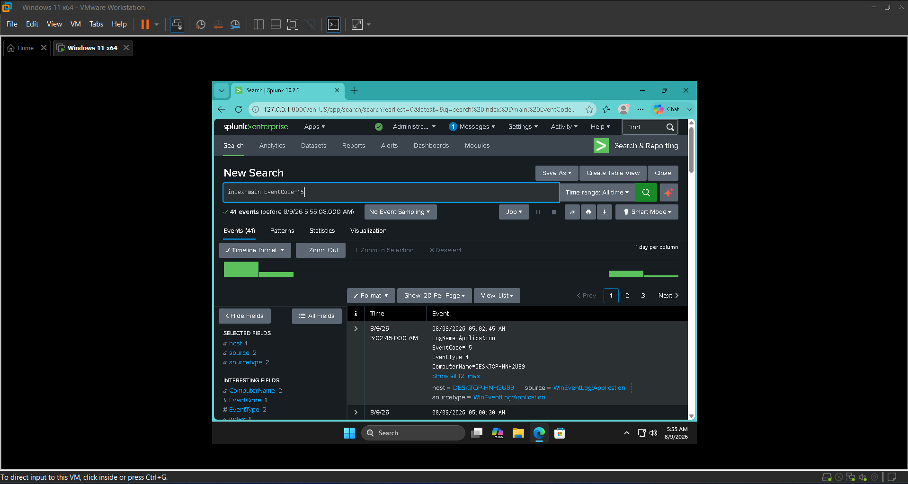

---

## 10. Installing the Splunk Add-on for Sysmon

**Note:** After initial configuration, I noticed that Sysmon events were being ingested into Splunk, but Splunk wasn't automatically extracting the fields from the XML. The events appeared as raw, unparsed data. The `EventCode` field was not available, making it difficult to filter and analyze the data effectively.

The **Splunk Add-on for Sysmon** is specifically designed to parse Sysmon events. It includes all the necessary `props.conf` and `transforms.conf` configurations to extract fields like `EventCode`, `CommandLine`, `Image`, and more.

### 10.1 Download the Add-on

I downloaded the Splunk Add-on for Sysmon from:
```
https://attack-range-appbinaries.s3.us-west-2.amazonaws.com/splunk-add-on-for-sysmon_402.tgz
```

### 10.2 Install the Add-on Using Splunk Web

1. Log into Splunk Web at `http://127.0.0.1:8000`.
2. Navigate to **Apps** > **Manage Apps**.
3. Click **Install app from file**.
4. Click **Choose File** and select the downloaded `.tgz` file.
5. Click **Upload** and follow the prompts.
6. After installation, restart Splunk Enterprise.

### 10.3 Verify the Add-on is Working

After installing the add-on, run a search and check if the `EventCode` field is now extracted:

```
index=main source="WinEventLog://Microsoft-Windows-Sysmon/Operational"
| stats count BY EventCode
```

You should now see a breakdown of events by EventCode (1, 3, 11, etc.).

---

## 11. Critical Windows Event IDs for SOC Analysts

### 11.1 Security Log (Event IDs)

| Event ID | Description | Why It Matters |
| :--- | :--- | :--- |
| **4624** | Successful logon | Identify successful authentication—look for Logon Type 3 (network), 10 (RDP) |
| **4625** | Failed logon | Detect brute-force and password spraying attacks |
| **4648** | Logon using explicit credentials | Detects credential misuse and pass-the-hash attempts |
| **4672** | Special privileges assigned | Administrative logon—monitor for privilege escalation |
| **4688** | Process creation (Security log) | Process creation—less detailed than Sysmon, but still useful |
| **4768** | Kerberos TGT request | Detects Kerberoasting attacks |
| **5140** | Network share object accessed | Detects lateral movement via SMB |

### 11.2 Sysmon Event IDs

| Event ID | Description | Why It Matters |
| :--- | :--- | :--- |
| **1** | Process creation | Full command-line and parent process—detect suspicious executions |
| **2** | File creation time | Detects timestamp manipulation—common malware evasion |
| **3** | Network connection | Source/destination IPs and ports—detect C2, exfiltration |
| **5** | Process termination | Know when a process ends |
| **7** | Image loaded | DLL/Driver loading—detect DLL sideloading |
| **8** | CreateRemoteThread | Detects process injection |
| **10** | ProcessAccess | Access to process memory—detects credential dumping (LSASS) |
| **11** | File creation | New files created on disk |
| **12** | Registry object added/deleted | Persistence mechanism detection |
| **13** | Registry value set | Registry modification detection |
| **15** | FileCreateStreamHash | Alternate Data Streams—malware hiding |
| **16** | Sysmon config change | Detect when Sysmon configuration is modified |
| **22** | DNS query | DNS requests—detect DNS tunneling, C2 |

---

## 12. Practice Exercises

I tried these exercises using my Sysmon and Security logs.

### Exercise 1: Find All Process Creations

**Goal:** Show all process creation events from Sysmon.

```
index=main EventCode=1
| table _time, host, Image, CommandLine, ParentImage
```

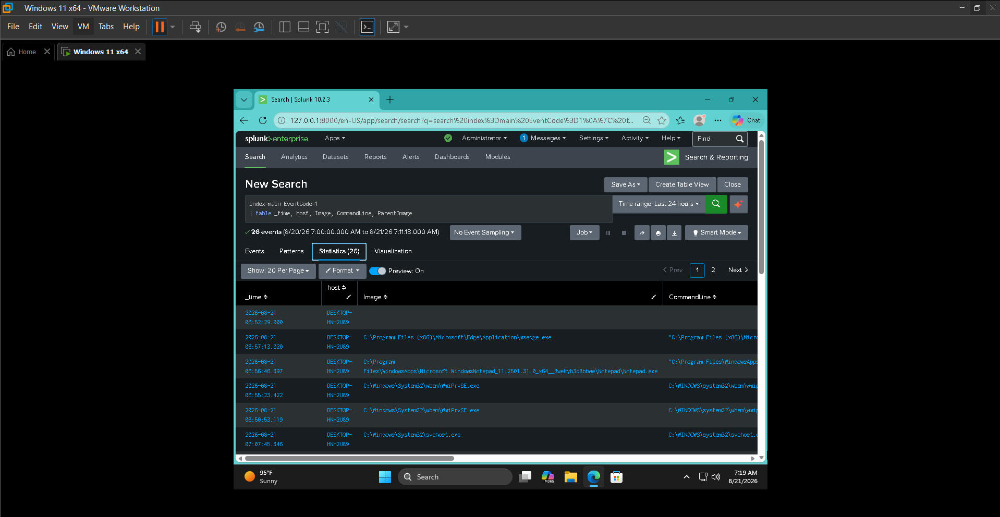

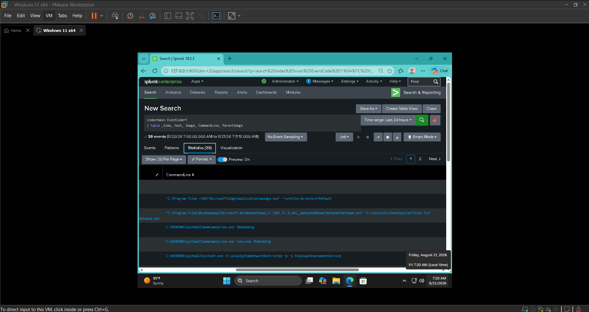

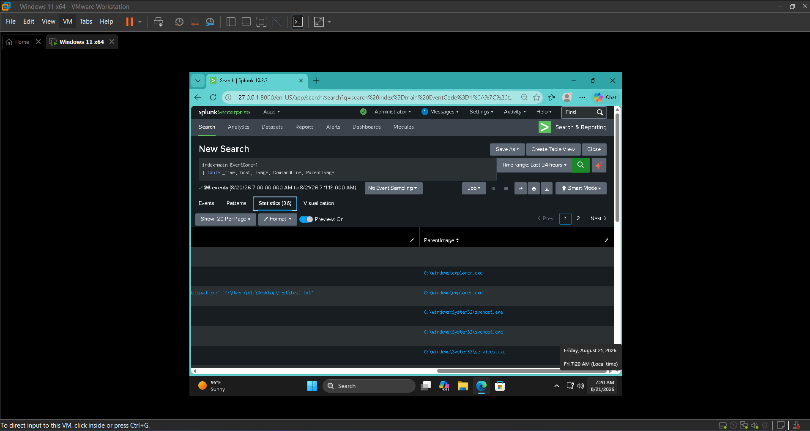

### Exercise 2: Identify Network Connections

**Goal:** Find all outbound network connections.

```
index=main EventCode=3
| table _time, host, Image, DestinationIp, DestinationPort
```

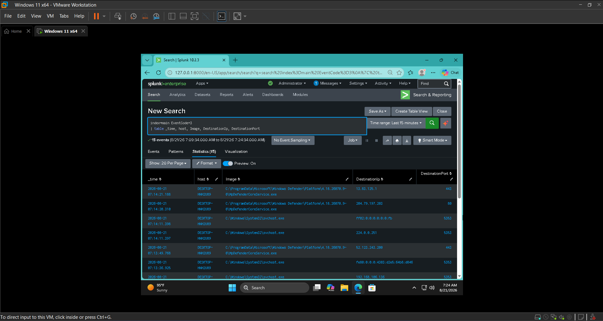

---

### Exercise 3: SMB Brute-Force Detection with Splunk & Sysmon

**Objective**  
Detect a brute-force attack against the SMB service and correlate failed/successful logons with network connection data using Splunk and Sysmon.

---

#### Lab Environment

| Component | Details |
| :--- | :--- |
| **Attacker VM** | Kali Linux 2025.3 |
| **Victim VM** | Windows 11 Enterprise (Build 28000) |
| **Network** | NAT Network (both VMs on same subnet) |
| **Attack Tool** | `netexec` (SMB brute-forcer) |
| **Target User** | `splunktest` |
| **Target Password** | `Password123!` |
| **Logging Tools** | Splunk Forwarder, Splunk Indexer, Sysmon |

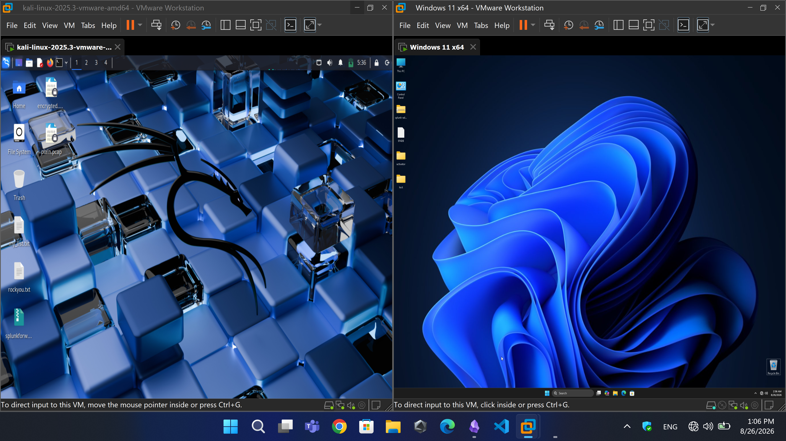

---

#### Part 1 – Windows Configuration (Prerequisites)

Before launching the attack, we must disable specific Windows security features that would otherwise block the attack or lock the account.

**Step 1.1 – Create a dedicated test account**  
Open **Command Prompt as Administrator** and run:
```cmd
net user splunktest Password123! /add
net localgroup "Remote Desktop Users" splunktest /add

# The second command is optional but keeps the user ready for RDP testing if needed later.
```


**Step 1.2 – Disable the Windows Firewall**  
The firewall blocks SMB (port 445) by default on public networks. To allow the attack:

- Press `Win + R`, type `wf.msc`, and press Enter.
- Click **Windows Defender Firewall Properties**.
- Set **Domain, Private, and Public** profiles to **Off**.
- Click **OK**.

> *Alternatively, you can create an inbound rule to allow port 445, but turning it off is easier for a lab.*


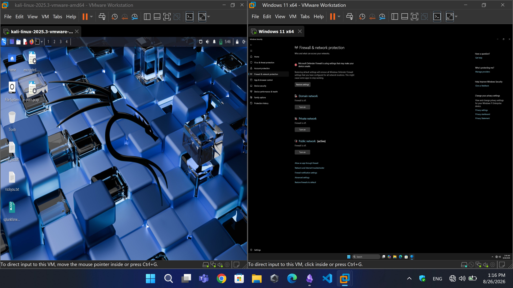

**Step 1.3 – Disable Account Lockout Policy**  
Windows locks an account after a few failed logins (usually 3-5 attempts). This would stop the brute-force instantly. Disable it:

```cmd
net accounts /lockoutthreshold:0
```

Verify with:

```cmd
net accounts
```
Look for `Lockout threshold: Never`.

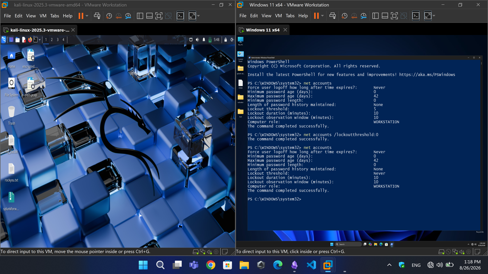

**Step 1.4 – Enable File and Printer Sharing (SMB Server)**  
Ensure the SMB service is listening:

- Open **Control Panel** → **Network and Sharing Center** → **Change advanced sharing settings**.
- Turn on **Network Discovery** and **File and Printer Sharing** for the **Private** profile.

Verify SMB is listening (optional):
```cmd
netstat -an | findstr :445
```
You should see `LISTENING`.


**Step 1.5 – (Recommended) Disable NetBIOS over TCP/IP**  
NetBIOS (port 139) causes timeout errors in `netexec`. Disabling it makes the attack run faster and gives cleaner terminal output for screenshots:

1. Open **Control Panel** → **Network and Sharing Center** → **Change adapter settings**.
2. Right-click your active adapter → **Properties**.
3. Select **Internet Protocol Version 4 (TCP/IPv4)** → **Properties** → **Advanced**.
4. Go to the **WINS** tab → select **Disable NetBIOS over TCP/IP**.
5. Click **OK** all the way out.
6. **Restart Windows 11**.

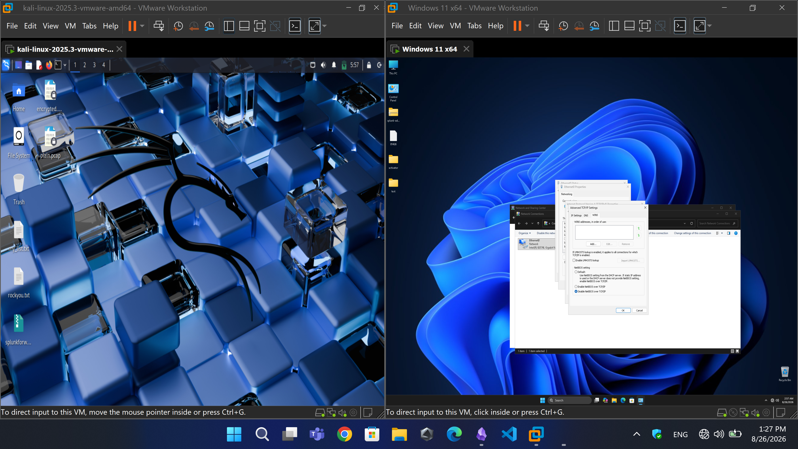

---

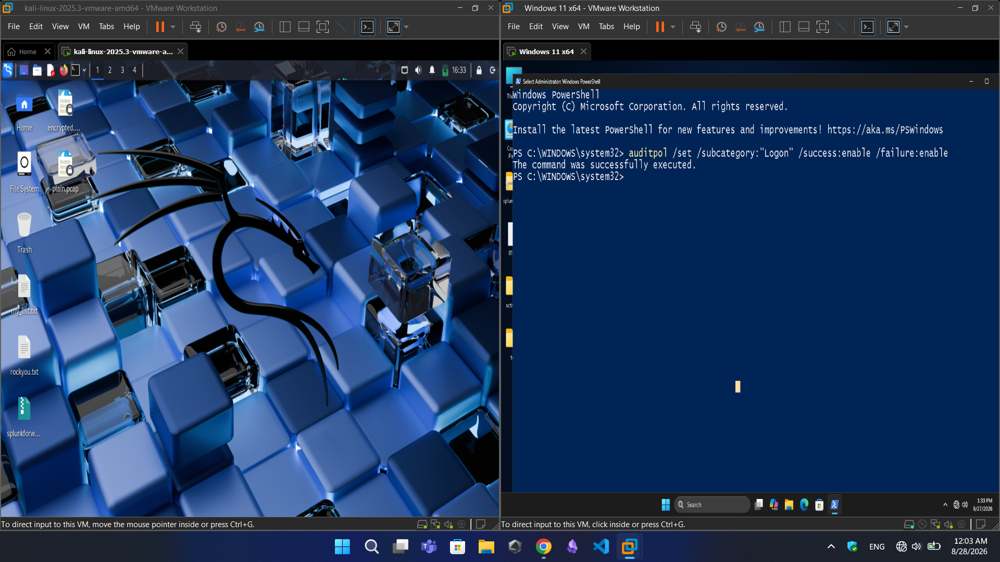

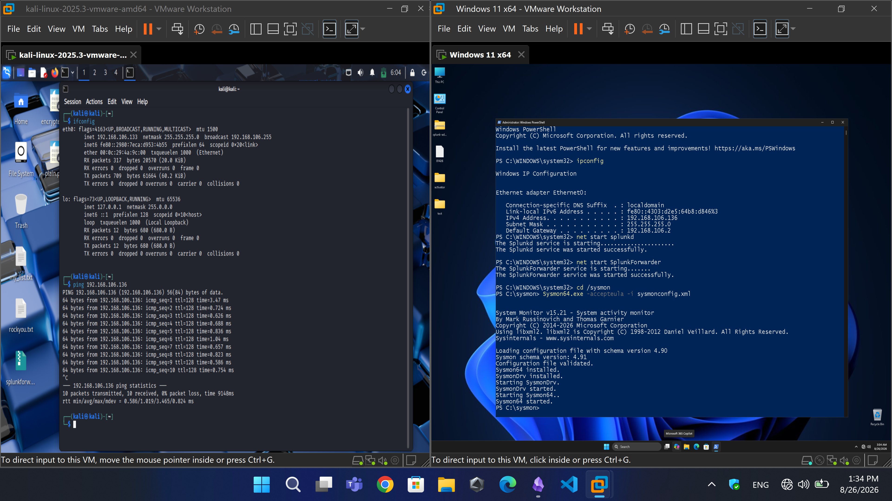

---

#### Part 2 – Launch the SMB Brute-Force Attack

Now that Windows is prepared, we attack from Kali.

**Step 2.1 – Prepare the password list**  
Create a file called `my_list.txt` on your Kali desktop:

```bash
nano ~/Desktop/my_test_file.txt
```

Add these lines (ensure `Password123!` is included):
```
123456
password
admin
Password123!
letmein
welcome
pass
12345
qwerty
abc123
```
Save and exit (`Ctrl+O`, `Enter`, `Ctrl+X`).


**Step 2.2 – Run NetExec**  
Launch the brute-force attack:
```bash
netexec smb 192.168.106.136 -u splunktest -p ~/Desktop/my_test_file.txt --ignore-pw-decoding --continue-on-success --timeout 5
```
(Replace `192.168.106.136` with your Windows VM's IP address.)
(`DESKTOP-HNH2U89` is the name of my Windows 11 VM machine.)


---

#### Part 3 – Verify Logs in Splunk

Open Splunk and run the following searches.

**Step 3.1 – Failed Logons (Brute-Force Evidence)**  
Search for failed network logons:

```spl
index=windows EventCode=4625
```


**Step 3.2 – Successful SMB Network Logon**  
Even though we did not use RDP, when NetExec sent the correct password (`Password123!`), Windows generated a **successful logon event** (Logon Type 3 = Network).  
Search:
```spl
index=main EventCode=4624 Logon_Type=3
```


**Step 3.3 – Sysmon Network Connection Logs (Event 3)**  
Sysmon logged every network connection from Kali to Windows on port 445 (SMB).  
Search:

```spl
index=main EventCode=3
```


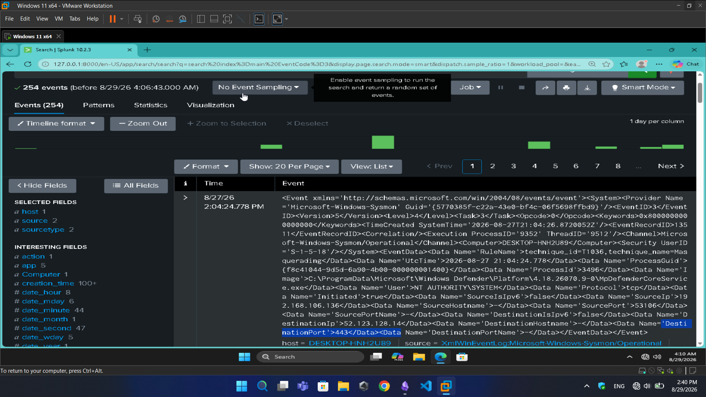

---

#### Part 4 – Correlation & Analysis

By cross-referencing the timestamps of the logs, we can build a complete attack timeline:

| Timestamp | Source | Event | Significance |
| :--- | :--- | :--- | :--- |
| `07:23:45` | Sysmon (Event 3) | Network connection to port 445 | Kali initiated SMB connection to Windows |
| `07:23:46` | Security (4625) | Logon failure for `splunktest` | Brute-force attempt (wrong password) |
| `07:23:47` | Sysmon (Event 3) | Network connection to port 445 | Kali sends another password attempt |
| `07:23:48` | Security (4625) | Logon failure for `splunktest` | Another failed attempt |
| `07:23:52` | Security (4624) | Logon success (Logon Type 3) | Correct password (`Password123!`) found |

**Correlation Search:**

```spl
index=windows (EventCode=4625 OR EventCode=4624 OR EventCode=3) 
| stats count by EventCode, _time
| sort - _time
```

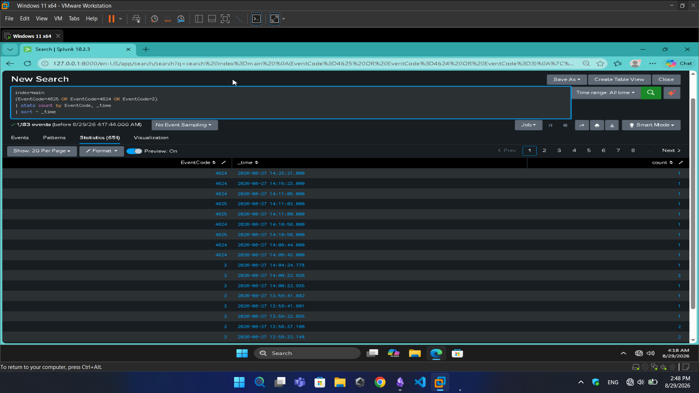

---

#### Findings

1. **Detection**: Brute-force attacks generate a distinct high-volume spike of `4625` events from a single source IP against a single user account.

2. **Correlation**: Sysmon Event 3 provides **network-level proof** of the connection, eliminating false positives (e.g., mistaking local misconfigurations for attacks).

3. **Compromise Confirmation**: A successful `4624` event immediately following a series of `4625` failures indicates the attacker successfully guessed the password.

4. **Visibility**: Without Sysmon, we would only see the authentication logs. With Sysmon, we can confidently attribute the attack to a specific source machine and port.

---

#### Conclusion

This exercise demonstrates how to leverage **Windows Security Logs** (Event IDs 4624/4625) together with **Sysmon** (Event ID 3) in Splunk to detect, confirm, and triage a credential brute-force attack against an SMB service. The key to a successful lab is properly **pre-configuring Windows** by disabling the firewall, turning off account lockout, and ensuring SMB is active.

---

#### Reverting Changes (Optional Cleanup)

Once you have taken all your screenshots, you may want to restore Windows security settings:

- **Turn Firewall back ON**: In `wf.msc`, set all profiles back to **On**.
- **Re-enable NetBIOS** (if you disabled it): Set the WINS tab back to `Default`.
- **Re-enable Account Lockout** (recommended for production): Run `net accounts /lockoutthreshold:5` to set it back to 5 attempts.
- **Delete the test account** (if no longer needed): `net user splunktest /delete`.

---

## 13. Troubleshooting Reference

### Issue: Sysmon installation fails with "Access Denied"

**Solution:** Run the command prompt or PowerShell as Administrator.

### Issue: No Sysmon events in Splunk

**Solutions:**
1. Verify Sysmon is running: `services.msc` and check the Sysmon service.
2. Verify the input is enabled in `inputs.conf`:
   ```conf
   [WinEventLog://Microsoft-Windows-Sysmon/Operational]
   disabled = 0
   ```
3. Restart the Splunk Universal Forwarder:
   ```cmd
   net stop SplunkForwarder && net start SplunkForwarder
   ```
4. Check the forwarder logs:
   ```
   C:\Program Files\SplunkUniversalForwarder\var\log\splunk\splunkd.log
   ```

### Issue: Sysmon logs are too noisy

**Solution:** Update your Sysmon configuration to exclude known safe processes:

```xml
<ProcessCreate onmatch="exclude">
  <Image condition="end with">\svchost.exe</Image>
  <Image condition="end with">\lsass.exe</Image>
  <Image condition="end with">\winlogon.exe</Image>
</ProcessCreate>
```

Then update the configuration:
```cmd
Sysmon64.exe -c sysmonconfig.xml
```

### Issue: Security log events not appearing

**Solution:** Verify the Security log input is enabled:
```conf
[WinEventLog://Security]
disabled = 0
```

**Note:** The Security log requires the forwarder to run with **Local System** or **Network Service** privileges to read it. Check the service account in `services.msc` for SplunkForwarder.

### Issue: EventCode field not appearing in Splunk

**Solution:** Install the Splunk Add-on for Sysmon (see Section 10). This add-on provides the necessary field extractions to parse Sysmon XML events.

---

## ✅ Milestone Achieved

At this point, you can:
- ✅ Install and configure Sysmon on Windows 11
- ✅ Create a custom Sysmon configuration file
- ✅ Verify Sysmon is running and generating logs
- ✅ Configure the Splunk Universal Forwarder to collect Sysmon and Security logs
- ✅ Install and configure the Splunk Add-on for Sysmon
- ✅ Search for Sysmon events in Splunk with proper field extraction
- ✅ Identify critical Windows Event IDs for security monitoring
- ✅ Correlate Sysmon and Security events for deeper investigation
- ✅ Detect and analyze an SMB brute-force attack using Splunk

**Next Steps:** Continue to Chapter 4: Building SOC Dashboards, where you will create visual dashboards for monitoring Windows security events and Sysmon logs in real-time.

---

## 📚 References

- [Sysmon - Sysinternals (Microsoft Learn)](https://learn.microsoft.com/sysinternals/downloads/sysmon)
- [Sysmon Configuration Files (Microsoft Learn)](https://learn.microsoft.com/sysinternals/sysmon/configuration-files)
- [Sysmon Modular Configuration (GitHub - olafhartong)](https://github.com/olafhartong/sysmon-modular)
- [Splunk Add-on for Sysmon Documentation](https://splunk.github.io/splunk-add-on-for-microsoft-sysmon/)
- [Windows Event Log IDs Every SOC Analyst Should Know](https://epicdetect.io)
- [Splunk Universal Forwarder Manual](https://docs.splunk.com/Documentation/Forwarder)
- `DeepSeek AI`
