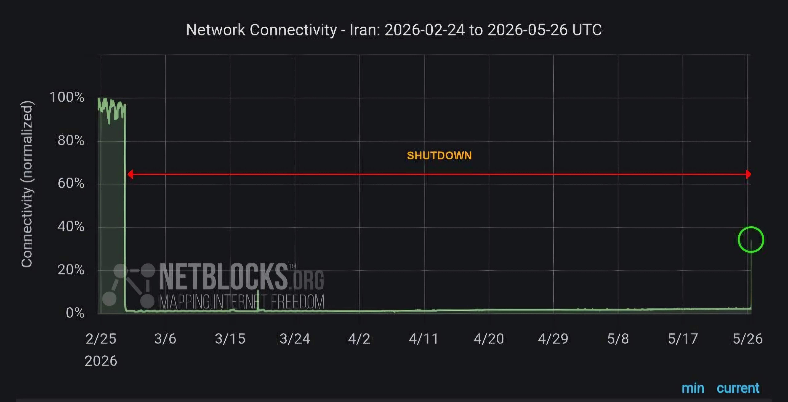

## Second Filtering Incident: May 2026

**Start Date:** 25 Ordibehesht 1405 (May 15, 2026)
**End Date:** 5 Khordad 1405 (May 26, 2026)

**Source:** CITNA News Agency reports on May 15, 2026, that GitHub was once again blocked for Iranian users. (https://www.cinta.ir/node/336506)

**What happened:** GitHub was accessible again on 5 Khordad 1405.

**What I did during this period:** I continued studying cybersecurity from books and completed exercises offline. All work was saved locally.

**Proof:** See screenshot below  showing netblocks information during this filtering period.

— Ali Badelpour
