# SMB Brute-Force Detection with Splunk & Sysmon

## ⚠️ DISCLAIMER & WARNING

**This project is for educational and authorized security testing purposes ONLY.**
- All attacks were performed in an **isolated lab environment** with explicit authorization.
- The techniques demonstrated here are **real-world attack methods** that should **NEVER** be used against systems you do not own or have explicit written permission to test.
- Disabling security features (firewall, account lockout policies) as shown in this lab is **DANGEROUS** in production environments.
- The author assumes **NO responsibility** for any misuse of this information.
- **ALWAYS** follow responsible disclosure practices and applicable laws in your jurisdiction.

> *"With great power comes great responsibility."* — Use this knowledge ethically.
----

## 📖 Overview

This project demonstrates a hands-on approach to detecting a brute-force attack against the SMB (Server Message Block) service in a controlled lab environment. By combining the power of **Splunk** for log analysis and **Sysmon** for deep system monitoring, I correlated failed authentication attempts with network connection data to identify a successful credential compromise.

### Objective

The primary goal of this exercise was to:

1.  **Simulate** a real-world SMB brute-force attack using `netexec` (formerly CrackMapExec) from a Kali Linux machine.
2.  **Capture** forensic-quality logs using Sysmon and Windows Security Events.
3.  **Visualize and Analyze** the attack timeline in Splunk to identify the exact moment of compromise.
4.  **Correlate** failed logons (Event Code 4625) with successful logons (4624) and network connections (Sysmon Event 3).

### 🛡️ Key Takeaways

- A brute-force attack generates a distinct **spike** in `EventCode=4625` (failed logons) from a single source.
- The compromise is confirmed by a **successful logon `4624`** immediately following the failure spike.
- **Sysmon Event 3** provides crucial network context, allowing us to trace the attack back to the source IP and port (445) and eliminate false positives.

----
## 📋 Prerequisites

Before starting this lab, ensure you have:

| Requirement | Details |
| :---------- | :------ |
| **Hypervisor** | VMware Workstation, VirtualBox, or similar |
| **Kali VM** | Kali Linux 2025.3 with `netexec` installed (`sudo apt install netexec`) |
| **Windows VM** | Windows 10/11 Enterprise with network access |
| **Splunk** | Splunk Enterprise installed (free 500MB/day license works) |
| **Sysmon** | Latest version installed on Windows |
| **Network** | Both VMs on the same NAT network or subnet |

> **Tip**: Take snapshots of both VMs before starting so you can easily revert to a clean state.

----
## 🖥️ Lab Environment

The lab was built using virtual machines (VMs) on a private NAT network to simulate an attacker and a target victim.

| Component          | Details                                                       |
| :----------------- | :------------------------------------------------------------ |
| **Attacker OS**    | Kali Linux 2025.3                                             |
| **Victim OS**      | Windows 11 Enterprise                                         |
| **Network**        | NAT Network (Same Subnet)                                     |
| **Attack Tool**    | `netexec` (SMB Brute-Forcer)                                  |
| **Target User**    | `splunktest`                                                  |
| **Password**       | `Password123!`                                                |
| **Logging & SIEM** | Sysmon, Splunk Universal Forwarder, Splunk Enterprise Indexer |


----
## ⚙️ Part 1: Windows Configuration (Prerequisites)

Before launching the attack, we must disable specific Windows security features that would otherwise block the attack or lock the account.

**Step 1.1 – Create a dedicated test account**  
Open **Command Prompt as Administrator** and run:
```cmd
net user splunktest Password123! /add
net localgroup "Remote Desktop Users" splunktest /add

# The second command is optional but keeps the user ready for RDP testing if needed later.
```

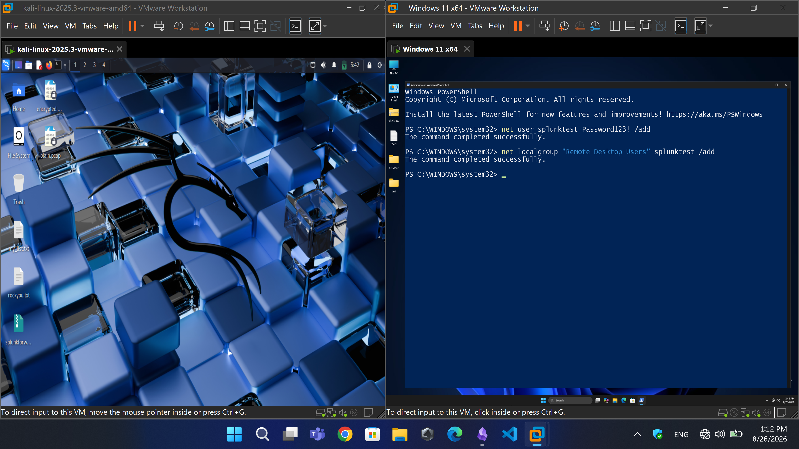

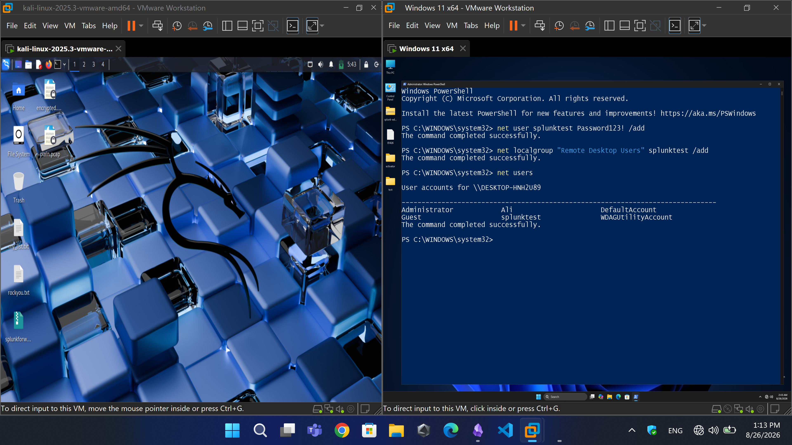

**Step 1.2 – Disable the Windows Firewall**  
The firewall blocks SMB (port 445) by default on public networks. To allow the attack:

- Press `Win + R`, type `wf.msc`, and press Enter.
- Click **Windows Defender Firewall Properties**.
- Set **Domain, Private, and Public** profiles to **Off**.
- Click **OK**.

> *Alternatively, you can create an inbound rule to allow port 445, but turning it off is easier for a lab.*

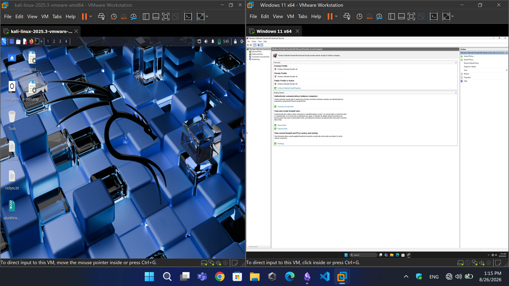


**Step 1.3 – Disable Account Lockout Policy**  
Windows locks an account after a few failed logins (usually 3-5 attempts). This would stop the brute-force instantly. Disable it:

```cmd
net accounts /lockoutthreshold:0
```

Verify with:

```cmd
net accounts
```
Look for `Lockout threshold: Never`.


**Step 1.4 – Enable File and Printer Sharing (SMB Server)**  
Ensure the SMB service is listening:

- Open **Control Panel** → **Network and Sharing Center** → **Change advanced sharing settings**.
- Turn on **Network Discovery** and **File and Printer Sharing** for the **Private** profile.

Verify SMB is listening (optional):
```cmd
netstat -an | findstr :445
```
You should see `LISTENING`.

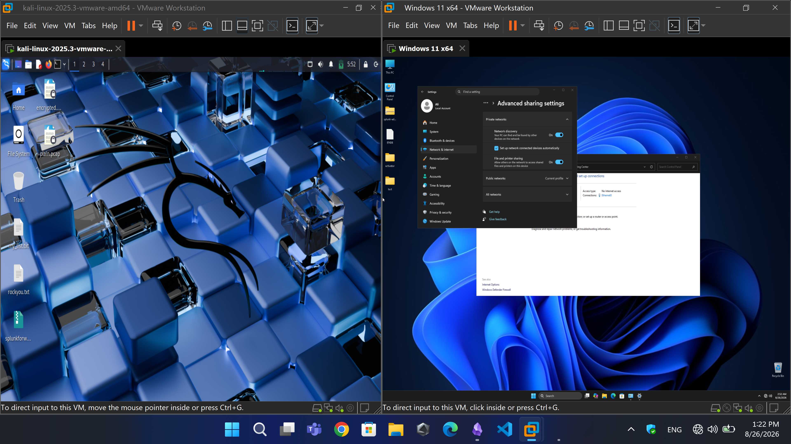

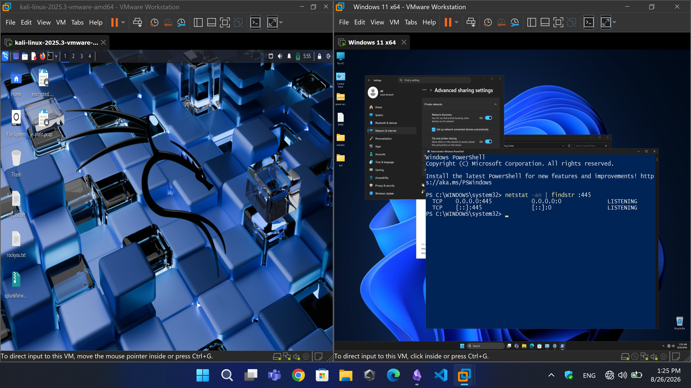

**Step 1.5 – (Recommended) Disable NetBIOS over TCP/IP**  
NetBIOS (port 139) causes timeout errors in `netexec`. Disabling it makes the attack run faster and gives cleaner terminal output for screenshots:

1. Open **Control Panel** → **Network and Sharing Center** → **Change adapter settings**.
2. Right-click your active adapter → **Properties**.
3. Select **Internet Protocol Version 4 (TCP/IPv4)** → **Properties** → **Advanced**.
4. Go to the **WINS** tab → select **Disable NetBIOS over TCP/IP**.
5. Click **OK** all the way out.
6. **Restart Windows 11**.


----


----
## 🚀 Part 2: Launching the Brute-Force Attack

Now that Windows is prepared, we attack from Kali.

**Step 2.1 – Prepare the password list**  
Create a file called `my_list.txt` on your Kali desktop:

```bash
nano ~/Desktop/my_list.txt
```

Add these lines (ensure `Password123!` is included):
```
123456
password
admin
Password123!
letmein
welcome
pass
12345
qwerty
abc123
```
Save and exit (`Ctrl+O`, `Enter`, `Ctrl+X`).

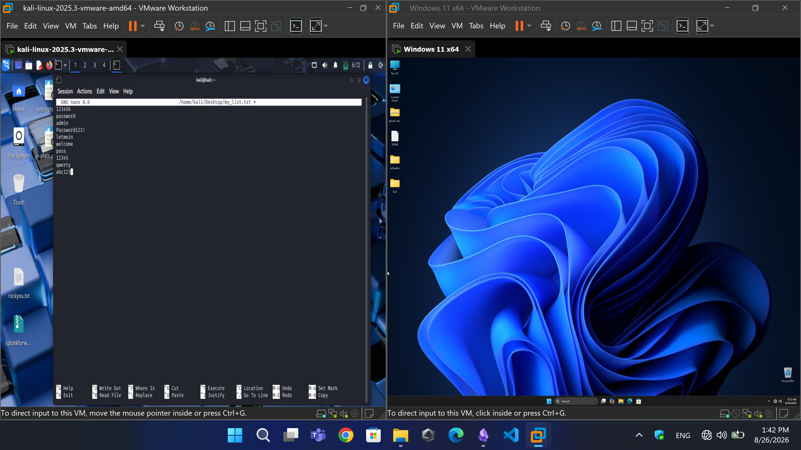

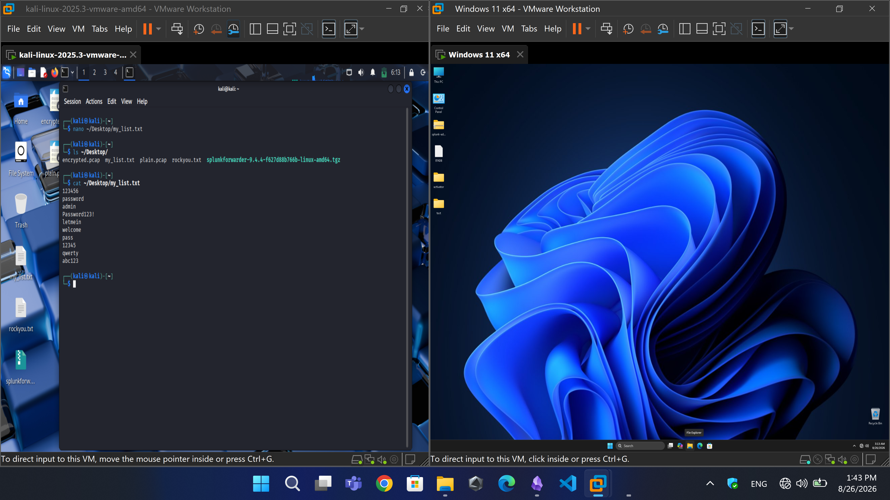

**Step 2.2 – Run NetExec**  
Launch the brute-force attack:
```bash
netexec smb 192.168.106.136 -u splunktest -p ~/Desktop/my_list.txt --ignore-pw-decoding --continue-on-success --timeout 5
```
(Replace `192.168.106.136` with your Windows VM's IP address.)
(`DESKTOP-HNH2U89` is the name of my Windows 11 VM machine.)

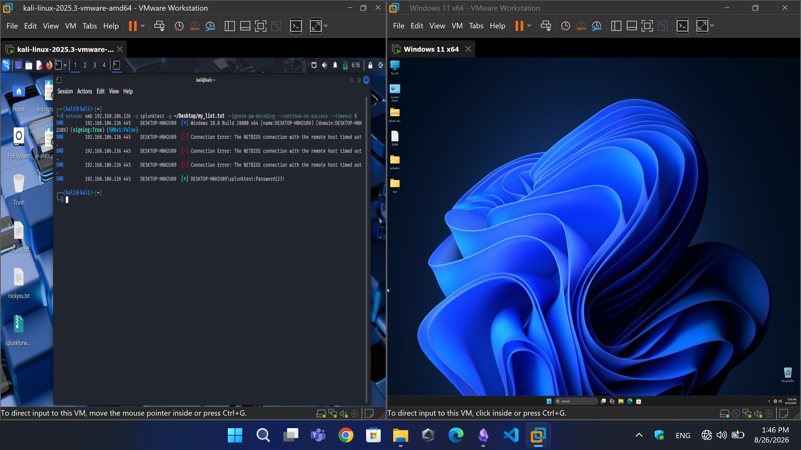

----
## 📊 Part 3: Log Analysis in Splunk

Open Splunk and run the following searches.

**Step 3.1 – Failed Logons (Brute-Force Evidence)**  
Search for failed network logons:

```spl
index=main EventCode=4625
```

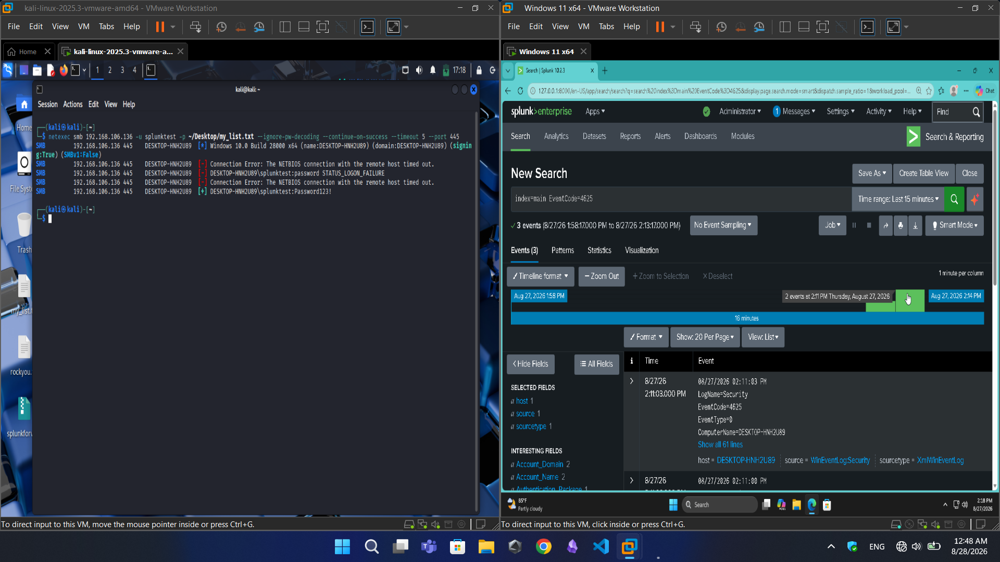

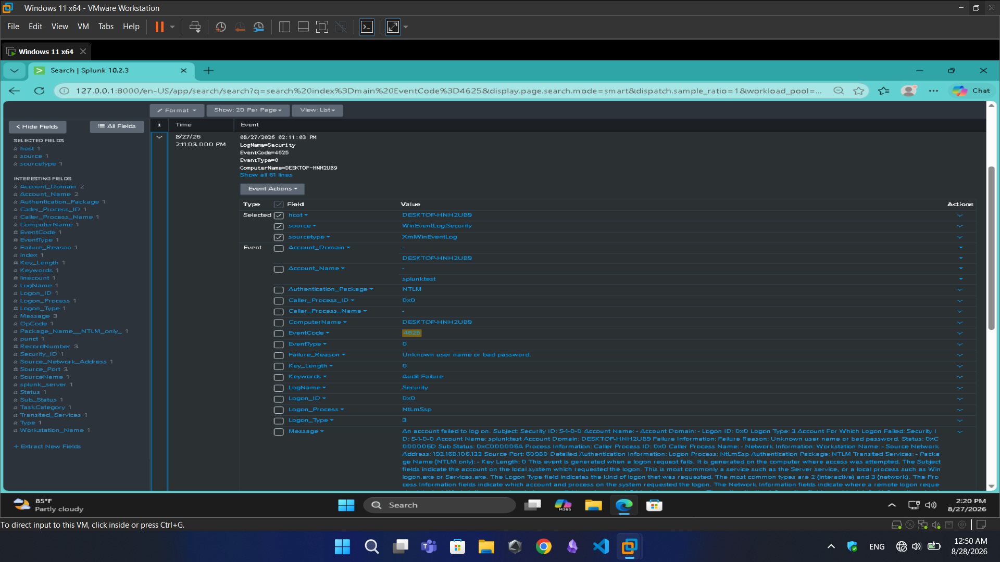

**Step 3.2 – Successful SMB Network Logon**  
Even though we did not use RDP, when NetExec sent the correct password (`Password123!`), Windows generated a **successful logon event** (Logon Type 3 = Network).  
Search:
```spl
index=main EventCode=4624 Logon_Type=3
```

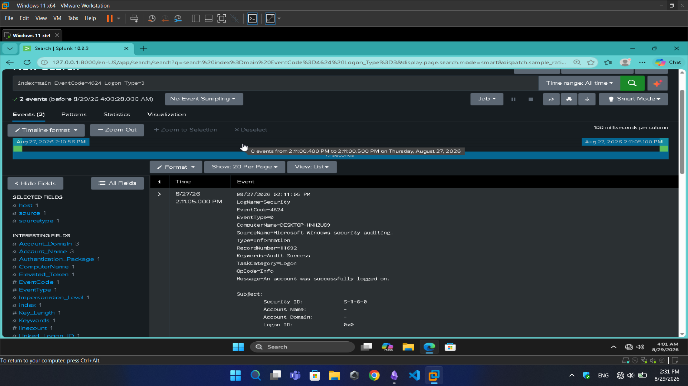

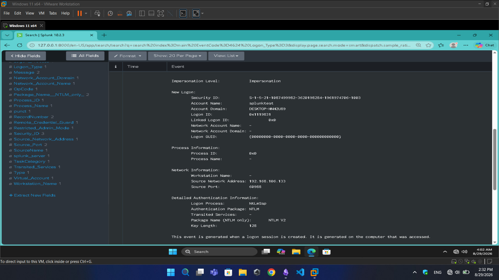

**Step 3.3 – Sysmon Network Connection Logs (Event 3)**  
Sysmon logged every network connection from Kali to Windows on port 445 (SMB).  
Search:

```spl
index=main EventCode=3
```

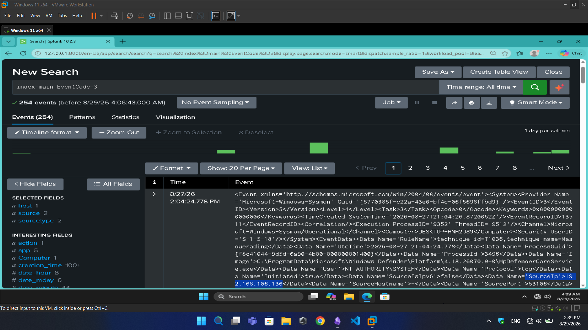


----
## 🔗 Part 4: Correlation & Analysis

By cross-referencing the timestamps of the logs, we can build a complete attack timeline:

| Timestamp  | Source           | Event                          | Significance                             |
| :--------- | :--------------- | :----------------------------- | :--------------------------------------- |
| `09:52:01` | Sysmon (Event 3) | Network connection to port 445 | Kali initiated SMB connection to Windows |
| `09:52:07` | Security (4625)  | Logon failure for `splunktest` | Brute-force attempt (wrong password)     |
| `09:52:08` | Sysmon (Event 3) | Network connection to port 445 | Kali sends another password attempt      |
| `09:52:11` | Security (4625)  | Logon failure for `splunktest` | Another failed attempt                   |
| `09:52:13` | Security (4624)  | Logon success (Logon Type 3)   | Correct password (`Password123!`) found  |

**Correlation Search:**

```spl
index=main (EventCode=4625 OR EventCode=4624 OR EventCode=3) 
| stats count by EventCode, _time
| sort - _time
```

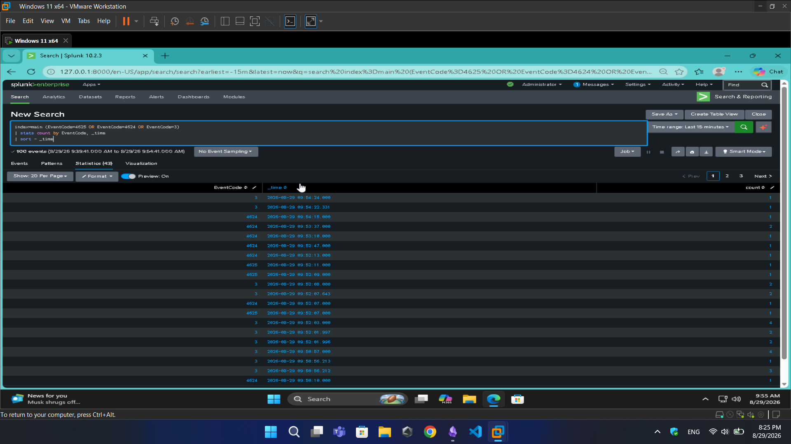


----
## 🧠 Findings & Conclusion

### Summary of Findings

1. **Detection**: The brute-force attack was clearly identifiable by a high-volume spike of `4625` events from a single source IP.
    
2. **Correlation**: Sysmon Event 3 provided the necessary **network context** to prove the attack originated from the Kali machine and was not an internal OS misconfiguration.
    
3. **Compromise Confirmation**: The successful `4624` logon immediately after the failure spike pinpointed the exact time of compromise.
    
4. **Visibility**: Without Sysmon, the investigation would rely purely on authentication logs. Sysmon adds a crucial layer of network visibility that strengthens incident response.

### Conclusion

This lab effectively demonstrates how to leverage Windows Security Logs (Event IDs 4624/4625) in conjunction with Sysmon (Event ID 3) to detect and confirm a credential brute-force attack against the SMB service.

This project highlights the power of combining different log sources in a SIEM like Splunk to cut through the noise and uncover sophisticated attack patterns.

----
## 🧹 Reverting Changes (Optional Cleanup)

Once you have taken all your screenshots, you may want to restore Windows security settings:

- **Turn Firewall back ON**: In `wf.msc`, set all profiles back to **On**.
- **Re-enable NetBIOS** (if you disabled it): Set the WINS tab back to `Default`.
- **Re-enable Account Lockout** (recommended for production): Run `net accounts /lockoutthreshold:5` to set it back to 5 attempts.
- **Delete the test account** (if no longer needed): `net user splunktest /delete`.

----
## 🔧 Troubleshooting Guide

| Issue | Possible Cause | Solution |
| :---- | :------------- | :------- |
| **NetExec timeout errors** | NetBIOS still enabled on Windows | Disable NetBIOS over TCP/IP (Step 1.5) |
| **No logs in Splunk** | Splunk Forwarder not running | Run `net start SplunkForwarder` on Windows |
| **Account locks immediately** | Lockout policy not disabled | Verify with `net accounts` (should show "Never") |
| **Firewall blocking SMB** | Firewall still active | Double-check in `wf.msc` (all profiles OFF) |
| **No Sysmon Event 3 logs** | Sysmon not installed or misconfigured | Run `Sysmon.exe -accepteula -i` |
| **Index returns no results** | Wrong index name | Check your Splunk configuration; try `index=*` first |

----

## 📊 Detection Rules & Use Cases

### Splunk Alert Rule

You can turn this into a scheduled alert in Splunk:

```spl
index=main EventCode=4625
| stats count by src_ip, TargetUserName, _time
| where count > 50
| eval alert = "Possible brute-force attack detected from " . src_ip
| table _time, src_ip, TargetUserName, count
```
### Detection Logic

| Trigger                   | Threshold             | Time Window |
| ------------------------- | --------------------- | ----------- |
| Failed Logons (4625)      | > 50 attempts         | 5 minutes   |
| Failed to Success Ratio   | 20:1 or higher        | 10 minutes  |
| SMB Connections (Event 3) | > 50 from same source | 5 minutes   |

----
## 🔐 Security Recommendations

To protect against SMB brute-force attacks in production:
### Immediate Actions
- **Enable Account Lockout**: Set threshold to 3-5 attempts.
- **Enable Firewall**: Block SMB (445) from untrusted networks.
- **Use Complex Passwords**: Enforce password complexity policies.
- **Enable MFA**: Multi-factor authentication prevents password-only compromises.
### Long-term Strategy
- **Implement SIEM Monitoring**: Alert on high volumes of 4625 events.
- **Deploy Sysmon**: Critical for network-level visibility.
- **Restrict SMB**: Allow SMB only from authorized IP addresses.
- **Regular Audits**: Review logs for unusual authentication patterns.
- **Network Segmentation**: Isolate critical systems from general network.

----
## 🛠️ Quick Reference
### Windows Commands
```cmd
# User Management
net user splunktest Password123! /add
net localgroup "Remote Desktop Users" splunktest /add
net user splunktest /delete

# Account Lockout
net accounts /lockoutthreshold:0
net accounts /lockoutthreshold:5

# SMB Verification
netstat -an | findstr :445

# Splunk Service
net start SplunkForwarder
net stop SplunkForwarder
```
### Kali Commands
``` bash
# Install NetExec
sudo apt update && sudo apt install netexec
# Create Password List
nano ~/Desktop/my_list.txt

# Launch Attack
netexec smb <IP> -u <user> -p <password_list> --ignore-pw-decoding --continue-on-success --timeout 5

# Check SMB Status
nmap -p 445 <IP>

```

### Splunk Queries
```spl
# Failed Logons
index=main EventCode=4625

# Successful Logons
index=main EventCode=4624 Logon_Type=3

# Sysmon Network Connections
index=main EventCode=3

# Correlation
index=main (EventCode=4625 OR EventCode=4624 OR EventCode=3)
| stats count by EventCode, _time
| sort - _time
```

----
## 🎯 MITRE ATT&CK Mapping

| Tactic                | Technique                | ID                                                          | Description                    |
| --------------------- | ------------------------ | ----------------------------------------------------------- | ------------------------------ |
| **Credential Access** | Brute Force              | [T1110](https://attack.mitre.org/techniques/T1110/)         | Attempting to guess passwords  |
| **Lateral Movement**  | SMB/Windows Admin Shares | [T1021.002](https://attack.mitre.org/techniques/T1021/002/) | Using SMB for lateral movement |

----
## 🛡️ Skills Demonstrated

| Domain | Skills |
|--------|--------|
| **SIEM Operations** | Splunk SPL, log ingestion, query optimization, data correlation |
| **Threat Detection** | Brute-force identification, IOC analysis, anomaly detection |
| **Windows Security** | Event log analysis, Sysmon configuration, security auditing |
| **Offensive Security** | NetExec usage, SMB attack simulation, password spraying |
| **Incident Response** | Attack timeline reconstruction, root cause analysis |
| **Lab Design** | Virtualization, network configuration, logging setup |
| **Documentation** | Technical writing, procedural documentation, reporting |

----
## 📚 References & Further Reading

- [Sysmon Documentation](https://learn.microsoft.com/en-us/sysinternals/downloads/sysmon)
- [Splunk Search Reference](https://docs.splunk.com/Documentation/Splunk/latest/SearchReference/UnderstandingSPL)
- [MITRE ATT&CK - Brute Force (T1110)](https://attack.mitre.org/techniques/T1110/)
- [NetExec GitHub Repository](https://github.com/Pennyw0rth/NetExec)
- [Windows Security Event IDs](https://www.ultimatewindowssecurity.com/securitylog/encyclopedia/)

----

## 📝 License

This project is for educational purposes only. See the DISCLAIMER section for more information.

----

**⭐ If you found this helpful, consider giving it a star!**