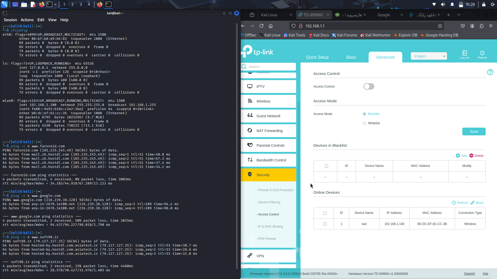
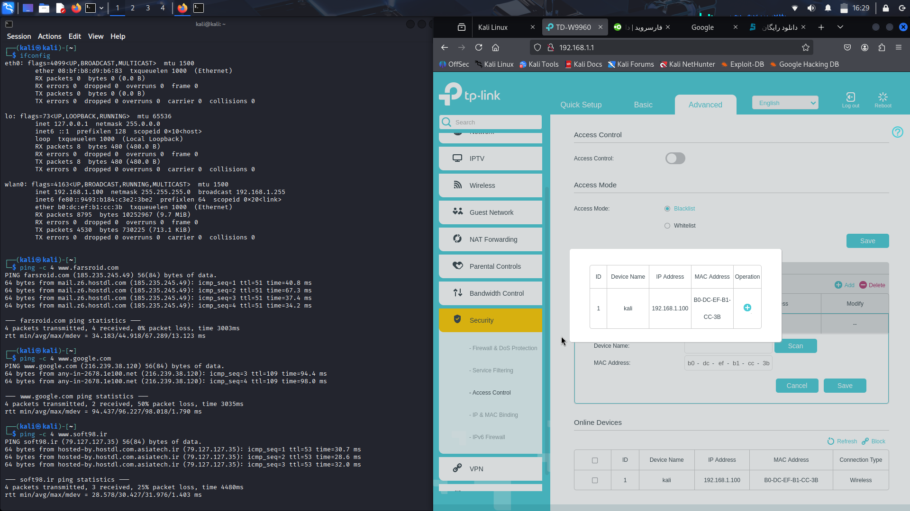
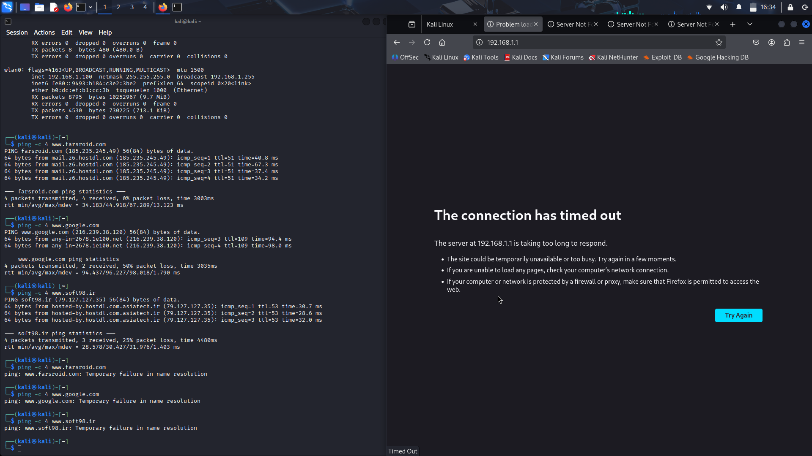
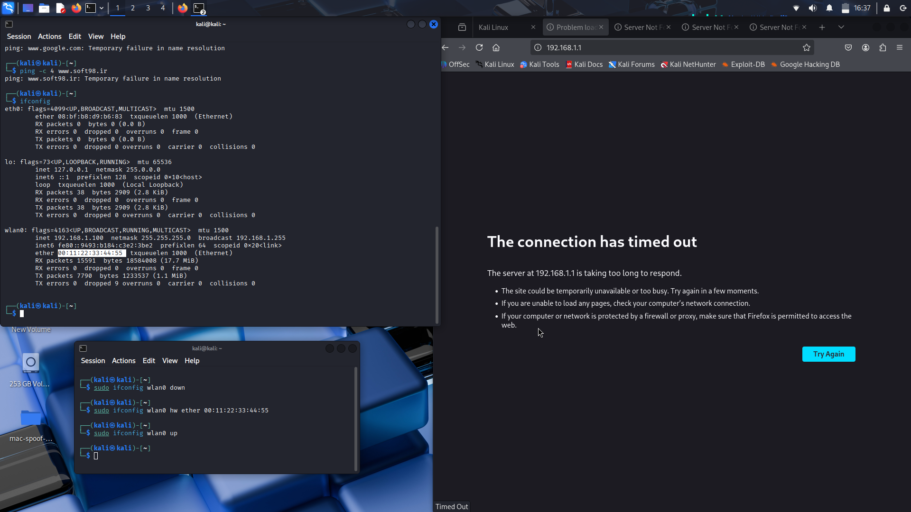
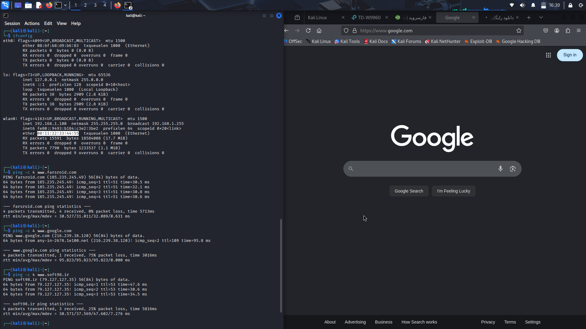
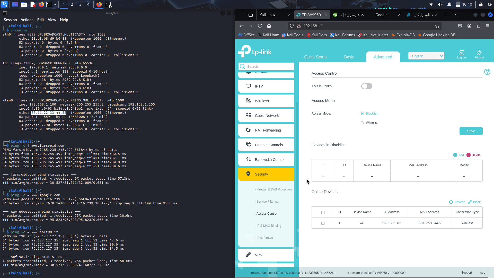
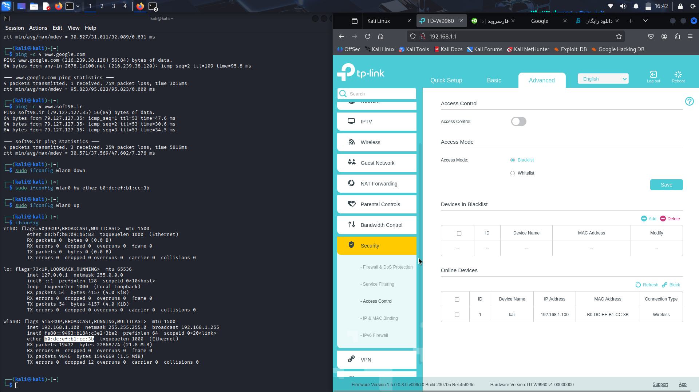

# Project: Bypassing Router MAC Blacklist by Spoofing a MAC Address


## Objective

In this project, I demonstrate how to bypass a router’s MAC address blacklist by manually changing the MAC address of my Wi-Fi adapter using Linux command-line tools. The scenario simulates a situation where my original MAC address is blocked by the router’s access control list while connecting to the access point is allowed, preventing any internet connectivity. By spoofing a new MAC address, I regain internet access and then remove the original MAC from the blacklist via the router’s admin panel.

## Environment & Tools

- **Operating System:** Linux (Kali Linux Live - USB)
- **Network Adapter:** `wlan0` (my integrated Wi-Fi adapter)
- **Commands used:** `sudo`, `ifconfig`, `ping`
- **Router admin interface:** Accessed via web browser at `192.168.1.1`

## Step-by-Step Procedure


### 1. Initial State – Original MAC Blacklisted

I confirmed that my original MAC address was added to the router’s MAC filter blacklist. After connecting to the Wi-Fi network, I had an IP address but could not browse the internet or ping any external site.

- Showing MAC address of my device in Router admin interface:
	
	Using the command `ifconfig` to check the IP address in `inet` and MAC address in `ether` part of `wlan0` interface. Accessing some websites and using `ping` to verify the connection.
```bash
   ifconfig
   # After blacklist, these pings will timeout
   ping -c 4 www.farsroid.com
   ping -c 4 www.google.com
   ping -c 4 www.soft98.ir
```

- Adding my MAC address to the Blacklist of my Router:
	
	I am doing this with navigating to `Advanced` tab, `Security`, `Access Control`

- The MAC address is in the Blacklist now and Access Control is ON and it's set to Blacklist. I have no access to any pages:
	
	I used `ping` command as well but no response from this command. 

### 2. Regaining Access - Spoofing MAC Address

In the chapter 3 of `Linux Basics for Hackers 2nd Edition by OCCUPYTHEWEB`, I learned that I can change my MAC address or Physical address of my interface which is called Spoofing. My router is blocking the access through the MAC addresses. So, I can use the technique `spoofing` to bypass the filtering.

- Spoofing my MAC Address and loading Google default page:
	
	While I am connected to the network wirelessly, I brought the interface `wlan0` down:
```bash
	sudo ifconfig wlan0 down
```
Then I change my MAC address to a random number:
``` bash
	sudo ifconfig wlan0 hw ether 00:11:22:33:44:55 
```
Bringing the interface up again:
```bash
	sudo ifconfig wlan0 up
```
I refreshed the tab in the `FireFox` and pages are now accessible.
	
- Removing my MAC address from the Router's Blacklist:
	
	
	From the default admin page at `192.168.1.1` and the password I knew `(admin:admin)`, I remove my MAC address from the Blacklist, turning off the `Access Control`, and saved the changes.

 - Recovering and applying the Original MAC Address:
	
	I repeated the spoofing steps (down, `hw ether`, up) using my original MAC address, which I had saved earlier from `ifconfig`. Alternatively, disconnecting and reconnecting the Wi-Fi adapter reset the MAC to its hardware default on some drivers, but the reliable method is to manually revert it.


## What I learned

By changing my Wi-Fi adapter’s MAC address using `sudo ifconfig`, I successfully bypassed the router’s blacklist restriction and regained full internet access. This demonstrates how easily MAC-based filtering can be circumvented and why it should not be relied upon as a primary security measure. For better protection, combine MAC filtering with strong Wi-Fi encryption (WPA2/WPA3) and a robust firewall.

## Ethical Concerns

I performed this project **exclusively in a safe, isolated environment** using only my own devices:
- My personal laptop
- My own home router/modem
- My own Wi-Fi network (no other users or devices were affected)

All actions, including MAC spoofing and modifying the router’s blacklist, were done **on my own hardware and network** with my full authorization. I never attempted to bypass any security measure on a network I do not own or for which I did not have explicit permission.

The purpose of this exercise was purely educational – to understand how MAC filtering works and why it is a weak security mechanism. I do not condone or encourage using these techniques to gain unauthorized access to any network. MAC spoofing should only be practiced in controlled lab environments or on your own equipment.

By documenting this project, I aim to raise awareness about the limitations of MAC‑based access control so that others can better secure their networks (e.g., by using WPA2/WPA3 encryption and strong passwords instead of relying solely on MAC filtering).

## Reference

- `OCCUPYTHEWEB - Linux Basics for Hackers 2nd Edition - 2025`
- `man ifconfig`
