# Project: Understanding Encrypted vs. Unencrypted Network Traffic

## 🎯Objective
**A hands‑on lab with `tcpdump`, Wireshark, and `ncat` (modern netcat)**

In the book `Network Basics for Hackers by OCCUPYTHEWEB 2019, Chapter 3: Network Analysis`, I have learned to check and understand packets travelling in a network much better. 
In this project I set up a simple network between my **Windows 11 laptop** (host) and a **Kali Linux VM** (VMware, NAT mode), to analyze real-world encrypted and plain messages in the packets.

I used `ncat` to send messages in two ways:
- **Plain text** – no encryption
    
- **Encrypted (TLS)** – with `--ssl`

I captured the traffic with `tcpdump` and analyzed it with **Wireshark** to see the difference.

> ⚠️ **Internet restriction**: I could not access official sites like `nmap.org` or Kali repositories.  
> I downloaded all tools from **GitHub** and **Debian mirrors**. (Please see the file /internet-outage-log/outage-log.md)

## 🖧 My lab setup

| Component        | Details                                                    |
| ---------------- | ---------------------------------------------------------- |
| **Host OS**      | Windows 11 (laptop) – IP `192.168.1.102` (home router)     |
| **VM**           | Kali Linux on **VMware** – IP `192.168.106.133` (NAT mode) |
| **Network mode** | VMware NAT – worked without extra configuration            |
| **Tools**        | `ncat` (Windows & Kali), `tcpdump`, `wireshark`            |

Both machines could ping each other despite being on different subnets (VMware NAT handles forwarding).

```ASCII
[Windows 11 host]  <---->  [VMware NAT]  <---->  [Kali VM]
 192.168.1.102                                192.168.106.133
```

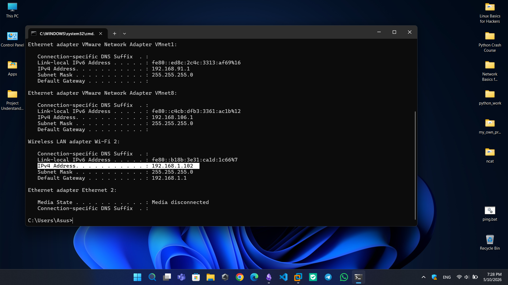

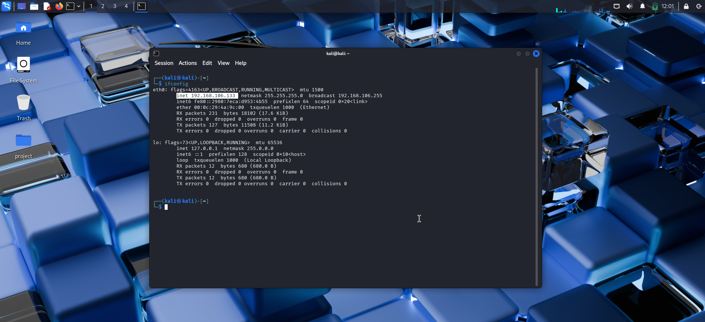

If the connection fails, temporarily disable Windows Defender Firewall or add an inbound rule for port 4444. (For me it was ok without disabling Windows Defender Firewall)

## 📥 How I downloaded `ncat` (because of internet filtering)

(using DeepSeek AI to understand `ncat`, finding the links, and `how to work with ncat in Windows and Kali`. Everything checked by me before acting.)
### For Windows 11

- Downloaded `ncat.exe` from **GitHub**  
    ([andrew-d/static-binaries](https://github.com/andrew-d/static-binaries/blob/master/binaries/windows/x86/ncat.exe))
    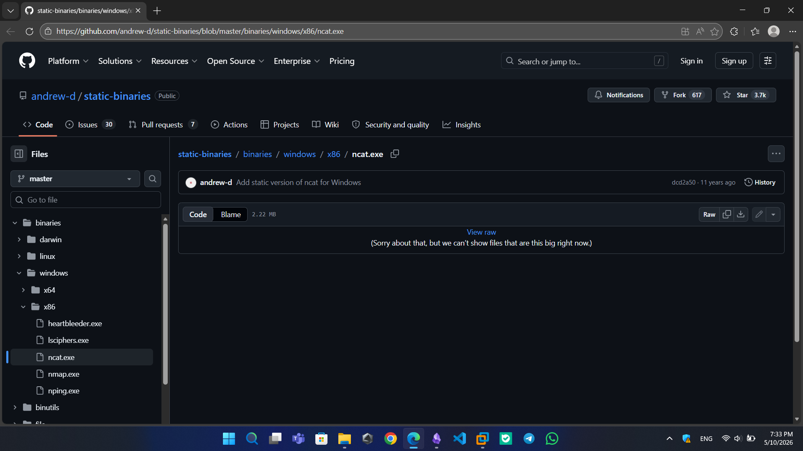
- Saved to `C:\Users\Asus\Desktop\ncat`
### For Kali (VMware)

- Could not access Kali repos directly.
    
- Downloaded a Debian package: `ncat_7.99+dfsg-1_amd64.deb` from a mirror.
    [https://ftp.debian.org/debian/pool/main/n/nmap/](https://ftp.debian.org/debian/pool/main/n/nmap/ncat_7.99+dfsg-1_amd64.deb)
    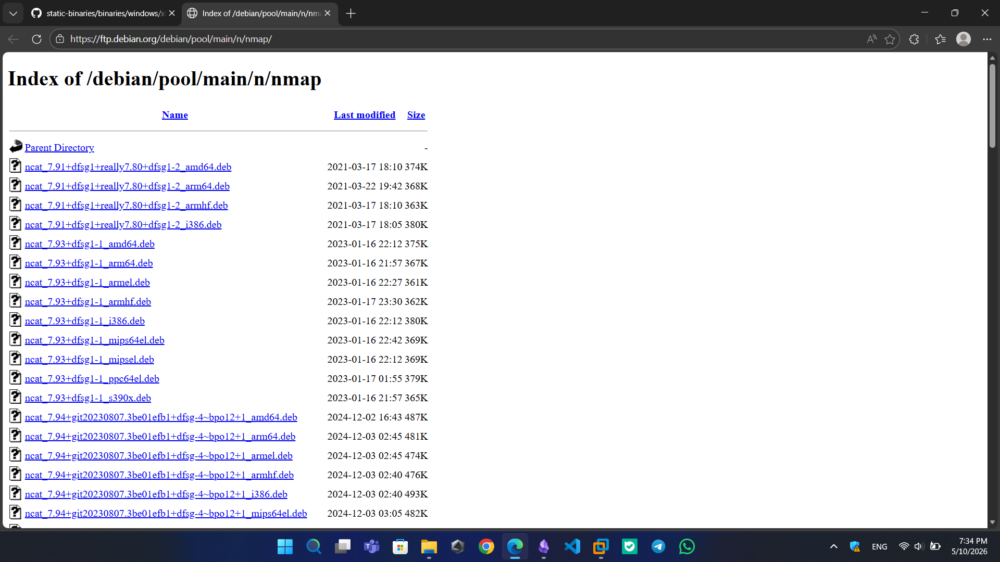
- Extracted the binary: (using DeepSeek AI to extract, run, and copying the PATH)
``` bash
    ar x ncat_7.99+dfsg-1_amd64.deb
    tar -xf data.tar.xz
    sudo cp ./usr/bin/ncat /usr/local/bin/
```
- Verified: `ncat --version` → version 7.99
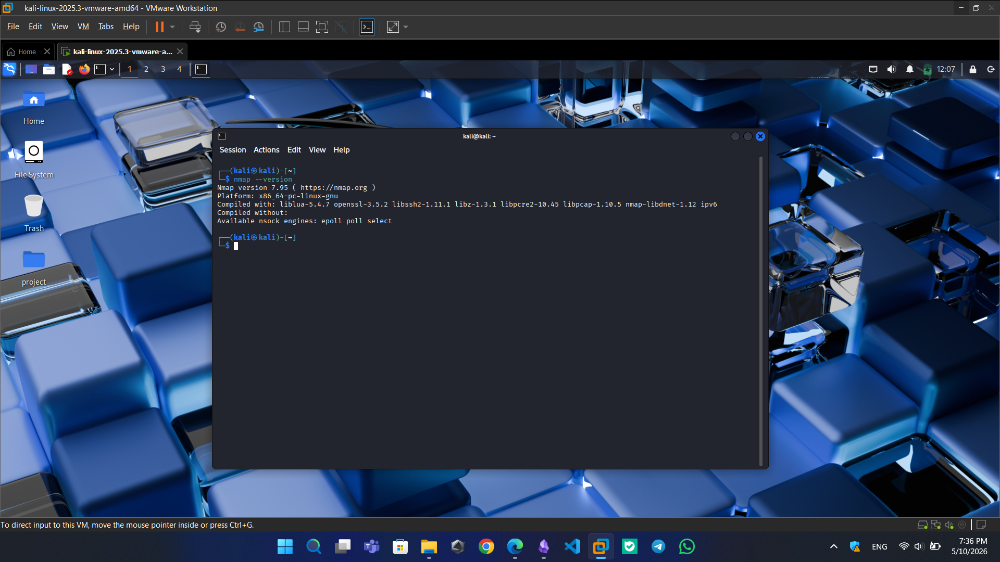
## 🧪 Two tests – plain vs encrypted

I used **the same `ncat`** for both. The only difference is the `--ssl` flag.
I ran the tests **separately** (not at the same time). Port 4444  is used two times, not at the same time.

### 🔓 Test 1 – Unencrypted (plain text)

**On Windows (listener)** – Command Prompt as Admin:

``` cmd
C:\Users\Asus\Desktop\ncat\ncat.exe -v --listen -p 4444
```
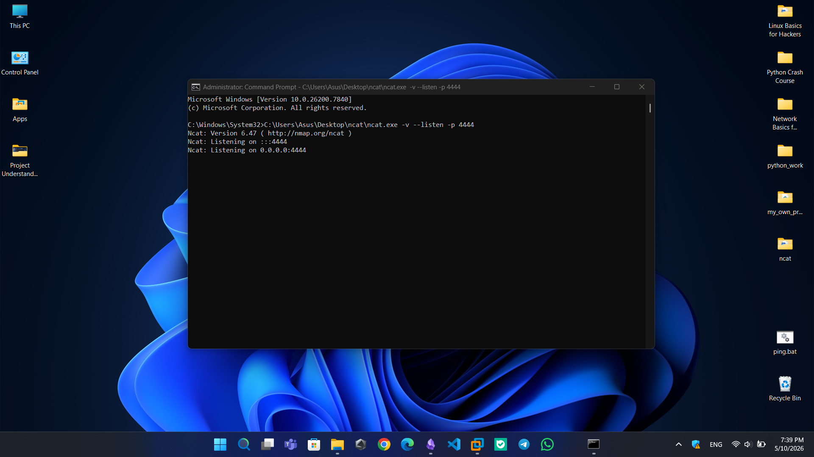

**On Kali (client)** – terminal:

``` bash
ncat 192.168.1.102 4444
```
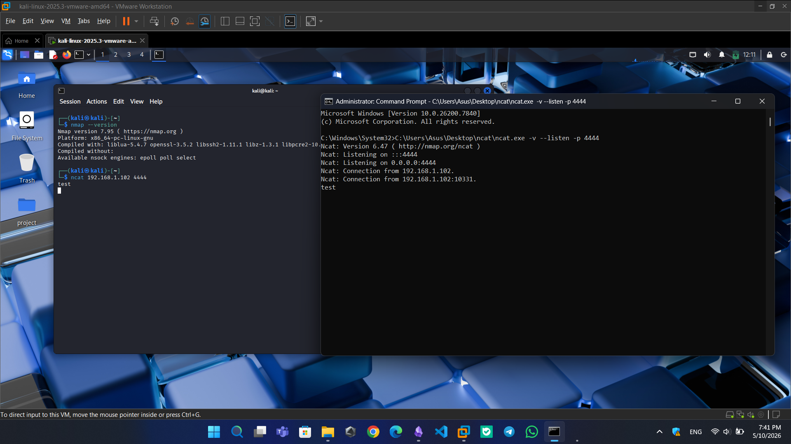

**Capture with `tcpdump`** (on Kali, another terminal):

``` bash
sudo tcpdump -i eth0 host 192.168.1.102 and port 4444 -w ~/Desktop/plain.pcap
```
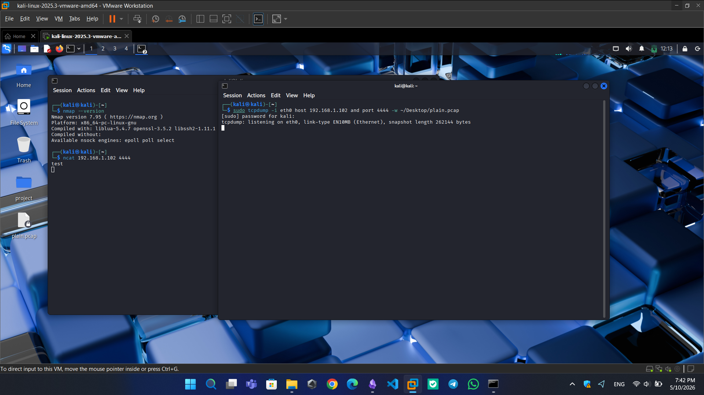

**Sending a message** – `Decryption Phrase:a54@8a7SE9%)13#5^!`
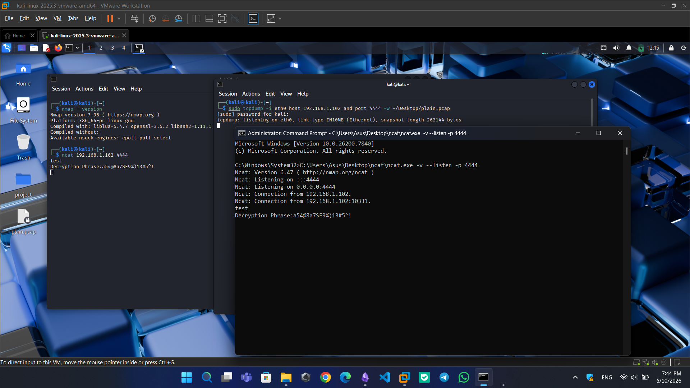
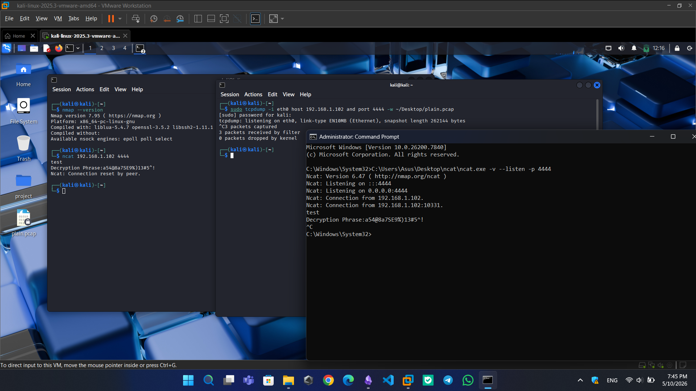
**Analyze in Wireshark**:
``` bash
wireshark -r ~/Desktop/plain.pcap
```
- Open `plain.pcap` → filter `tcp.port == 4444` → Follow TCP Stream
    
- The message is **completely readable** in plain text.
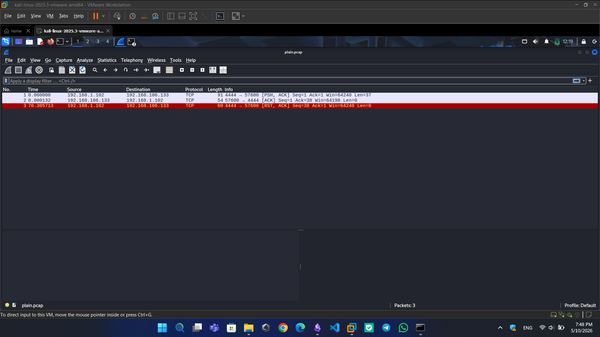
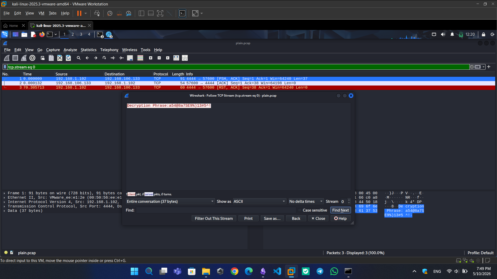

---

### 🔒 Test 2 – Encrypted (TLS)

**On Windows (listener with SSL)**:

``` cmd
C:\Users\Asus\Desktop\ncat\ncat.exe -v --listen --ssl -p 4444
```
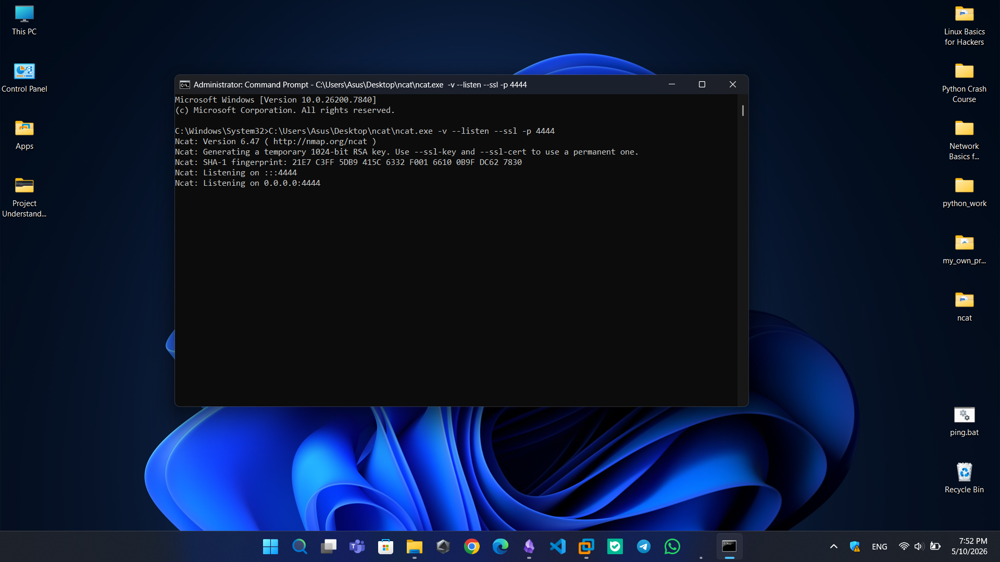

**On Kali (client with SSL)**:

``` bash
ncat --ssl 192.168.1.102 4444
```
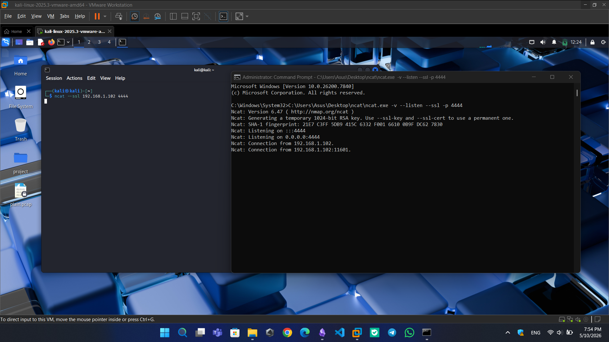
**Capture again** (same `tcpdump` command, new file):

``` bash
sudo tcpdump -i eth0 host 192.168.1.102 and port 4444 -w ~/Desktop/encrypted.pcap
```
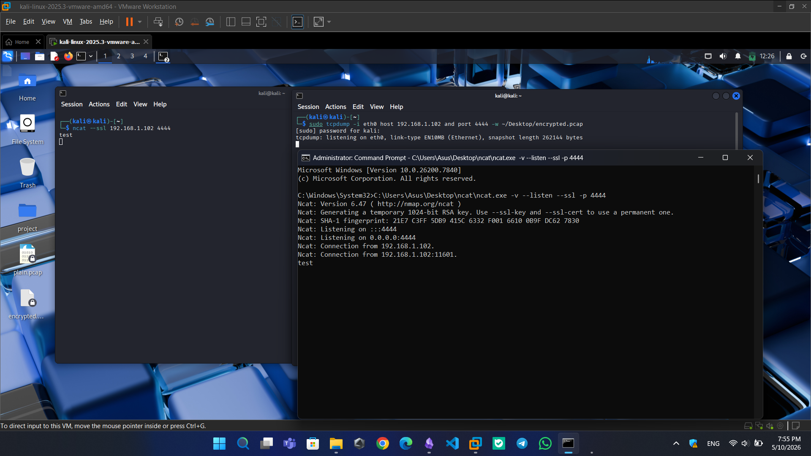

**Send the same message** – `Decryption Phrase:a54@8a7SE9%)13#5^!`


**Analyze in Wireshark**:
``` bash
wireshark -r ~/Desktop/encrypted.pcap
```
- Open `encrypted.pcap` → filter `tcp.port == 4444` → Follow TCP Stream
    
- You see **gibberish** – random bytes, no readable text.

- When `--ssl` is used, `ncat` performs a TLS handshake before any data is sent. This handshake is visible in Wireshark as `Client Hello`, `Server Hello`, etc. (Learned by DeepSeek AI)
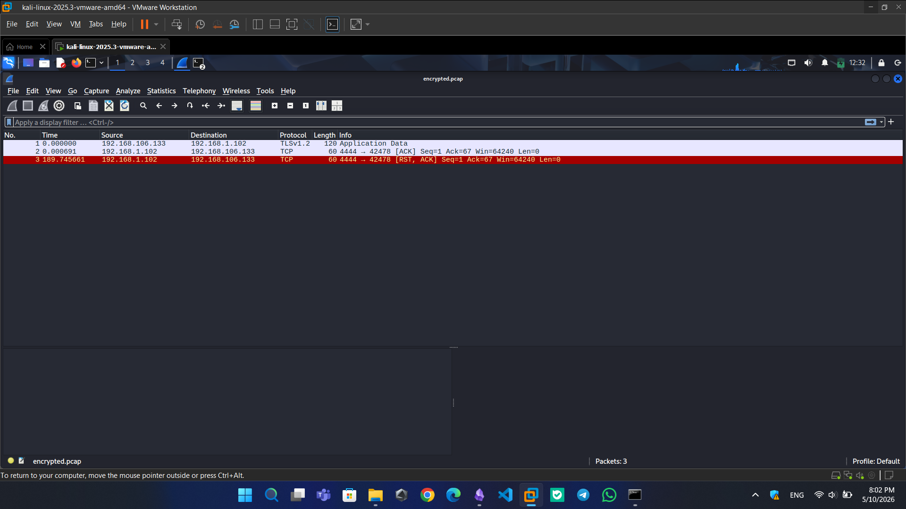
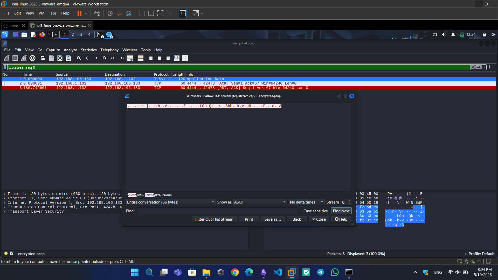
## 📊 Result comparison

|Mode|Command (Windows)|Command (Kali)|Wireshark shows|
|---|---|---|---|
|**Plain**|`ncat -v --listen -p 4444`|`ncat <WinIP> 4444`|Readable message|
|**Encrypted**|`ncat -v --listen --ssl -p 4444`|`ncat --ssl <WinIP> 4444`|Unreadable gibberish|

## 🧹 Cleanup (after finishing the project)

Before starting the project, I removed the temporary extraction files to free up space.

``` bash
# (Optional) Delete the .pcap files if you don't need them. I chose to keep mine.
# rm ~/Desktop/plain.pcap ~/Desktop/encrypted.pcap

# Delete the extracted Debian package files 
rm -rf ~/Desktop/control.tar.xz ~/Desktop/data.tar.xz ~/Desktop/debian-binary ~/Desktop/usr

# Delete the downloaded .deb file
rm ~/Desktop/ncat_7.99+dfsg-1_amd64.deb
```

> 📌 **Note**: I keep `ncat` installed in `/usr/local/bin/` – I might want it for future projects. The cleanup only removes temporary and capture files.

## 📚What I learned

Encryption is no longer optional – it’s essential. Today we use public Wi‑Fi, online banking, and cloud services. Without encryption, anyone with a sniffer (like Wireshark) can see our passwords, messages, and files in plain text. This project showed me that even on a simple NAT network, unencrypted traffic is wide open, while TLS turns the same data into unreadable gibberish. That’s why HTTPS, SSH, and VPNs exist.

## ⚠️ Ethical concerns, responsible use, and important notes

> This project was performed **inside my own private lab** – my laptop (Windows 11) and my own Kali VM. No external device was involved.

- **Do not** sniff traffic on networks you do not own or have explicit permission to test.
    
- **Do not** use these techniques to eavesdrop on others – it is illegal in most countries.

- Due to the Internet restriction, I couldn't use some sites or tools to test and run this project. The idea of this project was by me not using any AI or blogs or people. I used `DeepSeek AI` to come up with a solution in order to run this project. `ncat` downloading and using it on `Kali` and `Windows` were done with the help of this AI but all the switches and commands checked and reviewed by me.

- Understanding encryption helps **defenders** secure their networks and appreciate why HTTPS, VPNs, and SSH are essential.

This knowledge is for **educational and defensive security** purposes only.

## Reference 

`OCCUPYTHEWEB - Network Basics for Hackers - 2019`

`GitHub - (https://github.com/andrew-d/static-binaries/blob/master/binaries/windows/x86/ncat.exe`

`Debian mirrors - [https://ftp.debian.org/debian/pool/main/n/nmap/](https://ftp.debian.org/debian/pool/main/n/nmap/ncat_7.99+dfsg-1_amd64.deb)

`man tcpdump`
`man wireshark`
`ncat -h`
`DeepSeek AI`
